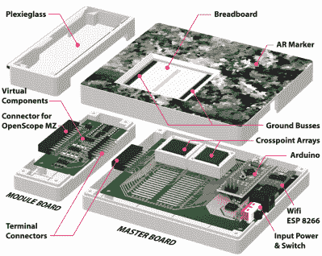

# 未来的增强现实试验板

> 原文：<https://hackaday.com/2019/05/27/the-augmented-reality-breadboard-of-the-future/>

你很难找到一个没有锤子的木匠，或者一个没有刷子的油漆工。一些工具对于它们各自的工艺来说是如此的基础，以至于它们的所有权本质上是一种给定。试验板也可以这么说:如果你在业余爱好甚至专业水平上使用电子产品，你肯定已经花了相当多的时间将元件和电线插入这些典型的原型制作工具之一。

随着时间的推移，试验板失去相关性的危险不大，但如果[【安德烈·比安奇】和她的团队对此有什么要说的，它可能会学到一些令人印象深刻的新技巧](https://github.com/makinteract/VirtualComponent)。VirtualComponent 由韩国高级科学技术研究所开发，使用增强现实和一些非常智能的电子设备将经典的试验板转变为强大的混合现实工具，用于测试和模拟电路。它不会取代你藏在工具袋底部的价值 3 美元的试验板，但有一天它可能会成为电子教室的标准设备。

 简而言之，VirtualComponent 本质上是一个动态试验板。同一行中的孔仍然像经典试验板一样进行电气连接，但由于基座中有两个 AD75019 交叉点开关阵列和一个 Arduino，它能够在用户选择的任意位置虚拟“插入”元件。因此，用户不必实际插入一个电阻，只需告诉软件在两个选定的孔之间连接一个电阻，交叉点阵列就会完成剩下的工作。

更重要的是，这些组件中的许多都可以模拟，或者至少可以在软件中增强。例如，通过使用 AD5241 数字电位计，VirtualComponent 可以调整虚拟电阻的值。为了提供可变电容，可以使用一组真实电容和一个 ADG715 数字开关将它们连接在一起，实现类似的技巧；本质上自动化了经典的“十进制盒子”所做的事情。在休息后的演示视频中，这一功能一直扩展到将虚拟函数发生器连接到电路。

整个系统由悬挂在试验板上的安卓平板电脑控制。使用平板电脑的摄像头，该软件提供了电路的物理和虚拟组件的增强现实视图。只需点击几下，用户就可以添加或编辑他们的虚拟硬件，并立即看到它如何改变物理电路的行为。

多年来，人们一直试图改进试验板，但到目前为止，似乎没有什么东西真正留下来。考虑到 VirtualComponent 的复杂性，他们很可能[会有一段更加艰难的时间来获得关注](https://hackaday.com/2019/04/06/hexagons-the-crazy-new-breadboard/)。也就是说，我们不禁对增强现实在硬件开发方面的[潜力感到兴奋。](https://hackaday.com/2018/07/26/bringing-augmented-reality-to-the-workbench/)

 [https://www.youtube.com/embed/xeq6MhjG2Vs?version=3&rel=1&showsearch=0&showinfo=1&iv_load_policy=1&fs=1&hl=en-US&autohide=2&wmode=transparent](https://www.youtube.com/embed/xeq6MhjG2Vs?version=3&rel=1&showsearch=0&showinfo=1&iv_load_policy=1&fs=1&hl=en-US&autohide=2&wmode=transparent)

