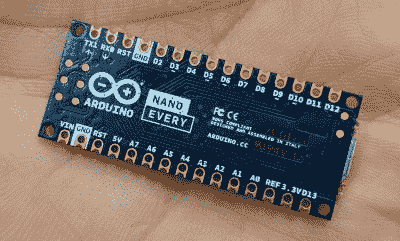
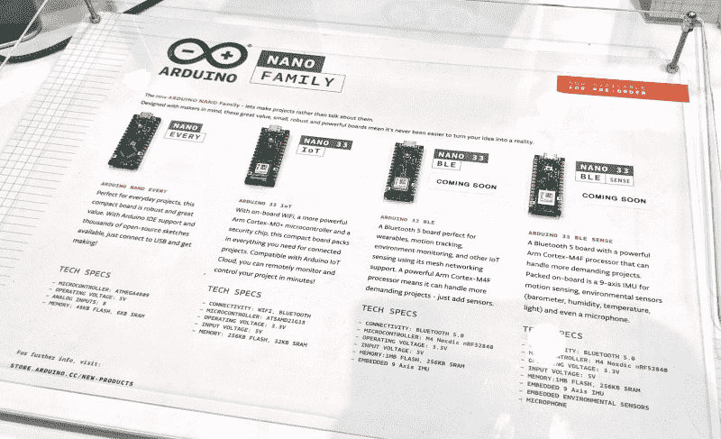

# 新的 Arduino 纳米线在 Maker Faire 湾区推出四种口味

> 原文：<https://hackaday.com/2019/05/19/new-arduino-nano-line-rolls-out-in-four-flavors-at-maker-faire-bay-area/>

Arduino 宣布了一系列新的纳米板，将于下个月开始发货。从设计，到主板上的芯片和功能，再到价格，这里有很多新的东西。我在 Maker Faire Bay 区的摊位前停下来看了看硬件。

立即引人注目的是电路板两侧引脚的新设计，从通孔过渡到齿形通孔混合。订购电路板时，引脚接头可以焊接到位，也可以不焊接。如果你没有得到它们，你可以将这些纳米板作为模块回流到更大的 PCB 设计上。推荐的足迹还没有，但我被告知他们将很快公布。

 这一系列中最基本的型号是“Nano Every”，一种以 ATmega4809 为中心的 5V 板。这带来了 48 KB 的闪存和 6 KB 的 RAM，运行在 20 Mhz。一个非常棒的地方是包含了电源调节功能，可以将高达 21 V 的输入转换为芯片的 5 V 调节电压，另外还可以通过其中一个接头上的 5 V 引脚为外部元件提供高达 1 A 的电流。对于黑客来说，你可以选择通过 VIN 线或 USB 头注入未经调节的电源。

所有这些都是对以前可用的 Nano 设计的一个很好的升级，9.90 美元的价格标签使它成为您的 8 位微控制器需求的真正理想的板。我想到的一个批评是，引脚在底部丝网上贴得很好，但我也希望在顶层看到这些标签。当用于试验板或焊接到另一个 PCB 时，引脚标签将被隐藏。

Nano 系列的其他产品围绕着更强大的芯片。如上所述，“Nano Every”板在 5 V 下运行 8 位芯片，但三种不同的“Nano 33”板具有在 3.3 V 下运行的 32 位芯片。有一种“物联网”版本，具有 Arm Cortex-M0+ SAMD21 处理器、6 轴 IMU，加上 uBlox NINA-W10 模块，这是一种基于 ESP32 的板，具有 WiFi、蓝牙和加密功能。这块板上的建议零售价是 18 美元。

“Nano 33 BLE”和“Nano 33 BLE 感应”板都取消了 SAMD21 芯片，并利用了作为 uBlox NINA-B306 模块一部分的 Nordic nRF52480，并提供蓝牙连接。售价 19 美元，BLE 风味可以让你得到一个 9 轴加速度计。再花 10 美元，“BLE 感应”增加了一系列传感器:压力、湿度、数字接近度、环境光、手势传感器和麦克风。这两款手机的预购预定将于今年 7 月开始发货。

[新的 Arduino Nano](https://blog.arduino.cc/2019/05/17/whats-new-at-maker-faire-bay-area-2019/) 设计在小尺寸上带来了强大的功能。我不得不怀疑 Arduino 是否在寻求与 ESP32 模块竞争。ESP32 模块上的齿形边缘允许它们出现在各种开发板和其他产品中。新的 Nano 设计延续了 Arduino 板对原型友好的传统，但增加了将板包括在基于表面贴装组件的产品设计中的能力。