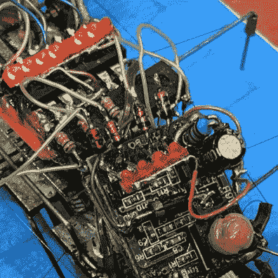
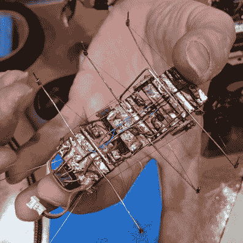
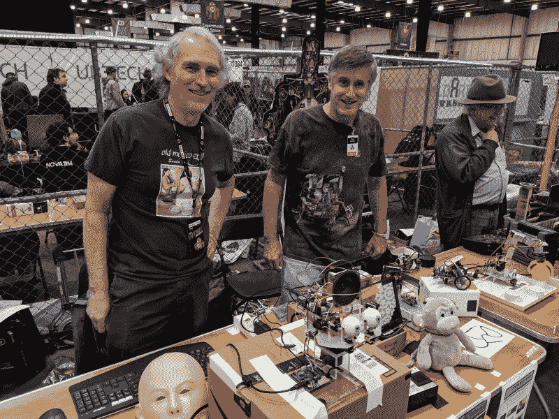
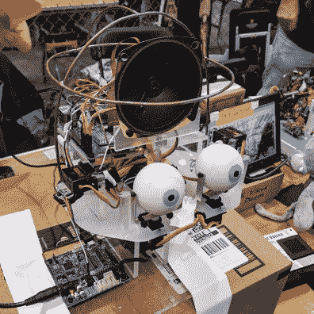
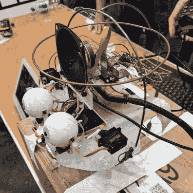
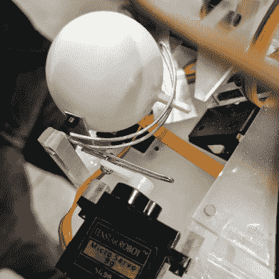
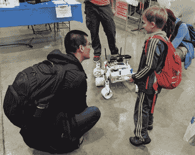
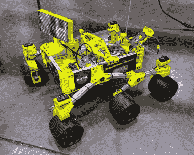

# 肌肉线 BugBot 和树莓皮机器人，它的眼睛在制造者集会上看着你

> 原文：<https://hackaday.com/2019/05/19/muscle-wire-bugbot-and-a-raspberry-pi-android-with-its-eye-on-you-at-maker-faire/>

周六下午，我花了很长时间在 Maker Faire Bay 区的自制机器人俱乐部展台闲逛。他们展出了一大堆非常有趣的机器人，我非常喜欢听他们讲述这两个机器人的故事。

很明显 [BugBot](http://mark-toys.com/BugBot.html) 得名于此。六条腿的步行器是马克·约翰斯顿的发明，他在一个机器人部件很难获得的时代建造了这种野兽。每条腿都由一根非常细的肌肉导线驱动，当高压通过它时，肌肉导线就会收缩。建造中真正棘手的部分之一是找到一种方法来连接这条线。它的熔点很低，所以试图焊接它通常会导致熔化。他的技术是将金属丝缠绕在腿本身上，然后将一小段铜管套在上面，形成一个卷曲连接。

  PIC microcontroller and muscle wire connections visible in this closeup  The underside of BugBot is impressive too! Two hoops normally hold the battery which is not shown here

这个小 bug 的核心是一个 PIC 微控制器，它被点对点焊接到其余的组件上。这只造成了一次真正的问题，当时马克不知何故用砖堵住了芯片，不得不更换它。仔细观察，你会发现要实现这一点，还有很多细节需要处理。正如我所说，在组件和突破模块爆炸之前，机器人制造更加困难。这上面的无线控制组件实际上是从儿童遥控玩具中打捞出来的。无论从哪方面来看，它们都不算伟大，但在当时这是最好的资源，而且很有效！你可以找到跳跃后嵌入的机器人的演示。

Ralph Campbell (left) and Mark Johnston (right)

一个机器人机器人正在展出，但当然，我最感兴趣的是看皮肤下面的东西。在上图中，你可以看到面具位于“帕特”骨架的左侧。拉尔夫·坎贝尔一直致力于这一构建，并计划融入面部识别和手势识别等互动功能，以影响机器人的凝视。

  Overview of “Pat” without skin  Hoops are coat hangers soldered together

 每个乒乓球眼里面都是一个树莓摄像头(实际上是 Adafruit Spy 摄像头，因为它的电路板尺寸很小)。Ralph 有一个单独的面部识别演示，他正在进行整合。但对我来说，机器人的机械设计让我着迷。

头骨的结构是用磁线捆绑和焊接在一起的衣架。眼睛的移动得益于一个由回形针制成的巧妙框架。每只眼睛旁边的伺服系统上下移动视线，而眼睛下面的伺服系统负责左右。一根木制火柴杆执行双重任务——将相机保持在眼睛瞳孔的位置，并允许它沿着垂直致动器的回形针轨道旋转。这是再简单不过的了，我觉得它非常聪明！

 [https://www.youtube.com/embed/taFqPqY04So?version=3&rel=1&showsearch=0&showinfo=1&iv_load_policy=1&fs=1&hl=en-US&autohide=2&wmode=transparent](https://www.youtube.com/embed/taFqPqY04So?version=3&rel=1&showsearch=0&showinfo=1&iv_load_policy=1&fs=1&hl=en-US&autohide=2&wmode=transparent)

## 游行的漫游者

既然我的话题是机器人，我想为 Hackaday 的郑健国大声喊出来。他被选为今年 Maker Faire 湾区的巡回展览。如果你还没有[跟随他的 sappy build](https://hackaday.io/project/158208-sawppy-the-rover)你应该(20，000 人不会错)！

我认为罗杰和一个未来的机器人制造者之间的这一刻非常感人。看到一个模仿火星漫游车的机器人，在地球上使用智能手机的触摸屏无线驱动，肯定会对这个男孩认为一个坚定的建设者可以完成的事情产生很大的影响。当然，罗杰激励的不仅仅是孩子。这辆黄色的路虎在其中一个摊位上展出。它基于罗杰的设计，正如这个全尺寸项目一样，[计划将该平台用作北极钻探测试平台](https://hackaday.io/project/165401-qmrd3)。