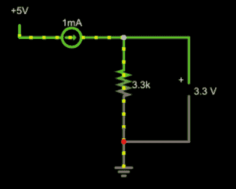
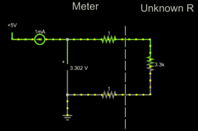
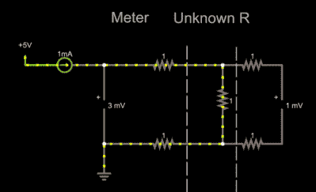

# 电路 VR:四线电阻测量

> 原文：<https://hackaday.com/2019/06/05/circuit-vr-resistance-measurement-with-four-wires/>

如果你想测量电阻，并且你知道欧姆定律，似乎你有一个简单的答案，对吗？给你要测量的物体通一个已知的电流，读出所需的电压。一点数学，仅此而已。或者是？如果您正在测量相当大的电阻，并且不介意小的误差，当然可以。但是对于微小的测量或高度精确的测量，您最好使用四线法。更重要的是，理解为什么要使用四线法是利用对电子学的理解来寻找问题解决方案的一个很好的例子。

## 非常嫌疑犯

 我们先来看一下[正常情况下的](http://tinyurl.com/y2xd6668)。

这很简单。3.3/0.001 = 3300 这就是答案。但是现实生活要复杂一点。毕竟，在模拟中一切都是完美的，但在现实中，电线和测量设备都不是完美的。

假设通向电阻的导线相当长。事实上，假设他们在每条腿上增加[一欧姆的电阻。现在不是 3.3kω，而是 3.302kω。这几乎没有什么区别——大约 0.06%。请注意，测量输出端的电压现在可以给出整个电阻的正确结果，而不仅仅是我们感兴趣的电阻。](http://tinyurl.com/y2tab2or)

这看起来没什么大不了的，对吧？但也有可能。想象一下，如果未知电阻非常小。甚至，比如说，[1ω](http://tinyurl.com/y5e8uta9)。现在我们相差很大！传统的模拟仪表通过短路探针使探针电阻归零。但是如果你想得到正确的数字显示结果，这需要一些复杂性。换句话说，通过完美的设置，您可以放置一个数字面板表来读取电路中的电压，并直接读取电阻。将它归零需要更多的努力才能让电表读取零伏，而不是短路时当前读取的 0.002 伏。

## 真实生活

 让我们再增加[一个第二电压表](http://tinyurl.com/y4x2vu9t)。由于连接电压表的导线是完美的，我们还将在这些导线上增加 1ω电阻。电压表也很完美。在现实生活中，它们的分流电阻可能达到 1 兆欧或更高。一分钟后你会发现这并不重要。但是不完美的线路确实有影响。现在，我们将和完美的电压表一起生活。

尽管有额外的电阻，现在右边的电压表读数正确。这些电阻没多大关系，因为电压表本质上是一个开路。没有电流流动，因此，导线上没有电压降。事实上，电压表上可能有 1 兆欧甚至更大的电阻，但这并不会造成任何显著的差异。读数下降到. 999997 毫伏。现代设备的电阻可能至少是它的 10 倍，这使得差异几乎可以忽略不计。

这是四线或开尔文测量的基础。两根导线推动电流通过被测器件，另外两根导线测量电压，同时传输尽可能小的电流。结果是一个非常准确的电阻读数。

你经常会听到载流导线被称为力线，另一对被称为传感线。通常，传感线放置在两个力线之间，以防止任何额外的线或迹线电阻影响测量。在处理小尺寸测量时，力线比传感线粗得多的情况并不少见。毕竟，感测导线承载的电流非常小，但测试 0.01ω电阻时，力线会有相当多的电流流过。

## 不仅仅是为了抵抗

概括地说，我们想要测量电压，但由于载流感应线的有限电阻上的压降而受阻。不借助跳线来降低电压降，意味着在我们进行测量的地方降低电流，解决方案是分成力线和感测线。直观地理解改变一件事如何影响另一件事的关系可以帮助你做出更好的设计。

即使你不想精确测量电阻，这个四线技巧也很有用。例如，大电流或高精度稳压电源也使用同样的技巧。如果您的电源在输出端测量电压，也会遇到同样的问题。当然，你在输出端调节到 5V。但是，负载牵引 2A 的 1ω连接器意味着只有 3V 到达负载！

答案是一样的。所有稳压电源都有来自输出端的某种形式的反馈。遥感电源将有一对直接连接到负载的小传感线。就像前面的情况一样，感应线携带的电流非常小，因此不会产生太大的测量误差。输出端子上的电压可能高于您设置的调节器，但负载上的输出应该是正确的。

许多商用电表，尤其是台式电表，提供四线测量选项。现在你知道它是如何工作的，以及你为什么要使用它。