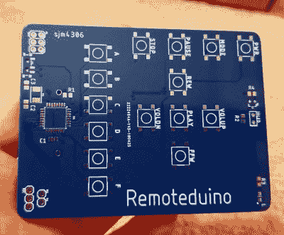

# 简单的 Arduino 通用遥控器

> 原文：<https://hackaday.com/2019/06/04/simple-arduino-universal-remote-control/>

红外遥控器可能不会像以前那样在普通家庭影院系统中独占鳌头，但它还没有完全退出市场。毕竟，一旦 Chromecast 无一例外地与你的手机断开连接，你打算用什么来阻止网飞呢？只要有设备能够响应通过红外 LED 发出的命令，黑客们就会想方设法参与进来。

 为了让红外远程黑客攻击变得简单一点，[【sjm 4306】提交了他的 Remoteduino 参加 2019 黑客日奖](https://hackaday.io/project/165553-remoteduino)。有了这个方便的工具，您可以专注于开发下一个 IR 遥控器项目的软件方面，而不必担心硬件。只要上传你的代码，然后点击。

正如你可能想象的那样，这个设计相当简单。在 PCB 的前边缘，您已经有了必备的 IR LED，以及大量的触觉按钮，您的代码可以将它们用作输入。遥控器的上半部分具有相当标准的布局，带有常用功能的丝网标签，但在它的下面，[sjm4306]有六个通用按钮，可以用于您喜欢的任何功能。

Remoteduino 由 ATmega328P 供电，整个系统由安装在背面的 CR2032 电池驱动。[sjm4306]在他关于 Hackaday.io 的文章中提到，在 Remoteduino 的开发过程中，电池寿命一直是一个考虑因素，因此他提出了一些节能考虑因素。使用内部 8 MHz 振荡器而不是外部晶体剃了一点顶部，[积极的睡眠例程让他剩下的路](https://hackaday.com/2015/07/24/it-keeps-on-going-and-arduino-edition/)。在测试中，他估计即使每天使用，电池也能使用几年。

 [https://www.youtube.com/embed/I3V3gMDKogU?version=3&rel=1&showsearch=0&showinfo=1&iv_load_policy=1&fs=1&hl=en-US&autohide=2&wmode=transparent](https://www.youtube.com/embed/I3V3gMDKogU?version=3&rel=1&showsearch=0&showinfo=1&iv_load_policy=1&fs=1&hl=en-US&autohide=2&wmode=transparent)

The [HackadayPrize2019](https://prize.supplyframe.com) is Sponsored by:     