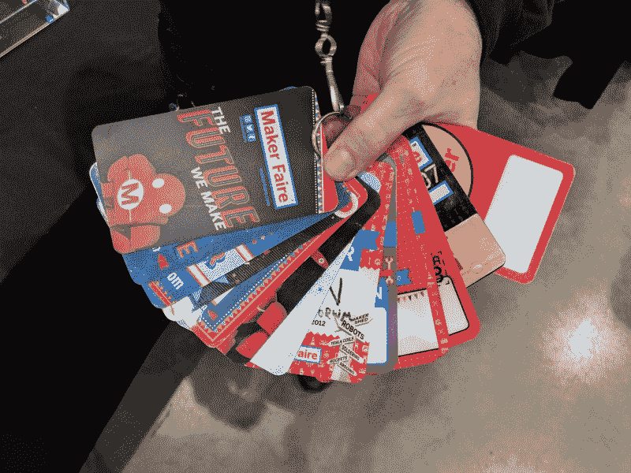

# 黑客日播客 020:屠龙的 EL，攻城武器物理学，解纠缠的 Charlieplex，激光互联网

> 原文：<https://hackaday.com/2019/05/24/hackaday-podcast-020-slaying-the-dragon-of-el-siege-weapon-physics-dis-entangled-charlieplex-laser-internet/>

加入编辑埃利奥特·威廉姆斯和迈克·斯奇斯的行列，他们将揭开我们本周看到的所有伟大的黑客。在这一集里，我们将谈论从太空传送的激光互联网，解开复杂的 Charlieplexed 电路，打开 IC 的盖子，以了解更多关于它们的信息，并在家里安全地做这件事。我们有一些后院攻城武器的乐趣(为了学习物理，我们发誓！)，在 FPGAs 上赌博，以及让自拍再次变得有趣的行扫描相机。没有人认为制造电致发光显示器是容易的，但是谁知道它有这么难呢？

如果你想继续，看看下面的链接，一如既往，在评论中告诉我们你对这一集的看法！

[//html5-player.libsyn.com/embed/episode/id/16571519/height/90/theme/custom/thumbnail/yes/direction/backward/render-playlist/no/custom-color/000000/](//html5-player.libsyn.com/embed/episode/id/16571519/height/90/theme/custom/thumbnail/yes/direction/backward/render-playlist/no/custom-color/000000/)

如果你想继续，看看下面的链接，一如既往，在评论中告诉我们你对这一集的看法！

[直接下载](https://traffic.libsyn.com/secure/hackaday/625446522-hackaday-ep20.mp3) (60 MB 左右。)

Where to Follow Hackaday Podcast

### 关注 Hackaday 播客的地方:

*   [谷歌播客](https://podcasts.google.com/feed/aHR0cDovL2ZlZWRzLnNvdW5kY2xvdWQuY29tL3VzZXJzL3NvdW5kY2xvdWQ6dXNlcnM6OTM5MTM0NzIvc291bmRzLnJzcw)
*   [iTunes](https://itunes.apple.com/us/podcast/hackaday-podcast/id1447409683)
*   [Spotify](https://open.spotify.com/show/3NRV0mhZa8xeRT0EyLPaIp)
*   [装订机](https://www.stitcher.com/podcast/hackaday-podcast)
*   [RSS](http://hackaday.libsyn.com/rss)

## 第 020 集节目笔记:

#### 本周新消息:

*   [hack aday 湾区创客集会的所有黑客](https://hackaday.com/?p=359196)
    *   [String launcher 视频(恐怖音频作为公共服务被移除)](https://photos.app.goo.gl/feBf5x8rPW3EVRHu5)

#### 本周有趣的黑客:

*   [PokerBot 使用 FPGA 进行卡计算马力](https://hackaday.com/2019/05/16/pokerbot-uses-fpga-for-card-calculating-horsepower/)
    *   [蒙特卡洛法——维基百科](https://en.wikipedia.org/wiki/Monte_Carlo_method#Monte_Carlo_simulation_versus_%22what_if%22_scenarios)
    *   [费舍尔-耶茨洗牌-维基百科](https://en.wikipedia.org/wiki/Fisher%E2%80%93Yates_shuffle)
*   [横向思考更简单的挑战](https://hackaday.com/2019/05/20/lateral-thinking-for-an-easier-charlieplex/)
    *   [∅:查理普莱克斯与 LED 点阵模块](http://crawlingrobotfortress.blogspot.com/2013/03/charlieplexing-with-led-dot-matrix.html)
*   本·克拉斯诺创造了一个 DSKY
    *   [建造电致发光玻璃平板显示器——阿波罗 DSKY](https://www.youtube.com/watch?v=Z2o_Sp2-aBo)
    *   超级公司的本·克拉斯诺:在你自己的店里制造外星科技
*   [用投石机让物理变得有趣](https://hackaday.com/2019/05/20/make-physics-fun-with-a-trebuchet/)
    *   [以每小时 124 英里的速度投掷网球](https://hackaday.com/2018/09/10/trebucheting-tennis-balls-at-124-mph/)
    *   [用于物理教育的 Tracker 视频分析和建模工具](https://physlets.org/tracker/)
*   [有了合适的老师，集成电路可以很容易理解](https://hackaday.com/2019/05/20/integrated-circuits-can-be-easy-to-understand-with-the-right-teachers/)
    *   [视频:低微的二极管——仅用两个引脚就能实现多种功能](https://hackaday.com/2014/06/09/video-the-lowly-diode-umpteen-functions-with-only-two-pins/)
*   非常现代的飞点扫描仪
    *   [GitHub–firmata/协议](https://github.com/firmata/protocol)

#### 快速破解:

*   迈克的选择:
    *   [对智能灯泡不满意？制作您自己的](https://hackaday.com/2019/05/19/not-happy-with-smart-bulbs-make-your-own/)
    *   [Rhysonic Wheel 自动播放现场音乐](https://hackaday.com/2019/05/18/the-rhysonic-wheel-automates-live-music/)
    *   [黑客预算的旋风吸尘器](https://hackaday.com/2019/05/17/a-cyclonic-vacuum-cleaner-on-a-hackers-budget/)
*   埃利奥特的选择:
    *   [支持人工智能的电传打字直播流近乎连贯的对话](https://hackaday.com/2019/05/23/ai-enabled-teletype-live-streams-nearly-coherent-conversations/)
    *   受辐射影响的展示为世界末日做好了准备
    *   [无危险解封芯片](https://hackaday.com/2019/05/19/decap-ics-without-the-peril/)
        *   彼得·拉克曼，马库斯·杨克:打开微芯片的盖子

#### 不能错过的文章:

*   [我们所知道的关于 SpaceX 的 Starlink 网络的一切](https://hackaday.com/2019/05/20/everything-we-know-about-spacexs-starlink-network/)
    *   [空中千兆以太网](https://hackaday.com/2016/03/10/gigabit-ethernet-through-the-air/)
    *   [为什么未来的卫星会燃烧](https://hackaday.com/2019/04/22/why-satellites-of-the-future-will-be-built-to-burn/)
*   Zork 和 Z-Machine:将大型机引入 8 位家用电脑

**面试:**

*   五月早些时候，我们听到消息称，制造商费尔湾地区正面临金融危机。虽然这个事件的未来是未知的，但遗产是显而易见的。世界各地的创造者大会对无数人的生活产生了深远的影响。很难想象这一切是从 2006 年的第一次活动开始的。Mike Szczys 上周末花了一些时间追踪尽可能多的人。在短短的时间里，这些人分享了一段美好的回忆，并帮助我们描绘了首届创客节的场景。
*   感谢 [Lenore Edman](https://twitter.com/1lenore) 在联系第一届 Maker Faire 的人们方面提供的大量帮助。

A pass for every Maker Faire Bay Area shown by one of the people we interviewed