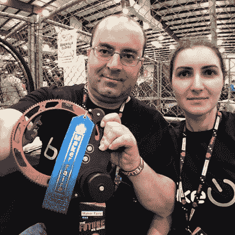

# BikeOn 使电力转换变得轻而易举

> 原文：<https://hackaday.com/2019/06/07/bikeon-makes-electric-conversion-a-snap/>

如果你在一个相对城市化的地区，并且你的目的地在一个合理的距离内，很难反对骑自行车而不是开车。这对环境有好处，也是锻炼和保持活跃的好方法。但是，全职为互联网写作的人们说，我们中的一些人可能会在情况变得艰难时欣赏一点机电优势。

为了让给你的自行车充电变得尽可能容易， [[Shushanik]和[Aram]正在开发一款他们称为 BikeOn](https://hackaday.io/project/165754-bikeon) 的产品，他们最近参加了 2019 年 Hackaday 奖。由于一些非常聪明的工程，这个小装置可以夹在标准自行车的框架上，并将其 350 瓦电机的能量直接转移到后轮上；所有这些都不需要任何工具或永久性的修改。

在休息后的视频中，[Aram]演示了用户如何在几秒钟内安装 BikeOn 电机组件。自然有一个结实的电池需要连接到车架上，但即使这样也已经足够模块化，可以连接到许多自行车的水瓶架上。

细心的读者可能会注意到 BikeOn 没有明显的控制机制。BikeOn 使用扭矩传感器、加速度计和陀螺仪的组合来智能地确定骑手何时可以使用助力，而不是手动摸索。

BikeOn 在 2019 年 Maker Faire 上获得了编辑选择奖，现在它正在角逐 Hackaday 奖，随着它走向商业发布，我们很高兴看到更多关于该产品的信息。

 [https://www.youtube.com/embed/yLrsXcK_x3s?version=3&rel=1&showsearch=0&showinfo=1&iv_load_policy=1&fs=1&hl=en-US&autohide=2&wmode=transparent](https://www.youtube.com/embed/yLrsXcK_x3s?version=3&rel=1&showsearch=0&showinfo=1&iv_load_policy=1&fs=1&hl=en-US&autohide=2&wmode=transparent)

The [HackadayPrize2019](https://prize.supplyframe.com) is Sponsored by:     