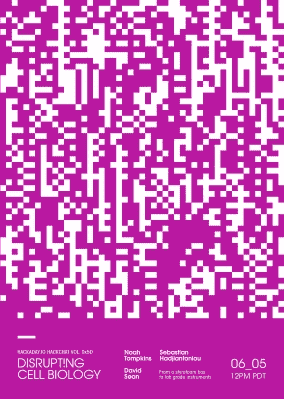

# 扰乱细胞生物学黑客与诱导剂聊天

> 原文：<https://hackaday.com/2019/06/03/disrupting-cell-biology-hack-chat-with-incuvers/>

太平洋时间 2019 年 6 月 5 日星期三中午，加入我们与现任者的[扰乱细胞生物学黑客聊天](https://hackaday.io/event/164407-disrupting-cell-biology-hack-chat)！

 当今许多最成功的科技公司都有创造神话的经历，包括在某个郊区街区的一个车库，所有的奇迹都发生在那里。是否真的有车库并不重要；谦虚的开端可以成就大事。对于医疗器械公司[的现任者](https://incuvers.com/)，车库实际上是渥太华大学的一个生物实验室，该公司的第一个产品是从[一个简单的孵化器项目](https://hackaday.com/2015/07/25/get-biohacking-with-a-diy-co2-incubator/)开始的，包括一个聚苯乙烯泡沫冷却器、一个太空毯和一个由 Arduino 控制的苏打流 CO2 气瓶。

从这个不起眼的原型中诞生了更多精致的设计，最终成为可销售的产品，使这家羽翼未丰的公司走上了一条道路，通过创新的孵化器，包括一种可以实时成像细胞生长的孵化器，对细胞生物学领域产生巨大影响。从原型到产品的过程是今年 Hack Chats 中的一个常见主题，Noah、Sebastian 和来自 Incuvers 的 David 将在周三讨论这个主题以及更多内容。

 我们的黑客聊天是 [Hackaday.io 黑客聊天群发消息](https://hackaday.io/messages/room/2369)中的社区直播活动。本周，我们将在太平洋时间 6 月 5 日星期三中午 12:00 坐下来讨论。如果时区让你烦恼，我们有[一个方便的时区转换器](https://www.timeanddate.com/countdown/generic?iso=20190605T12&p0=224&msg=Disrupting+Cell+Biology+Hack+Chat&font=cursive)。

点击右边的那个发言气泡，你会被直接带到 Hackaday.io 上的黑客聊天群，不用等到周三；随时加入，你可以看到社区在谈论什么。