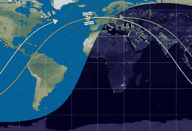
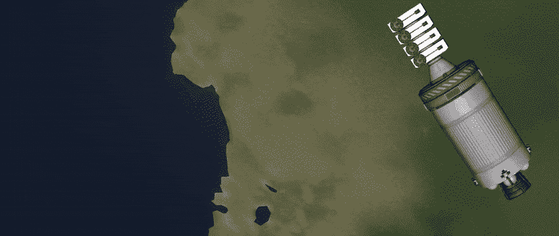

# 在 Starlink 的“太空列车”离开车站之前去看它

> 原文：<https://hackaday.com/2019/05/31/see-starlinks-space-train-before-it-leaves-the-station/>

你最近有没有抬头看夜空，看到一条奇怪的发光点线？你有没有注意到新闻和社交媒体中提到的 UFO 报告数量有所上升？如果是这样的话，你可能已经被许多人亲切地称为埃隆·马斯克的“太空列车”所感动了:[一排紧密组合的 Starlink 卫星](https://hackaday.com/2019/05/20/everything-we-know-about-spacexs-starlink-network/)正在环游全球。

有些人想知道 Starlink 卫星有什么独特之处，可以让他们在地面上用肉眼看到，但这其实并不新鲜。对于观察者*和*来说，这都是关于在正确的时间处于正确的地点的问题。诀窍是从观察者的角度来看，当太空中的物体已经落下时，让它捕捉来自太阳的光。这和月亮在晚上发光的原因本质上是一样的，只是规模小得多。

The ISS as it travels through Earth’s night and day

这种[现象被称为“卫星耀斑”](https://en.wikipedia.org/wiki/Satellite_flare)，追逐它们是狂热的天空观察者最喜欢的消遣。由于这个原理，如果你知道在晴朗的夜晚何时何地可以看到国际空间站，你就可以很容易地看到它划过天空。美国宇航局甚至提供一项服务，使用电子邮件或短信告诉你什么时候从你的位置可以看到[国际空间站。](https://spotthestation.nasa.gov/)

Starlink 卫星的独特之处不在于我们可以从地面上看到它们，而在于它们中有如此多的卫星在一条直线上飞行。第一次发射释放了 60 颗卫星，比我们以前见过的更紧密；Elon 甚至警告说，Starlink 卫星之间的碰撞并非不可能。这些近距离卫星耀斑的累积效应有点令人吃惊，可以理解的是，人们担心当所有 12，000 颗 Starlink 卫星都在轨道上时，夜空会是什么样子。

好消息是，效果只是暂时的。随着卫星展开并开始单独机动，天空中的那条长线将会消失。但在埃隆的“太空列车”永远离开之前，让我们看看它是如何被创造的，以及你如何仍然可以瞥见这一独特的现象。

## 就像一副纸牌

一般来说，卫星是用某种程度的力从运载火箭中弹出的，所以它们彼此之间会保持一个安全的距离。为了降低复杂性，提高可靠性，在许多情况下，这种机制只不过是一个可以远程释放的大型弹簧。即使这种轻微的推动也足以确保物体之间的间隙继续扩大，因为它们通过它们现在分离的(尽管仍然非常相似)轨道。

但是 Starlink 发射的独特之处在于没有使用动力弹射系统。相反，卫星被允许从猎鹰 9 号的第二级漂移出去，只靠简单的物理推进。这不仅比为 60 颗卫星创建一个弹射系统更便宜、更容易，而且在释放时让它们靠得更近还简化了将它们移入最终轨道所需的轨道机动。

那么这是如何实现的呢？我们可以通过近距离观察 SpaceX 的现场任务报道获得第一条线索。在卫星部署之前，背景中太阳和地球的运动显示猎鹰 9 号的第二级处于平转状态。如果你曾经观看过 SpaceX 之前发射的直播，或者就此而言的任何发射，你就会知道这是多么不寻常。

正常情况下，运载火箭是稳定的，这样有效载荷上的唯一动量就是弹射力。但在这里，SpaceX 故意加速运载火箭的第二级，这样当卫星被释放时，它们基本上会被离心力“抛出”。在发布前的新闻发布会上，埃隆·马斯克谈到了这一部署，他说这“看起来就像在桌子上摊开一副牌。”

为了有助于形象化，我们可以用每个人都喜欢的火箭模拟器 Kerbal Space Program 在较小的规模上重新创建部署:

从这个角度来看，很清楚“太空列车”最初是如何通过这种不寻常的卫星部署方法形成的。

## 在他们走之前见到他们

如果这是故事的结尾，我们可以期待在相当长的一段时间内看到一系列相对紧密的 Starlink 卫星。但是这些卫星有自己的工作要做，它们有自己独立的推进系统。一旦猎鹰 9 号旋转赋予他们的惯性给了他们一点喘息的空间，他们就能够启动推进器，开始进行必要的机动，将他们送入最终轨道。

当你读到这里的时候,“火车”正在解体。Starlink 卫星使用的低推力离子发动机意味着它们的分离不会在一夜之间发生，但每过一天，这个曾经极其紧密的群体之间的距离就会增加。除了 SpaceX 之外，没有人知道这个过程需要多长时间，但鉴于我们自发射以来已经看到的运动，几周可能不是一个不合理的估计。

这意味着你还有时间自己去看。网站 N2YO 目前正在跟踪 Starlink 卫星的质量，并将生成一个日期和时间列表，从您所在的位置可以看到这些卫星。请记住，由于这些卫星正在积极机动，它们掠过的准确时间可能会与这些计算略有不同。为了获得最佳效果，让你的眼睛适应黑暗，并在预测的通道前几分钟开始寻找。

## 潜在的更加暗淡的未来

从逻辑上讲，人们可以假设，在每一批新的 Starlink 卫星发射后的最初几周，应该可以看到类似的“太空列车”。因此，即使你最终因为云层覆盖或者你不想在黎明前起床而错过了这一次，在接下来的几年里仍然会有数百次这样的机会。

但是我们已经知道这些卫星只是比原型阶段高了一步，而且 SpaceX 预计它们在真正开始大规模生产之前将经历几次设计变更。Elon 还评论说，他已经指导 Starlink 团队寻找降低卫星反射率的方法。下一批发射的卫星的硬件调整可能会减少或完全消除耀斑效应。

无论下一代 Starlink 卫星是否能够消除发射后的“太空列车”效应，有一点是肯定的:没有理由担心未来的夜空会被照亮的虚线纵横交错。一旦所有的操作完成，它们被放置在最终的轨道上，Starlink 卫星将不会比已经在头顶上呼啸而过的数千颗卫星更容易在夜空中看到。

* * *

*Starlink 卫星在轨道上的图像取自[一段由电影《迷魂记》](https://www.youtube.com/watch?v=cycLZQtM8HU)发布到 YouTube 上的视频。*