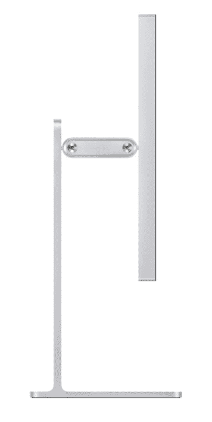
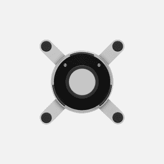
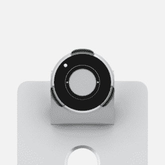
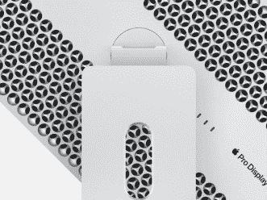
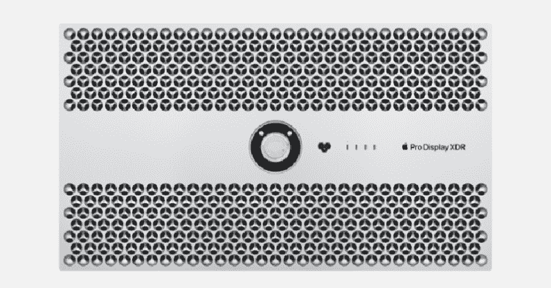

# 苹果刚刚干掉了 VESA Mount，我们再高兴不过了

> 原文：<https://hackaday.com/2019/06/04/apple-just-killed-the-vesa-mount-and-we-couldnt-be-happier/>

在 2013 年苹果 Pro 垃圾桶 Mac 的巨大失败之后，苹果一直在努力开发下一代工作站台式机。本周，新的 Mac Pro 已经发布，其规格令人惊讶:我们终于可以买到一台存储容量只有 iPhone 一半的专业台式机。不过，大新闻不是下一代奶酪磨碎机 MAC:新显示器[Pro Display XDR](https://www.apple.com/pro-display-xdr)已经杀死了古老的 VESA mount，我们再高兴不过了。

VESA 安装，或者更准确地说，VESA 安装接口标准，是在 1997 年作为平板显示器和电视的安装标准而制定的。看看你的显示器背面，你可能会发现一个 75 毫米或 100 毫米见方的 M4 螺纹镶嵌图案。较大的尺寸和相应较大的线尺寸用于巨大的壁挂式电视。过去二十年来，这一直是将显示器安装到支架上的标准。现在，由于苹果公司勇敢的设计师，这一标准面临着挑战。

新的 Pro Display XDR 通过一个“圆盘形磁性连接器”连接到 Pro 支架。该连接器旨在连接到专业显示器 XDR 的背面，并将专业支架和显示器锁定在一起。这是一款磁性显示器支架，是显示器安装技术的革命性进步。

新的 Pro Display 支架允许许多 VESA 支架没有设计的东西:Pro Display XDR 可以旋转到纵向或横向模式。虽然这种显示器是否会自动改变 MacOS 中的显示方向的细节仍在等待中，[这是三十年来一直可能的事情](https://www.youtube.com/watch?v=Dh5175Q4Vgo)，专利绝对已经过期，任何人都可以建立一个加密狗，根据重力方向自动在纵向和横向模式之间切换。

苹果 Pro 支架将于今年秋季上市，零售价为 999 美元。你可以看出那是笑点，因为那是我们结束文章的地方。

          

我们将等待今年秋天 Pro 显示器的发布，但与此同时，请准备好您的干草叉。这种显示器没有任何传感器来检测哪个方向是“向下”,你最终将进入电脑的设置，在横向和纵向之间切换。