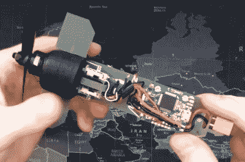

# 设计一架从榴弹发射器发射的无人机

> 原文：<https://hackaday.com/2019/06/06/designing-a-drone-to-fire-from-a-grenade-launcher/>

你可能会认为，可以从标准的 40 毫米榴弹发射器中发射出来用于快速部署的小型自主无人机是军方想要得到的那种东西。当然，这是真的，许多公司都在致力于将这一想法应用于警察和军事领域。但是[Glytch]认为这项技术也可以用于搜索和救援行动，所以他正在为美国平民创造一个版本。

在 2019 CircleCityCon 上的演讲[“3D 打印罐-用于城市规模驾驶的可发射无人机”【Glytch】中，他概述了他在创造小型固定翼无人机(UAV)方面的进展，这种无人机甚至可以由我们这些没有三个字母政府机构预算的人来建造。他还没有达到可以进行测试发射的地步，但是设计进展得很好，我们非常有兴趣看看它将从这里走向何方。](https://circlecitycon.com/talks/3d_printing_canisterlaunchable_drones_for_cityscale_wardriving/)

 把一架有翼飞机装进 40 毫米发射筒的唯一方法是把它折叠起来，到目前为止，这也是[格里奇]努力的方向。他的无人机的机翼将使用一个刚性的前缘，在展开之前可以折叠平整。当处于飞行模式时，附着在无人机机身和前缘之间的防撕裂尼龙将被拉伸以形成实际的机翼表面；把它想象成蝙蝠的翅膀。一个类似的技巧将被用于飞行器后部的两个操纵面。

在内部，无人机使用所有现成的组件，[Glytch]希望这将使其足够便宜，最终可以大规模生产。正如他在最近的 YouTube 视频中解释的那样，马达、速度控制器、接收器和飞行控制器，都是你期望在小型遥控四轴飞行器中找到的那种东西。为了更容易在野外管理无人机，电池和有效载荷将装在一个可拆卸的头锥内；允许用户为不同的任务快速配置硬件。

目前，[Glytch]表示，让他的无人机在空中飞行的最大障碍是找到一个具有他所要求的特定特性的可折叠螺旋桨。由于找不到任何商业上可用的东西，他目前正在考虑自己设计，并在 SLA 机器上 3D 打印出来。他还需要设计一个软壳来支撑无人机穿过发射筒。顺便说一句，他目前正在用气枪榴弹发射器测试他的设计，因为他不想费力地处理涉及到真正交易的文书工作。

[Glytch]对高科技无人机世界并不陌生。他去年创作的受“看门狗”启发的黑客无人机获得了巨大成功，最近他一直在为他的飞行作品制作一个通过 WiFi 与 Raspberry Pi Zero 连接的[高清视频和遥测链路。](https://hackaday.com/2018/12/27/hd-video-and-telemetry-link-uses-standard-wifi-hardware/)

 [https://www.youtube.com/embed/5POsn4LlFQ0?version=3&rel=1&showsearch=0&showinfo=1&iv_load_policy=1&fs=1&hl=en-US&autohide=2&wmode=transparent](https://www.youtube.com/embed/5POsn4LlFQ0?version=3&rel=1&showsearch=0&showinfo=1&iv_load_policy=1&fs=1&hl=en-US&autohide=2&wmode=transparent)

