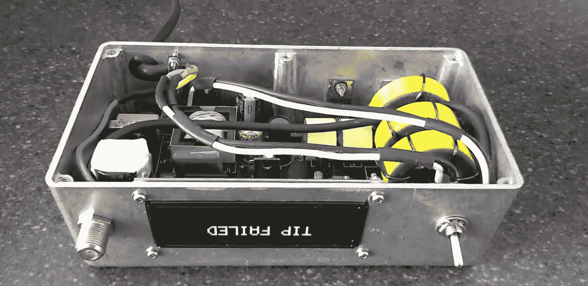
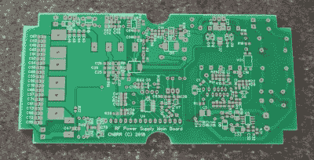

# 自制魔法让 Metcal 前进

> 原文：<https://hackaday.com/2019/06/16/homemade-magic-makes-the-metcal-go/>

最初的烙铁通常是 ~~Radioshack 或者Maplinfire starter 类型的。它们基本上是通过镍铬合金加热器或类似装置短路的墙壁电源，带有一些串联电阻，使房子更难烧毁。你把它们插上电源，电流就会流动，它们就会变热。完成了。~~

如果你坚持这个爱好一段时间，这些最终会被古老的 HAKKO FX-888D 或每个人都喜欢的模拟旋钮所取代。这些都有很大改善；具有温度控制导致更一致的加热尖端和更好的焊接体验。

进入电子工作场所，你会遇到下一个级别的优质烙铁:高端 HAKKOs、Metcals、JBCs 等等。使用这些铁杆实际上是一种宗教体验；它们瞬间加热，当你眨眼时焊料熔化。当你放下手机时，它们甚至会关闭！但是它们买起来很贵(提示:认为是二手的)。业余爱好者能做什么？

[SergeyMax]似乎也有这个问题。他咬紧牙关，[弄清楚了 Metcal 的工作原理，并制作了自己的底座](https://habr.com/en/post/451246/)。这是一个不小的壮举，因为 Metcal 看起来像一个普通的熨斗，但它明显比老式的点火器复杂得多。Metcal magic 基于振荡磁场(注意手机是通过 BNC 连接的？)与带有特殊涂层的尖端相互作用。在变化的磁场存在的情况下，尖端变热，直到它达到其居里温度，在这一点上，它停止与磁场相互作用，从而停止加热。

当用户焊接时，尖端通过将其热量吸收到零件中来冷却，并再次下降到居里温度以下，从而再次开始加热。这就像温度控制一样，传感器尽可能靠近器件，响应时间几乎是即时的，甚至没有控制环路！[SergeyMax]对这些熨斗如何工作有更详尽的描述，我们强烈推荐阅读。

那么，黑客是什么？根据旧的原理图和一些聪明的照片逆向工程[SergeyMax]建造了一个新的基站！公布的原理图中电容和电感的数量与预期的一样多。他没有发布源文件或 fab 文件，但我们怀疑原理图和裸板的照片加上一些修补足以让有事业心的黑客复制。

这篇文章非常详尽地描述了逆向工程过程以及设计高性价比 RF 电路时的相关问题。希望这不是我们看到的最后一个 Metcal 替代版本！休息后的视频“演练”。

编辑:我可能错过了，但是眼尖的[评论者【Florian Maunier】注意到](https://hackaday.com/2019/06/16/homemade-magic-makes-the-metcal-go/#comment-6157140)【SergeyMax】在 GitHub 上发布了这个黑客的[来源！](https://github.com/SergeyMax/SolderingStation)

 [https://www.youtube.com/embed/odTL6zllHzc?version=3&rel=1&showsearch=0&showinfo=1&iv_load_policy=1&fs=1&hl=en-US&autohide=2&wmode=transparent](https://www.youtube.com/embed/odTL6zllHzc?version=3&rel=1&showsearch=0&showinfo=1&iv_load_policy=1&fs=1&hl=en-US&autohide=2&wmode=transparent)

弗雷迪，谢谢你的提示！