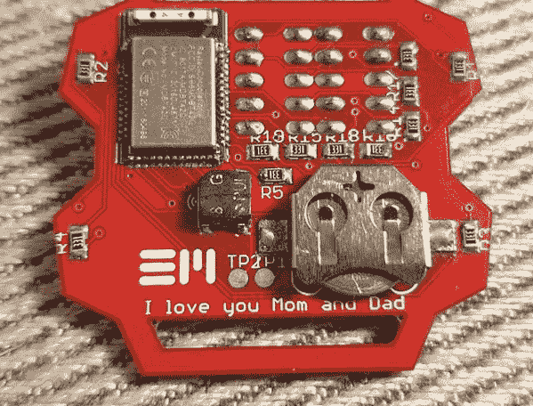

# 整洁智能(ish)手表制造使用 BLE

> 原文：<https://hackaday.com/2019/06/17/neat-smartish-watch-build-uses-ble/>

数字手表是一个非常好的想法，也是设计和构建低功耗电路的一个很好的实验方式。这就是[Eric Min]用这款 [neat 智能手表 build](https://iamericmin.github.io/tm4.html) 所做的。它基于 nRF52832 SoC，可以完成所有繁重的工作，包括连接到智能手机以获取更换电池的时间。它还有相当数量的发光二极管，这对任何这类项目都很重要。

[Eric]坦率地承认，他的原型仍有一些问题需要克服。首先，显示器在使用中容易变暗，这可能是因为 3V 的锂硬币电池在放电时实际上输出的电量比这个数字要少一点，而显示器的设计工作电压最低为 3V。对于下一个版本，他正在考虑使用 3.7V 的锂聚合物电池和 3.3V 的调节器，这应该能够更容易地驱动显示器，并保持它漂亮和明亮。或者换一个漂亮的有机发光二极管或 T2 的显示器。

也许我们最喜欢这个 17 岁少年设计的特点是印刷电路板背面的号召:“我爱你们，妈妈和爸爸”。嗷。我敢打赌你的 Apple Watch 没有那个吧？