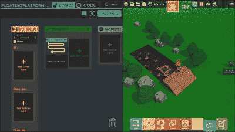

# 游戏构建器让孩子们——甚至是大孩子——构建游戏

> 原文：<https://hackaday.com/2019/06/17/game-builder-lets-kids-even-old-kids-build-games/>

在拥有一台 TRS-80、Commodore 64 或类似老式电脑的美好时光中，一个必经之路就是编写自己的游戏。它可能不会很好，但也不会比外面的大多数东西差太多。今天，试图让一个孩子对“猎巫”感兴趣可能是行不通的，让他们创造一个现代外观的游戏是不可能的。或者是？伪装成一个游戏本身， [Game Builder](https://store.steampowered.com/app/929860/Game_Builder/) 提供了一种互动的方式来创建有趣的游戏，而不必过于详细地编程。另一方面，它支持 JavaScript，所以如果你需要或者想要，你可以开始编程。我们可以很容易地看到一个孩子——甚至是一个成年人——轻松地使用这个来自谷歌的[免费游戏进行编程。](https://blog.google/technology/area-120/create-3d-games-friends-no-experience-required/)

在过去，硬件是一个限制因素，Basic 很容易生成一些文本或粗糙的图形。我们最喜欢的是猜你的号码的高低游戏。但是每个人都有一些他们自己创造的小游戏，所以他们说他们可以。然而，今天的游戏有很好的图形、音乐和 3D 图形，还有一大堆你在那时不必应付的东西。不过，Game Builder 让它变得非常简单。你可以自己开发一个游戏，也可以和朋友或者普通大众一起开发。参与的每个人都可以玩游戏，但他们也可以编辑游戏。该工具在 Steam 下运行，因此即使它被标记为 PC 或 Mac，如果您正确安装了[Steam](https://steamcommunity.com/linux)，它也可以在 Linux 上运行。

## 玩编辑

播放和剪辑差别很小。您可以从模板或空白画布开始。在游戏过程中的任何时候，您都可以通过鼠标点击或 tab 键切换到编辑模式。如果你从空白模板开始，你会在一个大的绿色区域中得到四个玩家角色。但是你可以改变任何你想改变的东西。你可以隐藏玩家，改变他们的表现，甚至他们的物理。

当你进入建造模式时，你会在底部看到一个菜单，让你选择:创建，移动，旋转，缩放，地形，文本，逻辑或者编辑。大多数都和它们听起来的一样。你可以从大量的模型中进行创作，这些模型与 [Google poly](https://poly.google.com/) 相结合。地形模式就像《我的世界》，地板是用积木搭建的。逻辑菜单才是真正有趣的。

## 可能的

每个演员可以有许多卡片排列在面板上。例如，玩家可能有一个健康面板。里面的卡片会设定玩家有多少生命值，以及当没有生命值时该做什么。另一张卡可能会记录与带有武器标签的物体的碰撞，并使用它从玩家的生命中扣分。其他卡片控制运动、显示属性等等。有些牌有 if/then/else 逻辑，有些牌对碰撞、时间或游戏开始等事件做出反应。

在图中，你可以看到左边的一张卡片让右边的一个平台来回移动。每张卡的设置因其功能而异。在这种情况下，你可以控制速度，例如。

这些卡片背后实际上有 JavaScript，如果你想要更好的控制，你可以把它转换成。“编辑”菜单命令允许您设置演员的外观以及他们的物理特性。例如，你可以使物体变得沉重或不可移动。你可以决定它们如何反弹，以及你是否能推动它们。对于像人物和墙壁这样的常见项目，有一些方便的预设。

## 试试吧

这听起来有点复杂，但如果你做了教程，它真的很简单。好的一面是，如果你在游戏中看到你想知道如何建造自己的东西，你可以进入建造模式，看看背后的逻辑。事实上，其中一个演示只不过是用那种方式来看的东西。有一枚火箭要发射，有一棵树你可以用斧头砍倒。你甚至可以画岩石。

你可能会喜欢下面[Shojib]的视频，看看它是如何工作的，但更有趣的是直接加载并尝试它。第一个下面还有一个官方教程视频。这并不难掌握，尤其是如果你学习了教程和卡展演示。

通常当我们在这里谈论电子游戏时，我们指的是过时的东西。我们希望看到有人用它来做一些经典游戏，比如《太空入侵者》或者《T2》中的《吃豆人》。我们认为你能做到。

 [https://www.youtube.com/embed/fwQlO9vGKkU?version=3&rel=1&showsearch=0&showinfo=1&iv_load_policy=1&fs=1&hl=en-US&autohide=2&wmode=transparent](https://www.youtube.com/embed/fwQlO9vGKkU?version=3&rel=1&showsearch=0&showinfo=1&iv_load_policy=1&fs=1&hl=en-US&autohide=2&wmode=transparent)

 [https://www.youtube.com/embed/L1hpFRztQGY?version=3&rel=1&showsearch=0&showinfo=1&iv_load_policy=1&fs=1&hl=en-US&autohide=2&wmode=transparent](https://www.youtube.com/embed/L1hpFRztQGY?version=3&rel=1&showsearch=0&showinfo=1&iv_load_policy=1&fs=1&hl=en-US&autohide=2&wmode=transparent)

