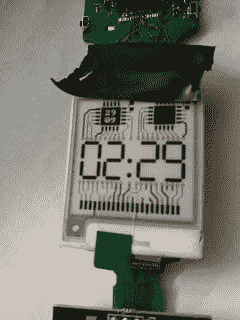
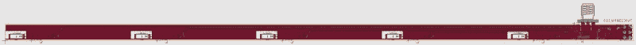
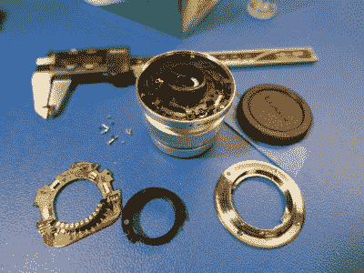
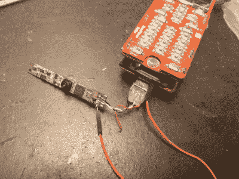

# 这些项目竭尽全力赢得柔性 PCB 竞赛

> 原文：<https://hackaday.com/2019/06/19/these-projects-bent-over-backward-to-win-the-flexible-pcb-contest/>

早在 3 月份，电话就发出了:拿出你最摇摆、最失败、最尺寸兼容的想法，向我们展示如果你能围绕一个柔性 PCB 设计它会有多好。我们甚至没有寻找原型；我们所需要的是一个想法，也许是一个草图，甚至是一个写在传说中的信封或鸡尾酒餐巾上的草图。

当我们去除这样的约束时，观察人们的反应是很有趣的。我们不得不说，柔性印刷电路板的应用范围之广，以及将它们设计到项目中所表现出的创造力令人难以置信。我们看到了从电路雕塑到可穿戴设备的一切。有些人非常实用，有些人则更有创造力。最后我们收到了 70 份参赛作品，有 60 份奖品要颁发，你的胜算永远是最大的。

现在，参赛作品已经过评估，获胜者也已确定，是时候看看你想出的让柔性 PCB 发挥作用的方法了。通常我们会在比赛总结中列出所有的获胜者，但是由于获胜者太多，我们无法一一列举。我们在这里只列出几个真正杰出的项目，但你真的应该查看一下获奖项目的列表，看看这种对灵活性的要求在我们的社区中带来了什么。

## 你可以戴的电路

“Schmartwatch” prototype, by Basti Neumann

正如预期的那样，相当多的参赛作品来自可穿戴设备领域。人体很少有平坦的部分，至少对我们大多数人来说是这样，而柔性 PCB 可以改变为传感器、致动器和显示器生产合身电子产品的游戏规则。[巴斯蒂·纽曼的“schmart watch”](https://hackaday.io/project/161901-schmartwatch#menu-description)是为了向 Pebble 手表致敬而设计的，它是一款永远在线的电子墨水显示屏，利用了专门用于表带的柔性印刷电路板。这是一款功能齐全的可穿戴设备，巴斯蒂已经开始小规模生产。

同样属于可穿戴设备类别的还有[压阻传感器元件](https://hackaday.io/project/164352-piezoresistive-sensor-matrix)，这是克里斯·科尔斯顿为优化假肢装配而发明的。正如我们[之前描述的](https://hackaday.com/2019/04/09/flex-pcbs-make-force-mapping-pressure-sensor-for-amputee/)，这个想法来自于看到一个朋友努力找到合适的假肢。他的朋友开发了一种单通道力传感器来测量残肢和假肢之间的压力，但克里斯将它提升到了一个新的水平。他的传感器矩阵使用 flex PCBs 和 Velostat 来构建肢体和假肢之间整个界面上的力的实时图像，这可能是获得舒适贴合的真正福音。

Chris Coulston’s piezoresistive sensor array helps with prosthetic fitment.

## 上升的是…

很少有领域像航空航天领域一样从电子设计的进步中受益，Eric Sims 为模型火箭设计的灵活 GPS 天线证明了这不仅仅局限于大型飞行器。虽然这个由五个 GPS 天线组成的阵列旨在保持 GPS 锁定并帮助回收火箭，无论火箭如何着陆，它都被设计成包裹在直径 4 英寸(10 厘米)的火箭管周围，但我们不确定 Eric 的火箭到底是不是玩具。我们非常喜欢每个天线都有自己的 LNA，并且可寻址的 RF 开关可以关闭天线以节省电能。

The long, long antenna Eric Sims designed to wrap around big model rockets. Click to embiggen.

## 灵活维修

Oops! Anthony Kouttron was able to repair this lens after he tore a flex PCB while cleaning it.

如今，打开笔记本电脑或电视，看到大量柔性印刷电路板，我们并不感到惊讶。这是有道理的，因为能够插入符合复杂形状的 PCB，并可以移动一点是现代设计的一个重要方面。Anthony Kouttron 从惨痛的教训中了解到，柔性印刷电路板并不是防弹的，因为他在尝试深度清洁心爱的相机镜头时撕裂了一块。由于无法找到维修零件，安东尼做了任何人都会做的事情:[他自己制作了替换的柔性印刷电路板](https://hackaday.io/project/165825-olympus-12mm-f20-lens-mount-repair)。

Dead laptop? The least you can do is harvest the camera before sending it off to e-waste.

与其说是修复，不如说是重新利用，我们真的很喜欢 [Arsenijs 的笔记本电脑网络摄像头再利用指南](https://hackaday.io/project/110436-laptop-webcam-reuse-made-simple)。报废的笔记本电脑多如牛毛，而且大多数都塞满了好东西。其中大部分与薄型柔性 PCB 连接器和线束相连。一旦你解放了相机，处理柔性印刷电路板和整理线路可能是一件苦差事。

## 恭喜你！

正如我们提到的，你赢得这场比赛的机会非常大。70 件参赛作品中的 60 件被选中，每个参赛作品都将从我们的赞助商 OSH Park good 获得一个代码，用于三个互补的 PCB。获奖者会收到电子邮件通知，其中包含兑换代码的说明。此外，我们向三个类别的参赛者提供了三张 100 美元的 Tindie 礼品卡:最佳项目、最佳文档和最佳社交媒体图片或视频。遗憾的是，我们没有通过社交媒体途径获得社交条目，所以我们无法授予礼品卡。但是 Madaeon 凭借他的无硅胶 DIY 柔性键盘获得了最佳文档奖，巴斯蒂的 Schmartwatch 获得了最佳项目奖。

祝贺所有柔性 PCB 竞赛的获胜者。我们希望竞赛规则通过规则的约束和自由来证明具有挑战性。我们没有失望。这里希望每个人都能看看新的[互联世界竞赛](https://wp.me/paBn4l-1wj3)。