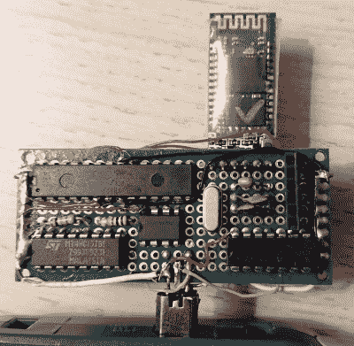

# 启动游戏男孩前进到蓝牙

> 原文：<https://hackaday.com/2019/06/21/booting-the-game-boy-advance-into-bluetooth/>

虽然 Game Boy Advance 可能不像它的前辈那样受人尊敬，但它可以说是“经典”手持游戏的巅峰，在 3D 和双屏出现之前。它最好的功能之一是所谓的多重引导模式，允许 GBA 从其链接端口下载程序。官方介绍了这一功能，这样你就可以和你的朋友一起玩多人游戏，即使他们没有游戏卡带，但很自然，黑客们很快就意识到你可以用它在未经修改的系统上运行任意代码。

【Shyri Villar】通过一个插件板很好地利用了这种能力，这个插件板[允许一个普通 GBA 被用作通用蓝牙 HID 控制器](https://github.com/Shyri/gba-bt-hid)。现在你可以在电脑上模拟 GBA 游戏，同时使用真实的东西作为输入设备。或者如果这对你来说有点多余，那么你认为任何 2D 游戏都可以从经典的游戏男孩控制布局中受益。

当系统上电时，板上的 ATmega328P 启动多重引导序列，并向其提供存储在 W25Q32 芯片上的 GBA 程序。一旦代码在 GBA 上运行，它就会通过相同的链接端口与一个常见的 HC-05 蓝牙模块进行通信。为了执行这种切换，[Shyri]使用 HCF4066 开关 IC 来改变连接器中的引脚分配，从用于上传 rom 的 SPI 到蓝牙模块的 UART 线路。

由于一切都由 GBA 的链接端口提供的 3.3 V 供电，以及一些软件细节，如存储蓝牙配对信息以供后续设备连接的能力，这实际上是一个非常实用的小工具。事实上，你可以在一个完全库存的 GBA 上做到这一点是非常令人信服的，特别是考虑到我们已经看到的一些以前的蓝牙游戏男孩的修改。诚然，市场可能有些有限，但通过定制的 PCB 和 3D 打印外壳，我们可以看到这可能是经典手持设备的流行配件。它不可能比[使用 GBA 作为你的万用表的远程显示器](https://hackaday.com/2015/02/01/give-your-multimeter-a-wireless-remote-display/)更合适。