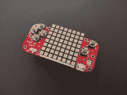

# PewPew 控制台将于 2019 年欧洲 Python 大会上亮相

> 原文：<https://hackaday.com/2019/06/21/the-pewpew-console-is-coming-to-europython-2019/>

EuroPython 是一个社区运营的开发者大会，始于 2002 年的比利时。2019 年，它将于 7 月 8 日至 14 日在瑞士巴塞尔举行，今年的与会者将有一个特别的惊喜。[与会者将获得一个供他们享受黑客乐趣的 PewPew 控制台](https://blog.europython.eu/post/185584014022/europython-2019-warning-spoiler-alert)！

An earlier version of the PewPew handheld. There have been many and varied revisions of the hardware.

我们以前在这些神圣的页面上介绍过这个项目；[更早的 PewPew 羽翼控制台](https://hackaday.com/2017/08/06/hackaday-prize-best-product-finalist-pewpew/)入围了 2017 年 Hackaday 奖最佳产品竞赛。在 EuroPython 上，与会者将会摆弄一个特殊的会议版本[，这是一长串开发版本](https://hackaday.io/project/159733-pewpew-standalone)的最新版本。它运行与 Adafruit Trinket M0 相同的微控制器 ATSAMD21E18A，可通过 CircuitPython 编程。会议版配备了一个 60 mm x 60 mm 的大型 LED 矩阵，以及一个带有蓝色按钮的橙色 PCB，以匹配活动的配色方案。

我们打赌与会者会喜欢在手持控制台上进行黑客攻击，它为任何不熟悉 Python 语言嵌入式开发的人提供了一个很好的平台。类似于徽章，它对顾客来说是一个很好的包装，会议应该会因此更加令人愉快！