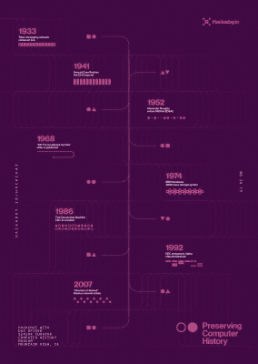

# 保存计算机历史黑客聊天

> 原文：<https://hackaday.com/2019/06/24/preserving-computer-history-hack-chat/>

加入我们太平洋时间 2019 年 6 月 26 日星期三中午与 [Dag Spicer](https://hackaday.io/DagSpicer) 的[保存计算机历史黑客聊天](https://hackaday.io/event/165331-preserving-computer-history-hack-chat)！

 在我们这个弹指一挥间就能获得人类全部知识的时代，博物馆似乎有点落伍了。但是，我们指尖上可用的信息往往只是冰山一角，像加利福尼亚州山景城的[计算机历史博物馆](https://www.computerhistory.org/)这样的机构致力于收集和保存信息时代的文物，捕捉制作它们的智力资本，也许更重要的是，提供背景并使一切都可以访问。

CHM 对于任何从事早期计算研究的人来说都是一个不可思议的资源。达格·斯派塞是 CHM 的高级策展人，或者用他自己的话来说是“首席内容官”。达格已经收集，编目，并监督世界上最大的计算机文物收藏近 25 年，他有一些故事要讲。他将在本周的 Hack Chat 上与大家分享，并回答大家关于计算机历史以及研究过去如何塑造计算未来的问题。

 我们的黑客聊天是 [Hackaday.io 黑客聊天群发消息](https://hackaday.io/messages/room/2369)中的社区直播活动。本周，我们将于太平洋时间 6 月 26 日星期三中午 12:00 坐下来讨论。如果时区让你烦恼，我们有[一个方便的时区转换器](https://www.timeanddate.com/countdown/generic?iso=20190626T12&p0=224&msg=Preserving+Computer+History+Hack+Chat&font=cursive)。

点击右边的那个发言气泡，你会被直接带到 Hackaday.io 上的黑客聊天群，不用等到周三；随时加入，你可以看到社区在谈论什么。