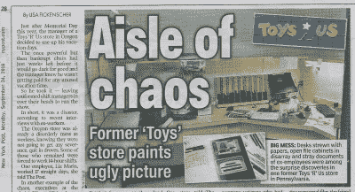
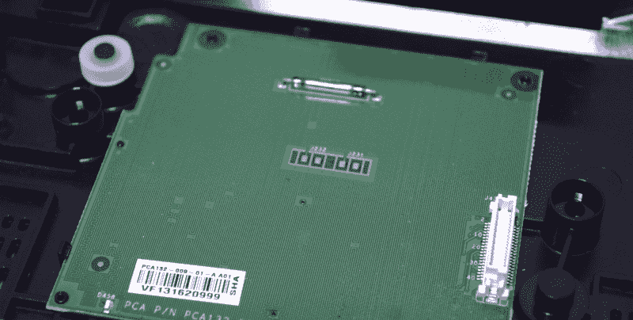
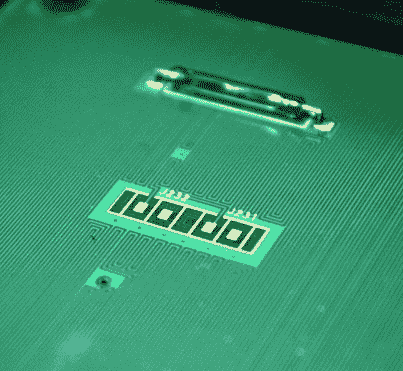
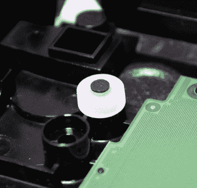
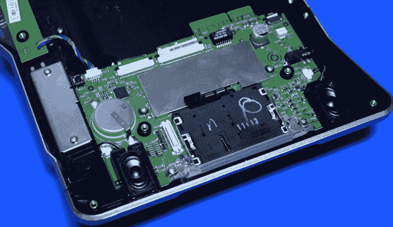
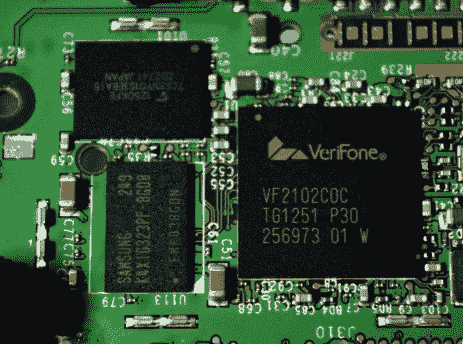
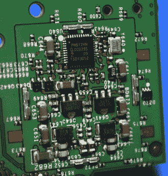
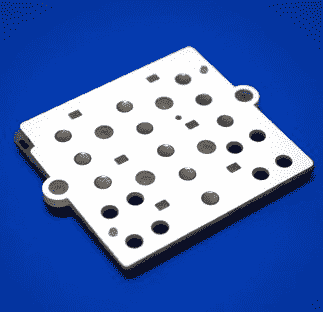
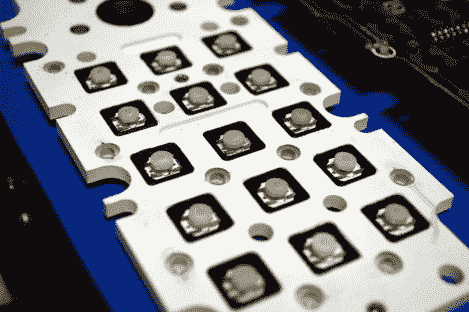
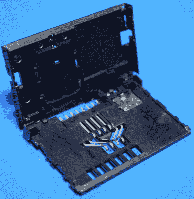

# 拆卸:VeriFone MX 925CTLS 支付终端

> 原文：<https://hackaday.com/2019/07/08/teardown-verifone-mx-925ctls-payment-terminal/>

经常阅读 Hackaday 的读者可能还记得，不到一年前，我有机会在新主人掏空大楼之前参观了一家关闭的玩具反斗城。尽管在这样一个场所最后的垂死挣扎中，它主办了习惯性的固定设备清算销售，但这个特殊的位置是值得注意的，因为留下了多少东西。现在，新的所有者有责任处理一个失败的零售巨头的所有碎片，从安全摄像机 DVR 和销售点系统到藏在后台办公室的员工医疗记录箱。

Clipping from New York Post. September 24th, 2018.

[由此产生的文章和附带的 YouTube 视频非常受欢迎](https://hackaday.com/2018/09/17/exploring-an-abandoned-toys-r-us/)，包括社保卡和驾照副本在内的员工信息被遗忘的消息甚至被《黑客日报》和《你真实的 T2》保密*在《纽约邮报》* 中提及。由于媒体的关注，发现其他几家商店的管理团队也同样玩忽职守，没有妥善处理玩具反斗城的设备和文件。

具有讽刺意味的是，我对 Hackaday 的好读者也有点失职。我从杰弗里的堕落城堡中解放了价值几车的设备，打算对它们进行一系列的拆卸，但已经九个月了，我没有任何收获。你可以在这段时间里生个孩子。顺便说一句，我做到了。也许这解释了优先事项的重新安排，但我不想找借口。你应该得到更好的。

废话不多说，我现在介绍我的玩具反斗城探险队的第一件硬件:VeriFone MX 925CTLS。这是一个相当现代的支付终端，拥有你所期望的所有功能，比如支持 NFC 和 EMV 芯片卡。当你在一家零售连锁店结账时，你很有可能见过其中的一个，或者至少是一些非常相似的东西。所以，如果你想知道吞噬你借记卡的机器里有什么，让我们来找出答案。

## 自毁程序启动

不幸的现实是，有一些非常聪明的人正在积极寻找“破解”像 VeriFone MX 925CTLS 这样的设备。我们都知道安装在支付终端外部的[卡“套卡机”,但从罪犯的角度来看，这种设备的最大弱点是你可以直接把它拉下来。理想的解决方案是将撇渣器硬件直接集成到终端本身，这样从外面就看不到它了。为了防止这种篡改，这些设备会利用各种技巧在有人试图打开机箱时自行关闭。](https://hackaday.com/2018/01/02/when-a-skimmer-isnt-a-skimmer/)

如果设备的背板被拆除，那么这个小 PCB 就会与主板断开连接，并且 VeriFone MX 925CTLS 知道它已经被打开。这很简单。但是，如果您仔细观察，会发现电路板上还有一个簧片开关和焊盘，与机箱内部的相应功能相对应。

因此，即使有人想出了如何在不破坏电气连接的情况下打开外壳(例如使用某种延长线)，这些功能仍然会在与设备的其余部分物理分离后跳闸。但在你走到那一步之前，连接到后面板螺钉的白色柱塞已经脱离了主 PCB 上的衬垫，提醒系统有人试图打开它。

  PCB detail, note the dense traces.  Plunger attached to one of the case screws.

但是，简单地在这个小板子上钻孔以接触下面的电子设备怎么样呢？这就是 PCB 上所有迹线的来源。钻透电路板总是会破坏痕迹，实际上就像正常触发防篡改系统一样。

如果我们计算这个电路板的物理断开，VeriFone MX 925CTLS 有五种不同的方式来检测它是否被篡改。尽管如此，如果我错过了几个，我也不会感到惊讶。如果你知道任何其他常用的技巧，或者即使你在这里看到一个被我忽略的技巧，请随时发表评论。

## 专为目的而造

在某种程度上，我很高兴 VeriFone MX 925CTLS 的防篡改系统在拆卸时使它成为了一个镇纸。这让我不必决定是否要重新组装它。因为这个设备要么打乱了它的内部存储，要么激活了某种软件标志来防止它被再次使用，所以我可以把它拆成零件，而不会有正常的罪恶感。

不幸的是，这里没有太多东西可以用在其他地方。其实几乎没有什么可以重复利用的。像这样的设备充斥着定制组件，你无法获得数据手册，即使你可以，也不是那种你可以在普通的 DIY 项目中使用的东西。但是我们仍然对建造它的工程感到惊讶。

特别值得一提的是 PCB 右侧的立体声扬声器和 3.5 毫米耳机插孔，对于那些视力有困难的人来说，这无疑是无障碍功能。在耳机插孔和中央 RF 屏蔽罩之间，您可以看到与前面提到的防篡改柱塞相对应的衬垫。射频屏蔽的左侧是一个笨重的 3 V 锂电池，用于为易失性存储供电。再往左，你可以看到厚厚的金属屏蔽覆盖着真正的磁条阅读器及其带状电缆，这无疑是保护设备免受攻击者试图通过钻穿外壳来访问敏感数据的另一种方法。

RF 屏蔽下的主要组件是 VeriFone 2102COC，这是某种类型的专有处理器。它与三星 K4X1G323PE 配对，这是一种通常在手机中发现的 128 MB DDR RAM 模块。旁边是一台东芝 TC58NYG1S3EBAI5，提供 250 MB 的 EEPROM 存储。电路板背面的另一个 RF 屏蔽下面是恩智浦 PN512，用于处理终端的 13.56 MHz 非接触式支付通信。

    

还有一些神秘的筹码。这些设备有清晰可辨的数字，搜索通常的供应商给了我购买它们的链接，甚至还有当前库存水平的报告；但是没有数据表，在许多情况下甚至没有描述它是做什么的。这让我相信它们可能是某种密码协处理器，我们这些凡人是不允许实验的。

## 像坦克或者阿帕奇一样

或许 VeriFone MX 925CTLS 最令人印象深刻的是它的坚固程度。聚碳酸酯外壳的下半部分扭曲的方式与砖块一样。里面的一切都是按照最高标准建造的，很明显，为了在相当恶劣的环境中尽可能长时间地使用这些东西，我们进行了大量的思考。普通客户正试图尽快完成交易，因此，期望不被戳戳戳戳打断的日常生活是痴心妄想。

由于键盘在正常使用过程中很可能会被滥用，所以发现它是一个异常重型的组件也就不足为奇了。事实上，键盘的设计与我去年从 AH-64A 阿帕奇的数据输入键盘中取出的[非常相似](https://hackaday.com/2018/04/30/milspec-teardown-ah-64a-apache-data-entry-panel/)。

  This is from a payment terminal.  This is from an attack helicopter.

这两个键盘似乎由非常相似的材料制成，并集成了弹簧加载的柱塞，提供了惊人的“咔嗒”响应。尽管我尽了最大努力，但我在两个键盘上都找不到任何可以证明它们来自同一家制造商的标记，但我们可以做梦。

## 学术经历

Fairly significant bummer

如果你一直在关注我之前的拆解，你会知道我经常强调[识别可能值得拯救的部分](https://hackaday.com/2018/01/22/teardown-christmas-laser-projector/)用于未来的项目。但在 VeriFone MX 925CTLS 的情况下，我不得不承认似乎没有什么值得保留的东西。

就个人而言，我最期待的组件是智能卡阅读器。虽然世界其他地方已经很熟悉这项技术，但在美国，它仍然是我们日常生活中相对较新的内容。我非常好奇，想看看其中一个阅读器的内部是什么样子，并幻想它可能是某种可以从终端提取的 I2C 或 SPI 设备。不幸的是，阅读器只不过是一块塑料，上面有一些灵活的手指推着芯片。

虽然这款设备没有什么特别的*材料*用途，但它仍然是我们大多数人日常生活中一件设备内部的启发性外观。如果你有机会拆开这样的东西，不要错过。你可能不会添加任何部件到你的箱子里，但是你肯定也不会空手而归。