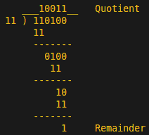
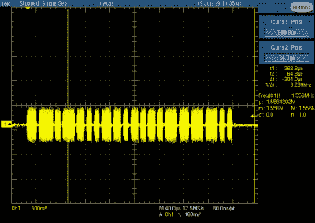
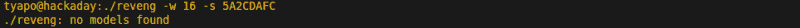
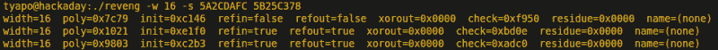
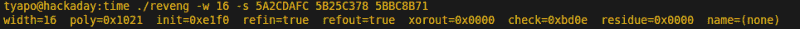

# 逆向工程循环冗余码

> 原文：<https://hackaday.com/2019/06/27/reverse-engineering-cyclic-redundancy-codes/>

循环冗余码(CRC)是一种校验和，通常用于检测数据传输中的错误。例如，每个给你带来你正在阅读的网页的以太网数据包现在都带有一个帧校验序列，该序列是用 CRC 算法计算的。任何未通过检查的损坏数据包都将被丢弃，丢失的数据将被检测到并由更高级别的协议重新发送。虽然以太网使用一种特别常见的 CRC，但还有许多不同的可能性。当你对一个包含 CRC 的协议进行逆向工程时，尽管它不是作为一种安全机制，但它可能会破坏你的计划。幸运的是，如果您知道正确的工具，您可以从几个示例消息中找出它。

最近在 [hackaday.io Hack Chat](https://hackaday.io/messages/room/2369) 上讨论了一个恰当的例子，其中【Thomas Flayols】寻求帮助对一些用于比赛计时的 RFID 标签的协议进行逆向工程。让我们来看看 CRC，它是如何被普遍使用的，以及如何使用[Thomas ' application]作为例子，对包含 CRC 的协议进行逆向工程。

## CRC 到底是什么？

CRC 是一种代码，旨在为消息添加冗余，以便可以检测到许多传输错误。有许多不同类型的代码可以以这种方式使用，但 CRC 的一些属性使其特别适用于通信协议。首先，它可以有效地在硬件或软件中实现。更重要的是，它特别擅长检测常见数据通道中常见的错误，尤其是一连串的位错误。使用 CRC 的最简单方法是将算法应用于要发送的消息，然后将结果 CRC 值附加到消息中。接收器应用相同的算法，然后检查传输的和本地计算的 CRC 值是否匹配。CRC 的长度各不相同，最常见的是 8 位、16 位或 32 位。

数学上，CRC 基于 GF(2)上的多项式除法，GF(2)是两个元素的伽罗瓦域。这涉及到许多有趣的数学问题，如果你想更深入地研究这个主题，一个简单的网络搜索就会找到大量的资源。但是，这是黑客日，我会试着给你足够的背景知识，让你能够攻击实际情况，所以我们开始吧。

简单地说，CRC 算法所涉及的多项式的系数只有 0 或 1。在二进制字符串和这样的多项式之间有一个简单的映射，其中每个设置位都变成一个以位的位置为指数的项。例如，二进制字符串 11011 可以表示为 x ⁴ + x ³ + x + 1。(作为助记手段，想想 x = 2。)为了计算一个 n 比特的 CRC，我们将 *n* 个 0 比特附加到我们的消息中，然后转换成一个多项式。然后，我们将该消息多项式除以作为 CRC 算法一部分的生成多项式。这种除法算法的多项式余数是 CRC。

## 计算 CRC

[](https://hackaday.com/wp-content/uploads/2019/06/crc-calculation-example_had.png) 好了，现在要讲得更有共鸣了。除法运算映射到一系列的异或运算，这将提醒你基本的算术。例如，要用生成多项式 11 计算消息字符串 1101 的普通 2 位 CRC，我们首先将 00 附加到消息中得到 110100，然后除以得到 10011 的商和 01 的(2 位)余数。这个余数就是 CRC。请注意，在长除法的每一步，都使用 XOR 运算，而不是我们更熟悉的借位减法。

如果您想编写自己的 CRC 实现，这一切都很有趣，但这可能是不必要的；您可以很容易地找到您选择的语言的实现。如果你想更详细地研究算法，[这里是一个开始](http://www.sunshine2k.de/articles/coding/crc/understanding_crc.html)的好地方。

## 并发症

除了生成多项式之外，还有四个描述通用 CRC 算法的参数。首先，输入字节可以被反映——从左到右交换比特顺序。也可以有 CRC 计算的初始起始值；这将被添加到消息的分割之前。除法运算之后，n 位 CRC 也可能被反映出来，最后，在使用之前，它可能与一个常数进行异或运算。虽然这些步骤中的每一个本身相对来说都是微不足道的，但是由此产生的可能的 CRC 算法的数量是巨大的；对于逆向工程的实际强力搜索来说太大了。

## 对 CRC 进行逆向工程

[](https://hackaday.com/wp-content/uploads/2019/06/rfid-tag-output.png)

RFID tag output

还记得托马斯和他的 RFID 标签吗？在示波器上检查了其中一个标签的射频输出后，他用二极管检波器、RC 滤波器和自制天线制作了一个简单的接收器。将接收器连接到 ESP32，他编写了一些代码，将接收到的脉冲发送回他的计算机进行分析。他发现，每个标签大约每 4 毫秒重复一次相同的 32 位信息。信息的 16 位可以识别为印在每个标签上的 ID 号，但每条信息的另一半是一个谜。

这种传输正是使用 CRCs 的原因。想象一下，如果标签 5 的消息在传输过程中发生了比特翻转，并作为标签 13 被接收。添加 CRC 可以检测到这个错误，并丢弃该消息——很快就会出现新的错误。但是，[Thomas]假设消息的剩余 16 位是校验和，现在面临的是确定哪一位。黑客聊天居民的第一种方法是尝试在线计算器来计算常见的 CRC 类型，但这并没有产生结果。虽然您可能很幸运地检查了最常见的几个 CRC 参数，但是这种方法不具有伸缩性。幸运的是，有一个有效的替代方案。

## crc 报复

对 CRC 逆向工程的研究为这项工作提供了合适的工具。[Gregory Cook]编写的 CRC RevEng 正是为了做到这一点:给定几个消息/CRC 对的例子，它可以确定所使用的 CRC 算法的参数。[Thomas]收集了许多标签的 id 和校验和，这里显示了其中的四个:

```
5A2C DAFC
5B25 C378
5BBC 8B71
5C0A 3EEC
```

为了执行搜索，使用“-s”开关调用 **reveng** 程序，在这种情况下，使用 CRC 的已知大小，“-w 16”。仅给定一个样本，程序无法确定哪个 CRC 生成代码:

[](https://hackaday.com/wp-content/uploads/2019/06/crc-reveng-1sample_had.png)

有了两个样本，程序确定了可能使用的三组参数:

[](https://hackaday.com/wp-content/uploads/2019/06/crc-reveng-2samples_had.png)

最后，给出三个例子，代码将搜索范围缩小到一组参数。

[](https://hackaday.com/wp-content/uploads/2019/06/crc-reveng-3samples_had.png)

从这里，相对容易验证这组参数也再现了[Thomas]可以访问的大约 40 个标记的剩余部分。确定 CRC 算法后，他现在可以生成自己的标签，或者可靠地从现有标签接收数据。

重要的是要记住，在这些消息中添加 CRC 代码并不是为了防止对手伪造传输。正如[Thomas]所指出的，由于标签不以任何方式同步，它们的开关键控信号很容易发生冲突，造成接收错误。检查接收到的消息的 CRC 为这种可能性提供了一些保障。

## 假冒的 CRC

CRC RevEng 代码还可以处理消息以生成所需的 CRC 值，这对欺骗很有用。程序称之为“反转”，该行为是通过“-v”开关调用的。这种用法要求您可以确定消息中的一个 *n* 位的部分，您可以更改该部分而不会产生负面影响——例如，一个被忽略的注释字段。如果可以在消息中找到这样一个连续的空格，就可以在那里替换一个值，使任何消息都具有给定的 CRC 代码。这在欺骗您需要以某种方式更改的数据包时很有用，同时保持特定的校验和值。

## 包扎

如果您发现自己在消息协议中面临一些未知的数据，考虑一下它可能是校验和的可能性。尽管许多 RF 协议对用户隐藏了这些值，但是如果你在最底层查看消息，你很可能会发现它们。如果你这样做了，记住有一个工具可以弄清楚发生了什么。