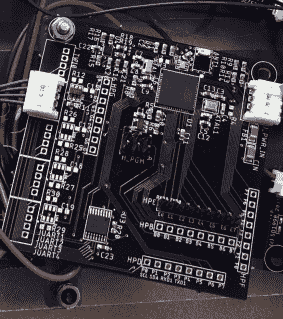

# 一个太阳能传感器盒可以使用 100 年

> 原文：<https://hackaday.com/2019/06/25/a-solar-powered-box-of-sensors-to-last-100-years/>

这是一个简单的目标:建造一个充满环境传感器的防水盒子，可以连续运行一个世纪。好吧，也许这并不完全“简单”。但是无论你如何称呼这个研究和记录我们称之为家园的星球的史诗般的探索， [[sciencedude1990]已经决定将他的任务作为 2019 年 Hackaday 奖的一部分。](https://hackaday.io/project/165980-solar-powered-wireless-sensor)

最终目标可能非常崇高，但是我们认为您会同意实现将复杂性降到了最低。如果这些太阳能传感器节点有机会走得更远，这是很重要的。已经做出了许多考虑到寿命的设计决定，例如用超级电容器取代只能充电几百次的锂离子电池，超级电容器应该在这个数字上加几个零。

 在最基本的层面上，系统中的每个节点都由光伏板、超级电容器和一个基于 ATmega256RFR2 的“主板”组成。这种单芯片解决方案不仅为 AVR 微控制器提供充足的处理能力来处理手头的任务，还提供集成的 2.4 GHz 无线电，用于将数据上传到本地基站。[sciencedude1990]在电路板上增加了 LSM303 加速度计和磁力计，但真正的功能来自外部“附件”电路板。

沿着主板的一侧有一排用于外部传感器的端口，每个端口都通过 UART 多路复用器连接到 ATmega。为了帮助控制能耗，每个外部传感器都有自己专用的负载开关；固件不会在需要的时候给外部传感器供电，即使这样，也只有在超级电容器有足够的电力来安全供电的情况下。现在[sciencedude1990]只有一个 GPS 模块被设计成插入主板，但我们非常有兴趣看看他(甚至可能是社区)还想出什么。

The [HackadayPrize2019](https://prize.supplyframe.com) is Sponsored by:     