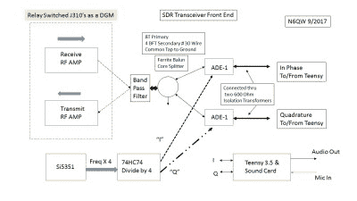

# 老式的 SDR 收发器

> 原文：<https://hackaday.com/2019/06/29/an-sdr-transceiver-the-old-school-way/>

软件定义无线电(SDR)为我们使用无线电的方式带来了巨大的变化。从你的调频广播接收机(现在很可能在芯片中嵌入了单一应用的 SDR 技术)到你在实验台上发现的无所不能的通用 SDR，对信号处理的控制已经从模拟领域转移到数字领域。可能性是无限的，一些制造收音机的老方法现在看来已经过时了。

[皮特·胡利亚诺 N6QW]是一位历史悠久的家庭自制收音机专家，他用他的 RADIG 项目证明了老式收音机在 SDR[中有很大的发展空间。这是一款用于 HF 的 SDR 收发器，它完成所有正交分频和与自制模块混频的工作，而不是更常见的将其隐藏在 SDR 芯片中的技术。这是一篇非常长的自下而上的日记格式的阅读，值得注意的是，他在大约三周的时间里从想法到工作 SDR。](http://www.n6qwradiogenius.us/)

A block diagram of the N6QW SDR

那么自制 SDR 包含什么呢？正如你所料，RF 前置放大器、滤波器和 PA 都是传统的，通过继电器在发射和接收之间切换。公共的发射和接收信号路径被分成两部分，并被馈送到一对 ADE-1 混频器，在那里它们与正交本地振荡器信号混合，以产生 I 和 Q，该 I 和 Q 被馈送到(或在发射的情况下来自)StarTech 声卡。本地振荡器是 SDR-Kits USB 驱动模块形式的 Si5351 合成器芯片，90 度相位正交信号由一组 74AC74 触发器作为分频器产生。

运行该节目是一个运行 Quisk 的 Raspberry Pi，尽管他在日记的开头提到使用 Teensy 来控制 Si5351，但从最终无线电的图片来看，Pi 似乎已经承担了这项工作。很明显，这是一个非常实验性的无线电，因为它是由木板上的有线模块组成的，所以我们期待着任何改进。这有一种设计的感觉，最终可以由许多其他无线电业余爱好者来建造，所以一开始就参与进来是令人着迷的。

如果我和 Q 在 SDR 技术方面让你喘不过气来，[也许我们能帮上](https://hackaday.com/2017/05/16/if-the-i-and-q-of-software-defined-radio-are-your-nemesis-read-on/)。

感谢[[Bill Meara N2CQR](http://soldersmoke.blogspot.com/)的提示！