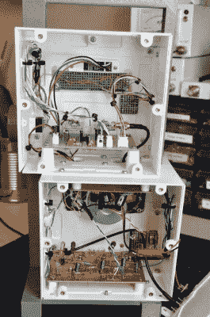

# 也接受 AM 和 SSB 的艺术作品

> 原文：<https://hackaday.com/2019/06/26/a-work-of-art-that-also-receives-am-and-ssb/>

整个冬天，[迈克尔·勒布朗]都在想，在那些漫长的黑夜里消磨时间的一个好办法就是自己动手打造一台直接变频接收机。他能够很容易地在网上找到这样一个项目的计划，但是按照说明去做有什么意思呢？最终的结果融合了他在网上找到的东西和他自己独特的调整和艺术风格。

 【迈克尔】将他的接收器基于由【阿什哈尔·法尔汉】创造的 DC40 的改进方法，这个名字[可能为业余无线电爱好者](https://hackaday.com/2017/03/14/ashhar-farhans-done-it-again/)的读者所熟悉。他进一步修改了设计，将音频放大器替换为 TDA2003A，并通过 Arduino 和 Si5351 时钟发生器安装了一个数字调谐器。有一个小有机发光二极管显示当前频率，这是用高品质的 Bourns EM14 光学编码器调整的，所以他可以在舒适和时尚的电波中冲浪。

数字调谐器与模拟 DC40 接收器配合使用，赋予了收音机有趣的双重性，[Michael]在他的音箱设计中充分体现了这一点。从实用的角度来看，他希望将系统的两个部分放在各自的盒子里，以尽量减少任何干扰，但 3D 打印的外壳将这种实用的考虑夸大成了一个有趣的话题。

模拟和数字隔间是歪斜的，它们的旋转控制在相反的两侧。如果不是因为整个零件都用螺栓固定在一起，并配有印刷零件的黄铜插件，收音机看起来可能会倒塌。顶部的集成提手不知何故让它看起来既复古又超现代。你很少能看到内部精心设计、外部美观的印刷外壳。[迈克尔]赢得了他的 3D 打印功勋徽章肯定与此有关。

 [https://www.youtube.com/embed/leUkEQRcJ3E?version=3&rel=1&showsearch=0&showinfo=1&iv_load_policy=1&fs=1&hl=en-US&autohide=2&wmode=transparent](https://www.youtube.com/embed/leUkEQRcJ3E?version=3&rel=1&showsearch=0&showinfo=1&iv_load_policy=1&fs=1&hl=en-US&autohide=2&wmode=transparent)

