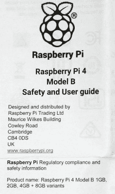

# 4 GB 是树莓派 4 的极限吗？

> 原文：<https://hackaday.com/2019/06/25/is-4gb-the-limit-for-the-raspberry-pi-4/>

所以，你已经冲到了你最喜欢的树莓酱经销商那里，拿到了你闪亮的新树莓酱 4。也许你正在焦急地等待着 postie，或者也许如果你足够幸运地住在剑桥附近，你只是漫步走进 Pi 商店，在柜台上买了一个。你拥有最好的 4 GB 型号，没有什么比在别人之前拥有最新玩具更好的感觉了。

A scan of the Pi 4 user guide, with a tantalising 8GB at the bottom.

你打开盒子，拿出圆周率，然后开始忙碌。说明书飘落到地板上，被忽视和遗忘。不过，如果你是我们的线人(埃里克·范·赞德沃特)，你会阅读它，注意到一些意想不到的东西，然后给你在 Hackaday 的朋友发一份扫描件。因为在没有人阅读的法规遵从性信息的顶部，有以下文本:

> 产品名称:树莓派 4 型号 B 1 GB，2 GB，4 GB + 8 GB 变种。

吸引他的不是缺少牛津逗号，而是诱人的 8 GB Raspberry Pi 4。有一天，我们会在这个系列中看到一款内存加倍的新机型吗？这样想就好了。

新产品问世时，会有一些不可避免的反应。一是刚买上一个的人都会不爽，二是总会有一群人说“*啊，别买这个，等超 duper 的升级款吧！*“我们想建议任何倾向于后者的人，这个消息不应该成为目前不购买树莓 Pi 4 的理由，因为 8 GB 版本的前景应该不会让任何人感到震惊。

Pi 人员将为他们的 SoC 配备尽可能多的地址空间，这是绝对有意义的，同样有意义的是，他们将为最终产品配备任何存储芯片，使其保持在目标价位内。如果你回想一下，你会知道这并不是第一次发生，早期的主板配备了 256 MB 的 RAM，但后来由于经济原因升级到了 512 MB。对圆周率琐事有极端了解的人也会知道，最初的 Model A 公布时是 128 MB，发布时是 256 MB，原因也是一样的。

还有一个问题，8 GB 会有那么大的区别吗？答案取决于你用你的 Pi 4 做什么，但值得记住的是，这不是高端工作站，而是一台单板计算机，为实验者提供了一个精简的 Linux 发行版。如果你正在推动计算努力的极限，你可能会感到失望，但大多数用户不会在 4 GB 模型上向 Raspbian 征税，即使他们安装了 Chromium 并打开了所有他们最喜欢的臃肿的社交媒体网站。也许我们已经被 x86 平台上的 Windows 的过度要求所限制，忘记了我们的计算机到底有多强大。毕竟，正如传说中的比尔·盖茨所说，“*的 64 万英镑对任何人来说都足够了”，对吗？*

我们可以期待一个 8 GB 的 Pi 4，然后在未来的某个时候。我们会把钱押在明年，因为 2020 年是闰年，2020 年 2 月 29 日将是圆周率的第~~2~~8 个生日，所以在那个日期前后进行推测是没有想象力的。但不要打赌，现在就把钱存起来买个 4 GB 的 Pi 4 吧。