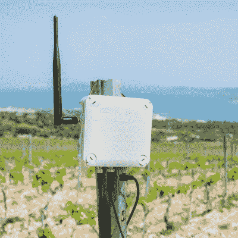

# Mitch Altman 通过 Hackaday 奖专家会议指导制造业

> 原文：<https://hackaday.com/2019/06/28/mitch-altman-mentors-manufacturing-with-hackaday-prize-expert-session/>

无论你做了什么，总有人做得更久，知道得更多。这是专业知识的基本前提，对于今年的 Hackaday 奖，我们推出了一系列导师会议。这些大师班将产品开发专家与 Hackaday 奖项目背后的人联系起来。我们一直在记录所有这些，所以每个人都可以从这些精彩的记录中获得建议、指导和指导。

The DrumKid, a random drum synthesizer

米奇·奥特曼应该是所有 Hackaday 读者都非常熟悉的人。他是 TV-B-Gone 的发明者，这种奇妙的设备可以在任何体育酒吧里同时把你变成英雄和恶棍。他是玉米田电子公司的总裁兼首席执行官，也是 T2 noise bridge 黑客空间的联合创始人。Mitch 是一名作家和教师，似乎在世界各地的几乎每一个会议和研讨会上都在宣传黑客空间、开源硬件和导师制度。

第一个见到米奇的硬件创作者是马特·布拉德肖，[drum kid](https://hackaday.io/project/164521-drumkid-aleatoric-drum-machine)的创作者。这是一个口袋大小的鼓机，灵感主要来自青少年工程公司的口袋运营商。几年前，Matt 开发了一个生成鼓声的网络应用，这个项目只是将这个想法带入了物理领域。对米奇来说，这是一片沃土；几年前，Mitch 也构建了一个基于 Arduino 的 synth，在很大程度上，Mitch 和 Matt 的项目非常相似。然而，马特的电路还有一些改进。电源是两节 AAA 电池和一个开关调节器，这会产生噪声并增加成本。Mitch 建议 ATMega328 可以直接使用三节 AA 电池，这样可以降低成本和噪音。

eAgrar, a system for monitoring conditions of plants and weather conditions at agricultural fields

下一个接受审查的项目是 eAgrar，一个用于监测植物状况和田间天气的系统。这个项目来自斯拉文·达姆扬诺维奇和马尔科·恰利奇。他们已经开发这种设备将近两年了，围绕 ATMega328 建立了整个系统。Slaven 在这个芯片上遇到了一个问题，他没有足够的输入和输出。固件已经写好了，但是感谢 Arduino IDE，没有理由继续使用那个 ATMega。Mitch 建议使用 STM32 或其他 ARM 内核。这就是他在他的一个合成器项目中使用的，你可以用和 ATMega 一样的价格得到足够多的输入和输出。

最后，我们来到约瑟夫，[和他的项目，普拉提改革者](https://hackaday.io/project/165674-pilates-reformer)。普拉提改革者是一种仅由三家公司制造的锻炼设备，每样东西都要花费数千美元。约瑟夫正在降低成本，但有一个问题:你如何建造 100 或 200 个这样的东西？米奇建议只需找到另一个制造商，可以建立这种设计，而不一定是一个建立普拉提机。这是有道理的——如果你所做的只是切割和连接结构梁，任何制造商都可以做到这一点，这就是制造商所做的。

这是我们今年系列 [Hackaday 奖导师会议的第三次](https://prize.supplyframe.com/)，我们还有更多需要编辑，还有更多需要录制。这并不意味着你不能从你的获奖作品中得到专家的帮助；我们正在寻找在项目上需要帮助的人，我们有[许多愿意提供建议的导师](https://hackaday.io/contest/164621-supplyframe-designlab-2019-hackaday-prize/log/163248-mentor-sessions)。如果你对有人在你身后监视感兴趣，[报名参赛](https://docs.google.com/forms/d/e/1FAIpQLSebsF7kT9FWRJs2MKrPvRZv5bx2eYmpc3N3aMSffP5Lk1tEcQ/viewform)。

[主图: [@matlman23](https://twitter.com/maltman23/status/684675471582314496) ]

 [https://www.youtube.com/embed/iKBau-dTc5Y?version=3&rel=1&showsearch=0&showinfo=1&iv_load_policy=1&fs=1&hl=en-US&autohide=2&wmode=transparent](https://www.youtube.com/embed/iKBau-dTc5Y?version=3&rel=1&showsearch=0&showinfo=1&iv_load_policy=1&fs=1&hl=en-US&autohide=2&wmode=transparent)

The [HackadayPrize2019](https://prize.supplyframe.com) is Sponsored by:     