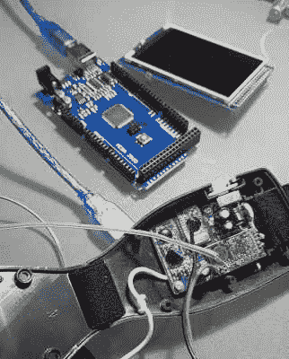
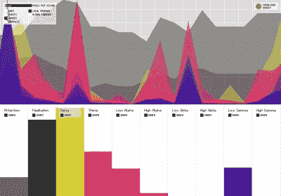

# 项目感知思考，打印诗歌

> 原文：<https://hackaday.com/2019/07/20/project-perceives-pondering-prints-poetry/>

如果你喜欢诗歌，这篇文章可能会让你相信，你的大脑比我们这些可怜的傻瓜更先进。[Roni Brandini]设计了一个系统，当你集中注意力时可以打印出一行行的诗。“心灵诗歌项目”使用了一种来自 Mattel 的 Mindflex 玩具的脑电图耳机，并将你的大脑信号传输到 Arduino Mega 2560。然后，该系统寻找表明注意力集中的脑电波模式。当你保持注意力集中时，系统会继续在一个小显示屏上打印出一行行的诗歌。

[Roni]通过接入 Mindflex 板上的数据传输引脚，遵循标准的 [Mindflex hack](https://hackaday.com/2010/04/08/hacking-the-mindflex-more/) 流程。PC817 提供光隔离，以确保墙壁电源不会意外渗入您自己的湿件。你可以只使用电池，但隔离仍然是一种最佳做法。

Arduino 大脑库用于破译信号。Mindflex 接收大约 1 赫兹到 50 赫兹的脑电波，这足以大致确定精神状态。例如，θ波在 4 Hz 到 7 Hz 的范围内，可以指示放松的、沉思的状态。低贝塔波的范围从 13 赫兹到 17 赫兹，表明一种警觉、专注的精神状态。Mindflex 系统也很慷慨，它提供了[衍生的冥想和注意力分数](http://www.frontiernerds.com/brain-hack)，范围从 0 到 100。

使用这种传感器和采样系统很难获得高水平的精度，所以代码使用了[Roni]的冥想分数、注意力分数和低 Beta 值的自定义配方。他发现最有效的方法是根据这些分数的关系来触发行动，而不是关注读数本身。例如，低β波和注意力分数的上升表明注意力集中。

如果佩戴者注意力集中，系统会在显示器上打印出几行诗，并绘制出三个数值的图表。作为一个额外的游戏化，它会告诉你在你完成这首诗之前你有多少次不能集中注意力。人们可以想象一个游戏试图通过打印其他短语或者甚至激活一系列机械干扰来打破注意力。

如果你不喜欢诗歌，你很幸运。“心灵诗歌”项目在处理脑电图耳机的信号和触发动作方面也取得了一些进展(双关语),这意味着你不必进入诗歌场景就能受益。你现在有了黑客的骨骼，可以让你用大脑肌肉和不用肌肉肌肉来控制事情。

为了获得灵感，看看其他一些 Mindflex 的技巧，让你用你的思维[点饮料](https://hackaday.com/2018/02/26/order-drinks-with-your-mind/)(推荐)[让人们大吃一惊](https://hackaday.com/2010/03/04/using-mindflex-to-shock-the-heck-out-of-people/)(不推荐)，甚至[绕着你的裙子](https://hackaday.com/2012/03/16/fashion-leads-to-mind-controlled-skirt-lifting-contraption/)(嗯……你做到了吗？).

 [https://www.youtube.com/embed/4xaHnI0rKp0?version=3&rel=1&showsearch=0&showinfo=1&iv_load_policy=1&fs=1&hl=en-US&autohide=2&wmode=transparent](https://www.youtube.com/embed/4xaHnI0rKp0?version=3&rel=1&showsearch=0&showinfo=1&iv_load_policy=1&fs=1&hl=en-US&autohide=2&wmode=transparent)

