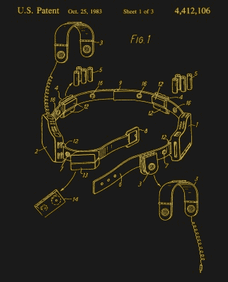

# 忘了随身听吧:是耳机

> 原文：<https://hackaday.com/2019/07/22/forget-the-walkman-its-the-headphones/>

四十年前的这个月，日本推出了一款产品，对消费电子市场产生了巨大影响，以至于我们今天仍在使用它的后代。故事是这样的，索尼的一位创始人在出差时会听音乐，他发现公司现有的产品既笨重又笨拙，于是要求他的工程师设计一些更方便的产品。

由此产生的原型成为索尼 MDL-3L2，这是一套小型化的高保真耳机，配有独特的泡沫耳塞和滑动金属头带，总重量为 45 克，令人惊讶地纤薄。它配有一个名为“Walkman”的卡式播放器，该播放器是从该公司现有的面向记者的录音机中衍生出来的，销量达数百万。耳机市场再也不会像以前一样了，如果你有一套轻便的易拉罐，那么这就是它们革命性的前身。

## 但是打住，耳机有什么特别的？

你可能没有听说过在各种报道中用这些术语描述的随身听 40 周年纪念日，因为人们记住的当然是便携式音乐播放器的社会影响，而不是它的耳机。制作混音带的快乐，在公共汽车上听人类联盟的快乐，以及成年人不赞成任何涉及孩子玩乐的事情的快乐。以前，音乐是一件静态的事情，需要笨重的唱机，但现在它可以被带到任何地方。那个时代的另一个年轻人的音频标志——音箱，根本无法与随身听相媲美，而*每个人*都想要一个。

The famous Stereobelt , from US patent [US4412106A](https://patents.googlea.com/patent/US4412106).

但从技术角度来看，随身听本身并不是使个人音频成为可能的突破，相反，轻便的耳机才是主要事件。即使在 1979 年，小型卡带播放器也不是革命性的，自从荷兰电子巨头飞利浦在 20 世纪 60 年代初推出听写机以来，我们都习惯的[小型卡带](https://en.wikipedia.org/wiki/Cassette_tape)格式就一直存在，随后是那个年代末推出的[微型卡带](https://en.wikipedia.org/wiki/Microcassette)和[微型卡带](https://en.wikipedia.org/wiki/Mini-Cassette)格式。在本世纪初，一位德国发明家已经生产出了一种他称之为“[立体声带](https://en.wikipedia.org/wiki/Stereobelt)的微型卡带播放器，并申请了专利，不可避免的是，不久之后，一家大型制造商将会生产出一种随身听大小的消费设备。

另一方面，1979 年，第一款随身听附带的轻质高品质耳机是一项真正的创新，也是个人音频成功故事中值得庆祝的组成部分。这场秀的真正明星是 MDL-3L2，所以也许是时候庆祝它所代表的东西，而不是它四四方方的马具。

2019 年，我们已经习惯了极简主义和口袋大小的电子设备，因此，为了真正理解一套轻量级耳机的影响，值得回到 20 世纪 70 年代，体验一次截然不同的消费科技。高保真音响在传统上是一种尊贵的物品，没有所谓的“音乐中心”高保真音响组合的木材和拉丝铝，任何客厅都是不完整的。对年轻人来说，音乐意味着卧室里有一台独立的唱机，一台随身携带的卡式录音机，或者一台 AM 便携式收音机，如果音量太大，父母随时都有可能发怒。耳机——至少是你买得起的那种——是笨重的塑料玩意儿，就像你祖母对室内装饰的品味一样酷，而且*当然*你不会在任何有人可能看到你的地方戴着它。任何轻量级的东西听起来肯定不好，任何听起来好的东西都超出了合理的预算。在随身听发布后，新的轻便随身听变成了*酷*，一种不听的时候经常戴在脖子上的必备时尚物品，这本身就是一种时尚宣言。很少有青少年拥有索尼原版音乐，这并不重要，这给了他们对音乐消费的自主权，他们热情地抓住了这一点。

## 足够的文化影响，手机本身呢？

[![A typical modern headphone transducer, with a rare-earth magnet, and coil suspended on a polyester diaphragm. Iain Fergusson [CC BY 2.5]](img/341c83943bb51b6c05d37de3f2c19da8.png)](https://hackaday.com/wp-content/uploads/2019/07/Headphone-transducer.jpg) 

一个典型的现代耳机换能器，带有一个稀土磁铁，线圈悬挂在一个聚酯振膜上。Iain Fergus son[[CC BY 2.5](https://commons.wikimedia.org/wiki/File:Headphone-transducer.jpg)]

令人惊讶的是，在研究这件作品时，事实证明很难找到关于 MDL-3L2 的任何信息，尽管它出现在第一款随身听的许多图片中，但它总是被顺便提及是索尼另一个设计团队的产品。早期型号的特点是蓝色和银色的设计，以匹配第一个随身听，在后来的型号和它们的副本中，你会发现一个有弹性的金属头带，每个耳朵都有一个较短的弹性滑块，位于塑料头带中。与后来的类似手机不同，它们有一根非常长的电缆，3 米似乎太长了。

因为个人立体声耳机被认为是便宜的，几乎是一次性的物品，似乎没有人把一副耳机拆下来放到网上。但由于轻质结构在几十年来几乎所有低价耳机中都很常见，因此我们可以通过查看最近的耳机驱动器来了解 1979 年是什么让它们变得特别。它们是所谓的动态耳机，其中由放大器供电的线圈直接固定在振膜上，并漂浮在磁场中。几乎所有不贵的耳机都是动态设计，几十年来，它们已经证明了自己制造成本低、可靠、高性能。索尼使用稀土磁体取代了更重的铁氧体磁体，这种磁体在早期的设计中很受欢迎，并在开放式硬质塑料框架上搭配了聚酯振膜。前面覆盖着那些独特的泡沫垫，而开放的背部导致音乐泄漏到周围环境中。这些功能多年来一直是耳机的标准，但在 20 世纪 70 年代，对于消费级产品来说，这些仍然是舶来品。

在第一台随身听推出后的几年里，个人立体声设备市场爆炸式增长，电子产品市场的每一个玩家都加入了进来。最初的索尼耳机被复制并变得更便宜，到 20 世纪 80 年代中期成为一种通用产品，你仍然可以花大约两美元买到这些橙色泡沫垫。它们发展成为入耳式设计，然后在进一步发展成为耳塞之前完全不用头带。但是所有这些个人音频产品都要归功于单一的祖先。不是第一个随身听，而是它的耳机，索尼 MDL-3L2。40 岁生日快乐！

标题图片:来自日本东京的 Yoshikazu TAKADA[[CC BY 2.0](https://commons.wikimedia.org/wiki/File:First_Walkman_1979_(31011124386).jpg)]