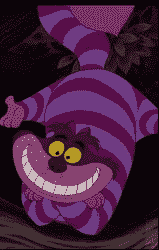

# 旧光盘制造出令人难以忘怀的彩虹漩涡

> 原文：<https://hackaday.com/2019/07/10/old-cds-create-a-haunting-rainbow-vortex/>

在西方文化中，20 世纪 60 年代是一个巨大的社会和政治动荡的时代，也是迷幻亚文化的开端。这导致了一种艺术风格，由明亮的色彩和多变的设计组成。[【Afraser-kru CK】建造了一个能够产生美丽彩虹光图案的装置，他称之为梅斯麦眼](https://www.instructables.com/id/Mesmer-eyes-Rainbow-Vortex-Slider/)。

Unnerving, to say the least.

该设备使用两张去掉反光涂层的光盘。这留下了塑料层，它看起来像是一个圆形衍射光栅。通过将手电筒发出的光穿过光盘，可以产生炫目的彩虹漩涡，如果再加一张光盘，效果会更好。可以通过改变圆盘之间的距离以及手电筒来移动和改变图案。这是通过使用一个在 PVC 管上滑动的滑板来实现的，滑板上装有每个单独的元件。

这是一种我们从未见过的建筑，模仿著名的柴郡猫，被很好地用作令人毛骨悚然的万圣节装饰。这是一个我们迫不及待要解决的问题，我们想知道把它变成一个投影或者更大规模的设计会有多困难。

令人毛骨悚然的眼睛仍然是万圣节的主要特征；我们之前已经介绍过了。休息后的视频。

 [https://www.youtube.com/embed/83myrMObHVQ?version=3&rel=1&showsearch=0&showinfo=1&iv_load_policy=1&fs=1&hl=en-US&autohide=2&wmode=transparent](https://www.youtube.com/embed/83myrMObHVQ?version=3&rel=1&showsearch=0&showinfo=1&iv_load_policy=1&fs=1&hl=en-US&autohide=2&wmode=transparent)

