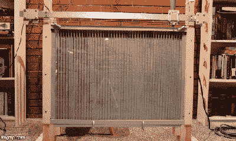

# 用这个能滴下彩虹糖的像素艺术机器人画出彩虹

> 原文：<https://hackaday.com/2019/07/12/paint-the-rainbow-with-this-skittle-dropping-pixel-art-robot/>

我们黑客就是无法获得足够多的糖果分类器，比如彩虹糖和 M&Ms，后者在分类和可吃性方面显然是更好的糖果。然而，分类并不仅仅是拿一个每种颜色的漏斗，然后堆成整齐的单色堆。[JohnO3]注意到所有这些五颜六色的糖果会成为漂亮的像素艺术，所以他建造了一个机器人来一次一个彩虹糖地构建图像。

 这款机器被称为“Pixel8R ”,是根据一袋彩虹糖中的八种颜色命名的，它有点大，上面有每种颜色的漏斗，下面有一个“画布”,上面有彩虹糖大小的通道和一个透明的丙烯酸盖。每个料斗都有一个带孔的转盘，每次将一个彩虹糖计量到一个漏斗中，该漏斗连接到一根沿帆布顶部移动的管子上，每次移动一根柱子。[JohnO3]开发了一个软件工具链，使用 GIMP 和 Python 脚本从图像文件到彩虹糖，图像一次建立一行，直到放置了 2760 个彩虹糖像素。

缺点:将彩虹糖分类到漏斗中。[JohnO3]现在手动完成这项工作，但我们希望看到像[这个](https://hackaday.com/2015/09/08/only-eat-red-skittles-weve-got-you-covered/)这样的分拣机位于料斗上方。或者，他可以换成 M & Ms，订购[单色包](https://www.mms.com/en-us/shop/single-color)。但是这有什么意思呢？

[通过 [r/arduino](https://www.reddit.com/r/arduino/comments/cazo9x/a_machine_that_creates_images_using_skittles_as)