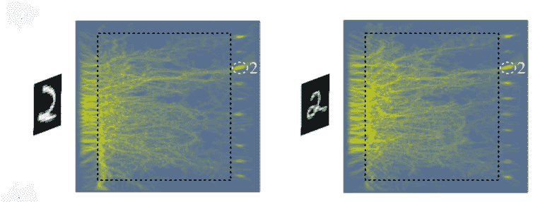

# 玻璃中的神经网络不需要电源，可以识别数字

> 原文：<https://hackaday.com/2019/07/16/neural-network-in-glass-requires-no-power-recognizes-numbers/>

我们都已经接受了由神经网络来完成诸如手写识别之类的工作。这些基础已经存在多年，最近计算能力和并行处理的增加使它成为一项非常实用的技术。然而，在核心层次上，它仍然是一台数字计算机，就像任何其他程序一样移动位。威斯康星大学、麻省理工学院和哥伦比亚大学的研究人员开发的新神经网络却并非如此。这种特殊玻璃[面板不需要电力，能够识别灰度手写数字](https://www.osapublishing.org/prj/abstract.cfm?uri=prj-7-8-823)。

玻璃包含精确控制的夹杂物，如气孔或杂质，如石墨烯或其他材料。当光线照射到玻璃上时，会出现复杂的波型，玻璃上十个区域中的一个区域光线会变得更强。每个区域对应一个数字。例如，这里有两个光在玻璃上识别一个二的图案的例子: 

利用 5000 幅图像的训练集，网络能够正确识别 1000 幅输入图像中的 79%。该团队认为，如果他们允许对玻璃制造放松限制，他们可以做得更好。他们从非常严格的设计规则开始，以帮助获得一个工作设备，但他们将评估在不增加生产难度的情况下提高识别率的方法。该团队还计划创建一个 3D 网络。

如果你想了解更多关于传统神经网络的知识，我们已经看到了大量的入门项目。如果 TensorFlow 难以下咽，试试这些 [200 行 C 代码](https://hackaday.com/2018/04/08/tiny-neural-network-library-in-200-lines-of-code/)。