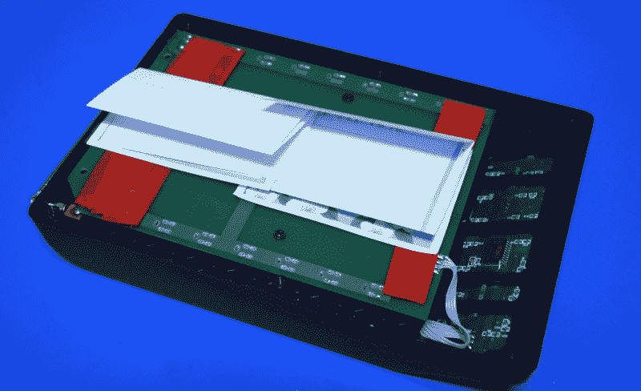
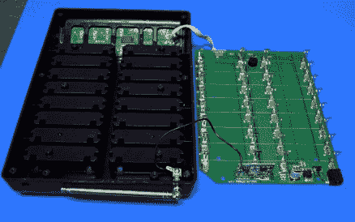
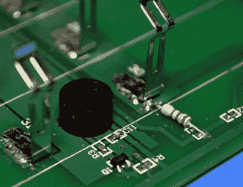
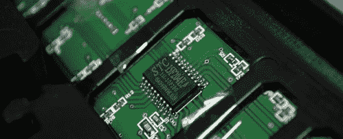
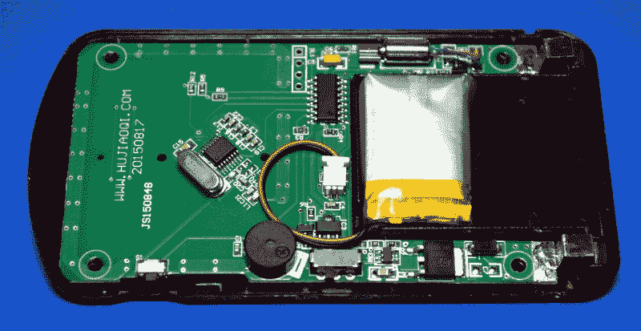
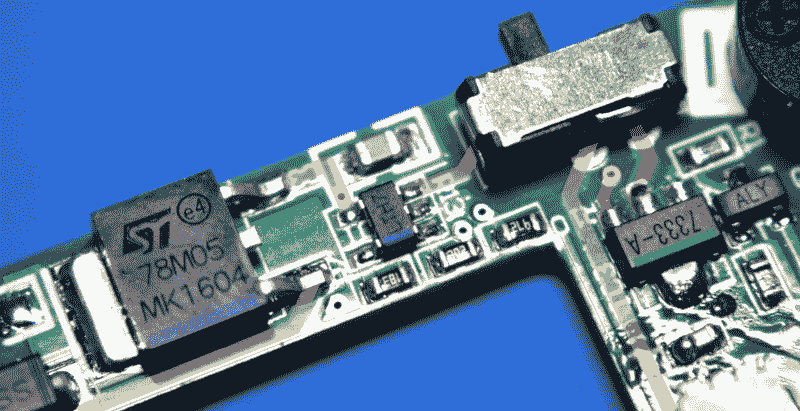
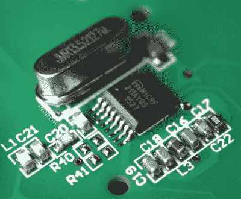

# 拆卸:Catel CTP300 餐厅寻呼机

> 原文：<https://hackaday.com/2019/07/30/teardown-catel-ctp300-restaurant-pager/>

我有一个问题。如果我去一个旧货交易会，或者甚至是一个存货特别多的庭院甩卖，我会觉得有必要买些东西。尤其是如果那个东西碰巧是一个古怪的电子产品。虽然总的来说，我是一个没有什么恶习的人，但我就是不能放弃一笔好交易；如果它上面有一堆按钮、发光二极管和天线，就更是如此。

Table for one, by the window.

几个月前，我花了 20 美元买了一套 Catel CPT300 餐厅传呼系统，原因就在于此。你可能已经猜到了，我不是开餐馆的。事实上，由于我的许多食物都是在电脑前吃的军用口粮，我尽可能远离餐馆老板。但是我被整齐地排列在充电座和基站组合中的一排排小塑料寻呼机迷住了，所以我必须拥有它。

卖它的人发誓说这个系统运行得非常好。甚至在他插上电源后，它什么也没做。但外表可能具有欺骗性，他保证所有的寻呼机都需要充好电才能恢复使用，这在我看来很有道理。当然，这无关紧要。普通的黑客读者在这一点上知道 CPT300 的命运是一样的，不管它是否工作。

顺便说一句，那些可爱的小寻呼机在充好电后不会突然恢复活力。他们很可能突然爆发出*某种*的东西，但我们一会儿就会讲到。现在，让我们来看看一个我们大多数人都曾经使用过，但很少有人有机会解剖的小工具。

## 但是首先，一个谜

CPT300 基本单元的外部没有太多可看的。顶部有 16 个为寻呼机充电的插槽，前面有一个简单的薄膜键盘，可以让您选择要向哪个单元发送信号。由于外面没有任何其他有趣的东西，我直接移除了构成设备底座的重金属板。

I didn’t *plan* on stealing the Declaration of Independence today, but here we are.

里面有几页折叠起来的便条纸，还有一条健康的红色绝缘胶带。大概是 PCB 在底座的金属板上短路了，所以有人进去加了一点绝缘材料。纸片是空白的，除了一张写着街道地址和电话号码的纸片。

地址上没有城市和州，但电话号码的区号显示是在纽约的布鲁克林。我们在离康尼岛木板路一个街区的一栋公寓楼里。假设 CPT300 没有在那里使用可能是安全的，但如果我们允许我们的想象力漫游一下，也许住在公寓里的人从这个设备来自的餐馆点了一些外卖。也许写有地址和号码的纸条，以及它后面的几页空白页，后来引起了某个人的注意，他正在寻找绝缘体来修复他们寻呼系统中的间歇性短路。当然，我们永远无法确定，但更奇怪的事情已经发生了。

## 一个基本的基地

随着这一轮调查的结束，我开始着手拆卸 CPT300 的底座。但事实证明，在谷歌地图上浏览布鲁克林的餐馆可能更令人兴奋。这种设备的设计和执行很容易被视为原型或某人的个人项目，并配有溢出的焊料和电阻器。

    Fine craftsmanship abounds

功能上，基站非常简单。在键盘下面有一个 STC15F204EA 微控制器，它读取按钮的状态，以查看用户想要唤醒哪个寻呼机。一旦您按下按钮，相应的二进制序列将被发送到位于充电板上的 bog-standard 433 MHz 发射机模块。一根简单的四线带状电缆将充电板与机箱上半部分的控制板连接起来。

    Common 433MHz radio module

这种带状电缆是连接逻辑分析仪以监听这两个设备之间通信的理想位置。使用 PulseView 中的开关键控(OOK)解码器，我们可以看到实际的二进制信号，该信号最终将通过无线方式发送出去，供寻呼机接收。

按下几个按钮并比较截取的二进制文件后，很容易找到设备标识符。只有最后 4 位发生了变化，这正好给了我们 16 种可能的组合；准确地说，每个 CPT300 基站支持多少个寻呼机。

## 膨胀的寻呼机

随着基站的彻底检查，是时候把我的注意力转向个人寻呼机了。如前所述，寻呼机即使在充电后也完全没有反应，所以我很好奇是什么让它们保持沉默。我的第一个假设是基站根本没有发射，但逻辑分析仪似乎表明它是。那么为什么传呼机没有反应呢？当我打开第一个寻呼机时，我有了答案。

如果你曾经使用过锂离子聚合物(LiPo)电池，你可能会立刻发现问题。没有的，给你个提示:电池不要像银棉花糖一样膨胀。

[我们之前已经讨论过所涉及的化学反应](https://hackaday.com/2017/09/18/the-science-behind-lithium-cell-characteristics-and-safety/)，但简而言之，一个不恰当的脂肪会经历电解质分解，使包中充满易燃气体，如氢气和氧气。所以这些电池不仅报废了，而且很危险，需要小心处理。我检查了其余的寻呼机，几乎所有的电池都有不同程度的肿胀。突然之间，20 美元似乎并不是什么大不了的事情。

那么什么是对脂肪电池的虐待呢？通常的罪魁祸首是过度充电或放电过深。因为所有的电池似乎都以同样的方式损坏，这让我相信传呼机的设计有缺陷。我的第一个想法是电池被过度充电，所以让我们仔细看看电源电路，并试图找出发生了什么。

沿着从左到右的黄色轨迹，我们看到传呼机的正充电板连接到 78M05 稳压器(用紫色标记)。与其把调节器放在充电器里，不如把低容量调节器放在每个寻呼机里，这样可能更便宜。因此，虽然基站充电轨上的电压因当前对接的寻呼机数量而有很大差异，但寻呼机中的 78M05 确保它始终有一个稳定的 5 V。从那里，它进入 LTC4054-LTH7(蓝色)，这是一个非常常见的锂电池充电芯片，设计为通过 5 V USB 运行。在 LTC4054 之后，走线连接到滑动开关的同一侧，直接进入电池连接器。

因此，充电器似乎组装得很好，但当寻呼机从基站上拆下来，电池开始放电时，会发生什么情况呢？当开关滑动到 on 位置时，我们从红色轨迹中看到，电源直接进入 7333-A 调节器(绿色),为寻呼机的电子设备提供 3.3 V 电压。这意味着只要开关打开，调节器和它供电的一切都直接连接到电池上。

在正常情况下，这不会真的是一个问题。电子设备可能一开始就不会消耗太多的电流，而且寻呼机每天晚上都会充电。此外，当电池接近其最低设计电压(通常在 3 V 左右)时，高质量的 LiPo 电池组上的内部电子设备应该切断。

但当我测试一些电池组时，有些已经降到了 1.7 伏。可能已经有几个月，甚至几年没有人试图给这些电池充电了。再加上糟糕的储存条件(比如把它们放在炎热的车库或阁楼里)，你就有了不可挽回的损失。

## 你现在能听到我吗？

除了一个小型爆炸装置，这些传呼机里面还有什么？不是很多。棋盘的一半是空的；很明显，这些设备的尺寸是为了方便用户，而不是必要的。每个寻呼机都有一个蜂鸣器、一排发光二极管和一个小型寻呼机电机供其使用，用于通知，Catel 网站上的文档说，你可以通过一系列按钮来配置它将使用哪一个。

I tip my crystal to you, m’lady.

有一个 16 针设备，显然是某种微控制器，但不幸的是，它完全没有任何标记。不过，它旁边有一个无人居住的四引脚接头，所以也许可以通过这种方式收集一些有趣的东西。顺便说一句，文档说你可以通过按住前面的一个小按钮来配对寻呼机，直到 led 开始闪烁，所以如果你想交换它们的号码，它们不需要物理地重新编程。

为了接收来自基站的信号，寻呼机使用工作频率为 433.92 MHz 的 Micrel MICRF211 接收机。值得注意的一件有趣的事情是，外部 13.52127 MHz 晶体的位置相当活泼。据我所知，这种安装方式是因为他们意识到它离 MICRRF211 和相关无源器件太近，可能会短路。他们没有重做板子，只是把水晶稍微翻转了一下。我检查了其他寻呼机，是的，它们都是这样的。

## 经验教训

我已经为传呼机订购了一把电池，一旦安装好，我相当有信心它们会恢复活力。当一切都恢复正常时，我认为 CPT300 将是一个有趣的主题，可以进行进一步的探索。具体来说，我想把它作为使用未知 433 MHz 设备的案例研究。例如，将电路板上的逻辑分析仪所见与软件定义无线电的空中捕捉进行比较。我的大部分拆卸都以一堆备件结束，但我认为这一个还有一些生命，所以请留意它的回归。

更重要的是，这次拆卸提醒你，当你拿起使用内部锂电池的旧设备时，你需要小心。没有检查电池组的健康状况就给这些寻呼机充电是一个错误，如果其中一个电池破裂，可能会引发火灾。因此，如果你正在寻找一个没有方便电池的有趣小工具，假设它已经没电了，直到你能够进入它并验证它可以安全使用。20 美元的旧物交换不值得你为此失去房子。