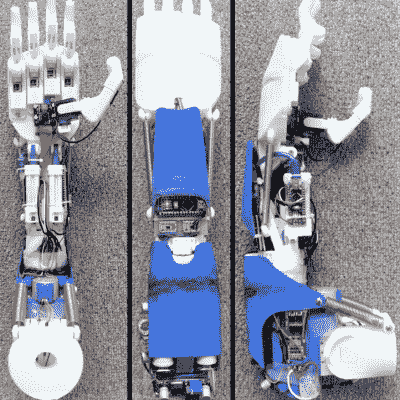

# 3D 打印假体读取你的思想，用它的手看东西

> 原文：<https://hackaday.com/2019/07/17/3d-printed-prosthesis-tracks-objects-moves-smoothly/>

随着时间的推移，业余爱好者的电子产品和机器人越来越便宜，也越来越容易制造，其中一个优势是可以负担得起假肢。一个很好的例子是[这个来自【Duy】](https://hackaday.io/project/165075-3d-printed-prosthesis-with-cv-bci-and-emg)的穿股假肢，他是今年 Hackaday 奖的参赛作品。

 拥有十个自由度，包括单个手指、两个拇指轴和足够的手腕运动以供手挥动，这本身已经是一个相当令人印象深刻的机器人内置。然而，这些功能并不止于此。整个假肢是模块化的，可以用于不同的配置，而且都是 3D 打印的，便于定制和制造。除了肌电传感器(这是这些假肢通常被控制的方式)，【Duy】还设计了用计算机视觉和大脑控制界面控制的手。

手掌中嵌入了一个摄像头，通过 CV 软件传递该信号，手可以识别并跟踪用户移动到附近的物体。这使得抓取更容易，因为每个物体所需的不同抓取模式可以编程到 Raspberry Pi 中来控制执行器。因为α波 BCI 可能无法为每个手指的全范围运动提供足够的识别能力，这就是计算机辅助可以帮助用户感觉假肢更自然的地方。

我们已经在这里看到了相当多的创意定制假肢，像[这个使用人工智能让用户用它播放音乐](https://hackaday.com/2018/01/08/ai-prosthesis-is-music-to-our-ears/)，还有这个[给它的用户一个纹身机器做附肢](https://hackaday.com/2017/01/04/the-cyborg-artist-tattoo-machine-arm-prosthesis/)。

The [HackadayPrize2019](https://prize.supplyframe.com) is Sponsored by:      

 [https://www.youtube.com/embed/EoCa1qWPuDo?version=3&rel=1&showsearch=0&showinfo=1&iv_load_policy=1&fs=1&hl=en-US&autohide=2&wmode=transparent](https://www.youtube.com/embed/EoCa1qWPuDo?version=3&rel=1&showsearch=0&showinfo=1&iv_load_policy=1&fs=1&hl=en-US&autohide=2&wmode=transparent)

