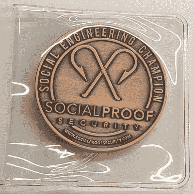

# 机场跑道和标签——如何成为一名社会工程师

> 原文：<https://hackaday.com/2019/08/23/airport-runways-and-hashtags-how-to-become-a-social-engineer/>

在每年因网络攻击造成的 1，170 万美元的公司损失中，估计有 90%是从支持人员的电话或聊天开始的，这表明人的因素显然是安全的一个重要方面，而大多数公司都严重缺乏安全培训。在开源情报(OSINT)和社会工程(social engineering)之间，有很多信息安全与强大的登录凭证或 VPN 无关，开源情报是指泄露给公共来源、等待收集的数据，社会工程是指操纵人们告诉你你想知道的东西。

如果你知道去哪里找，就可以得到很好的培训。我第一次听说 WISP(安全和隐私领域的女性)是去年 6 月在 Twitter 上，当时他们宣布了有史以来第一个 DEFCON 奖学金。作为 57 名幸运参与者之一，我有机会参加了我的第一次 DEFCON 和黑帽，并了解了他们的组织。

除了为安全会议颁发奖学金之外，WISP 还在开锁、安全研究、密码术和其他与安全相关的主题方面开办区域讲习班。他们最近在三藩市举办了一次 OSINT 和社会工程讲座，瑞秋·托巴(三次 DEFCON 社会工程 CTF 奖得主和 WISP 董事会成员)谈到了罗伯特·恰尔迪尼的说服原则及其在社会工程中的相关性。

恰尔迪尼是一名心理学家，因其关于说服是如何工作的著作而闻名，说服是社会工程学的核心技能之一。值得注意的是，虽然恰尔迪尼的原则被应用于社会工程的背景下，但它们也适用于其他说服手段，如在公开市场上以物易物获得更好的价格，或说服孩子吃完蔬菜。建议将其用于法律目的，并对目标产生积极的影响。让我们来研究一下托巴演讲的要点，看看我们是否能对这种工艺有所了解。

## 相互作用

一个最常见的网上约会技巧是从关于你自己的信息开始谈话。如果你向人们敞开心扉，他们中的大多数人可能会带着关于他们自己的信息回来。

随之而来的通常是一种社会责任感——如果有人为你买单，你会觉得下次外出时有义务为他们买单。同样，一旦你开始在电话中向客户支持人员提供关于你自己的信息，他们很可能会对谈论自己感到更舒服，在你们的谈话中尽早建立融洽的关系。这是真的，即使它是你为了浏览而编造的虚假信息——相当于电话钓鱼。

## 承诺和一致性

大多数人不喜欢对已经同意的事情反悔。以一种友好和有益的语气开始与你的目标的对话，会让你们接下来的对话保持同样友好的水平。温和的问题，比如问他们关于他们的宠物或者找到你们的共同点，是为未来建立一致性的最简单的技巧。

如果你从小处着手，做出微妙的承诺，你最终可以说服你的目标下载恶意软件或访问可疑网站。

## 社会证明

我们都倾向于信任更大的群体，尤其是如果这些群体是我们亲密的家人和朋友。即使一个陌生人与我们亲近的群体有关联，也会让我们立刻更加信任他们。

社交工程攻击中经常使用的一种技术是指名道姓地说出一个亲戚或同事的名字，作为获得目标信任的一种手段。万一目标开始追问比你准备的更多的细节，改变话题(“哦，我想我这边又有电话了……顺便问一下，我们刚才在聊什么？”)可以很好的避嫌。

## 爱好

对于面对面的社交工程攻击，模仿目标的肢体语言、节奏甚至用词可以让他们放松，让他们更加信任你。微妙的因素——有相似之处，给予他们赞美，与他们朝着共同的目标合作——会让你更讨人喜欢，从而更容易共事。即使是视觉攻击，使用你的目标使用的俚语，或者用和他们相似的语调说话，可以帮助你更有亲和力。

## 权威

斯坦利·米尔格拉姆是一位社会科学家，以关于人们服从权威人物的实验而闻名。他表明人们愿意服从一个穿着白大褂的权威人物，尽管他们被告知要做一些道德上有问题的行为。当你开始研究它时，你可能会惊讶于我们遵从权威的程度。人们更有可能遵循可信的专家和领导人告诉他们去做的事情。在公司环境中，如果指令来自老板或工作场所中比他们级别高的人，员工很可能会照做。

## 稀缺性和紧迫性

如果你在工作中催促某人，他们可能会不小心，犯更多的错误，这正是你作为一名社会工程师想要的。设置有利于这一点的情境——比如假装在机场等待你的飞机起飞，或者假装在一个有哭闹婴儿的房子里——可以让你的目标更容易接受你毫无疑问地告诉他们去做的事情。在下面的视频中，一名 DEFCON 社交工程师非常有效地使用了这种技术来执行 SIM 卡交换，并将记者锁定在他们的手机之外。

 [https://www.youtube.com/embed/bjYhmX_OUQQ?version=3&rel=1&showsearch=0&showinfo=1&iv_load_policy=1&fs=1&hl=en-US&autohide=2&wmode=transparent](https://www.youtube.com/embed/bjYhmX_OUQQ?version=3&rel=1&showsearch=0&showinfo=1&iv_load_policy=1&fs=1&hl=en-US&autohide=2&wmode=transparent)

## OSINT 策略

花在视觉或面对面社交工程攻击上的大量时间集中在提前收集信息。这包括社交媒体研究(一家公司 60%的敏感信息可以在公开的 Instagram 帖子上找到)、多金(对一家公司进行有针对性的搜索，以找到私人文件和信息)，以及挑选一个目标。

通常，通过搜索 Instagram 地理位置和标签找到的照片可以透露一家公司使用的操作系统、电子邮件客户端和防病毒软件等信息。它甚至可以泄露公司使用的座机电话和打印机型号、他们的办公室布局以及他们使用的供应商(可以通过欺骗来获取公司财务信息)。

很多时候，敏感文档会意外地进入搜索结果。Google dorking——执行搜索，如`site:google.com filetype:pdf`或`filetype:docx`以获取原本不打算公开的文件——可以帮助揭露公司内部文件和政策。这些可以帮助攻击者建立关于公司如何工作的一般逻辑，他们的 IT 和帮助台是如何构建的，甚至是公司内部使用的行话。

附件通常采用实际为公司工作的人的身份，使受害者更难通过快速搜索他们自称的人来发现社交工程攻击正在进行中。这可能伴随着一个伪造的电话号码(在网上很容易免费做到)。

研讨会以 OSINT capture-the-flag 结束，参与者团队被要求从开源信息中找到尽可能多的关于目标公司的信息。然而，实际上监视一家公司是违法的，除非采取法律措施来确保攻击是作为公司测试自身安全的一种方式。

## 后卫外卖

从一个辩护人的角度来看，这都是令人难以置信的惊人信息。优秀的社会工程师不仅很难与真正的员工、承包商或人力资源专业人士区分开来，而且他们还会配备一个信息工具箱，用来获得你的信任，并利用你直觉的安全感。

【via @ luza _ jara Millo】

对社交工程师不利的一个策略是要求回复电话或给他们发电子邮件。因为社会工程师通常会伪造他们的电话号码，一个快速的呼叫就会显示他们根本不是他们正在模仿的那个人。拥有一个礼貌的偏执对于面对客户的员工来说尤其重要，比如支持人员和 IT 专业人员。

此外，拥有受 2FA 保护的账户也很重要。在逮捕一名社交工程师的情况下，请求安全验证——就像要求他们回电话或电子邮件一样——可能是成为黑客攻击的受害者和在面对网络安全威胁时保持警惕的区别。

如果你有机会参加 DEF CON，我建议你参加一个公开的 SECTF 挑战。看着普通的竞争对手坐在一个玻璃盒子里，说服公司放弃他们最敏感的信息，以获得与“人力资源部门的莎拉”交朋友的机会，这是一种相当不错的体验。

 [https://www.youtube.com/embed/bjYhmX_OUQQ?version=3&rel=1&showsearch=0&showinfo=1&iv_load_policy=1&fs=1&hl=en-US&autohide=2&wmode=transparent](https://www.youtube.com/embed/bjYhmX_OUQQ?version=3&rel=1&showsearch=0&showinfo=1&iv_load_policy=1&fs=1&hl=en-US&autohide=2&wmode=transparent)

