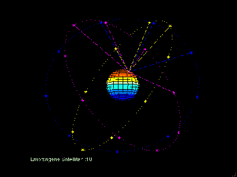
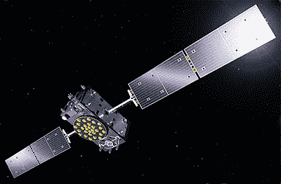

# 你可能没有注意到的神秘的全球导航中断

> 原文：<https://hackaday.com/2019/07/19/inside-the-mysterious-global-navigation-outage-you-probably-didnt-notice/>

自从第一颗全球定位系统卫星进入轨道以来的四十年左右的时间里，整个世界已经开始依赖卫星导航系统。现代经济建立在这样的假设上，即人和资产可以定位在地球表面上、表面上、甚至表面下一米以内或更好的任何地方。多年来，GPS 是实现这一目标的唯一途径，但数十亿美元已经投入到其他全球导航系统的部署中，实现了一定程度的独立于 GPS，并在停电时提供了一些急需的冗余，就像欧盟的伽利略系统最近遭受的那样。

Galileo 是一个针对高纬度地区优化的高精度公共访问定位系统，在撰写本文时，这个问题似乎已经解决。然而，欧盟对此次中断一直三缄其口，将调查其根本原因的工作留给了几个聪明的黑客，他们配备了特别提款权，并全面了解卫星星座如何利用广义相对论和狭义相对论的原理，将你指向最近的星巴克。

## 导航等等

伽利略背后的想法可以追溯到 20 世纪 90 年代末，当时欧盟内部的大国决定，全球导航卫星系统(GNSS)的运行主要是为了平民的利益，并且没有外国势力干扰的可能性，这将是一个明智的想法。该系统的基本结构结合了空间和地面要素，为所有用户免费提供 1 米的定位精度，无需担心大规模冲突前的军事先发制人。需要高分辨率定位的客户需要支付 1 厘米精度的加密信号，这使伽利略成为迄今为止最精确的本地 GNSS。其他功能包括搜索和救援能力，其中卫星星座侦听来自海上船只或野外徒步旅行者的紧急转发器的信号，派遣紧急响应者，并向发送者发送确认。

The Galileo constellation. Note the inclinations of the orbits, which are configured to ensure optimal coverage at higher latitudes. By [Lukas Rohr](//commons.wikimedia.org/w/index.php?title=User:Lrohr&action=edit&redlink=1 "User:Lrohr (page does not exist)") CC BY-SA 3.0

伽利略项目于 2003 年正式启动，但遭受了多年的资金问题，与美国等竞争对手在频率共享上的争吵，以及普遍的治理困境。这些问题最终得到解决，两颗实验卫星分别于 2005 年和 2008 年发射升空。这些用作测试和验证平台，一旦所有的盒子都被检查过，更多的卫星加入其中，地面站被建立，运行现代 GNSS 所需的基础设施被组装。

到 2016 年底，伽利略达到了早期运行能力(EOC)阶段，计划中的 30 颗左右的卫星星座中约有 18 颗在空中。EOC 是一种 beta 测试，早期采用者只能提供微弱的信号。尽管已经发射了更多的卫星——现在有 26 只鸟在轨道上——并且信号强度已经增加，伽利略还没有进展到完全运行能力阶段，或 FOC。这一过渡计划在 2019 年的某个时候进行。

## 是时候了

A Galileo Full Operational Capability (FOC) satellite. About 19 m span across the solar arrays. Source: The indispensible [Gunter’s Space Page](https://space.skyrocket.de/doc_sdat/galileo-foc.htm)

在其 EOC 阶段，伽利略遭遇了不止一个严重的问题。2017 年初，四颗卫星上的一些高精度时钟出现了问题，一些鸟的铷原子钟和氢脉泽时间标准都出现了故障。这引起了可以理解的骚动，因为这些钟应该有 10 年的在轨寿命。时钟问题没有导致任何服务中断或降级，因为每颗卫星都携带三个备份时钟，但它确实导致了一次重组和对尚未发射的硬件的审查。

虽然伽利略在时钟问题上相对毫发无损，但下次就没这么幸运了。今年 7 月 11 日，伽利略系统遭遇重大停机，26 颗卫星中有 24 颗被列为“不可用”，原因不明，另外两颗被列为“测试中”。虽然负责伽利略系统的欧盟机构 GSA 最初向客户发出建议，该系统将[谨慎使用](https://www.gsc-europa.eu/notice-advisory-to-galileo-users-nagu-2019025)，后来该系统将[完全不使用](https://www.gsc-europa.eu/notice-advisory-to-galileo-users-nagu-2019026)，但在系统启动后的至少四天内，他们并没有特别主动地说明中断的根本原因。即使现在他们已经宣布服务已经恢复，但除了“伽利略地面基础设施的设备故障引发的技术事故”之外，对此问题没有任何解释。

有效的沉默显然是美国总务署的政策，这取决于黑客试图确定伽利略发生了什么。众所周知，任何 GNSS 基本上都是一组需要仔细同步和更新的真正精确的轨道时钟，随着 GSA 承认问题源于地面部分，在那里寻找问题似乎是合乎逻辑的。

## 停留在过去

这就是无线电爱好者兼 GNSS 工程师 Daniel Estévez (EA4GPZ)使用 Lime SDR 接收器和 GNSS-SDR(一种用于查看导航卫星数据的开源平台)所做的事情。在一篇精彩的文章中，丹尼尔详细描述了他的发现。在中断期间，来自卫星的信号在信号强度和调制方面都很好，基本数据，如之前引起全球定位系统问题的[星期号](https://hackaday.com/2019/04/05/countdown-to-the-gps-timepocalypse/)都符合预期。但是在回顾星历表，或者每颗卫星的轨道描述时，他发现了一些奇怪的事情:这些卫星似乎对它们在太空中的位置有错误的想法。

所有卫星的轨道都会随着时间的推移而略有变化，并且由于 GNSS 接收机使用卫星发送时间信号时所处的位置来确定位置，因此需要精确地知道星历表。据丹尼尔所见，伽利略星座的星历表自 7 月 11 日以来就没有更新过——差不多是在退化开始的时候。由于卫星不知道它们在哪里，随着它们在 11 日离它们的位置越来越远，接收器计算的定位解变得越来越差。

丹尼尔的数据与伽利略内部的匿名消息来源一致，他认为“意大利 PTF[精确计时设备]的问题”是中断的根本原因。PTF 是整个星座的星历表的来源，如果那里有问题，它肯定会以我们看到的方式显现出来。美国总务署还没有正式证实这一点，但鉴于他们在上周一直守口如瓶，不要屏住呼吸等待更多的信息。

最终，普通的伽利略用户可能根本没有注意到断电，因为大多数支持伽利略的手机也支持 GPS 和 GLONASS。只要地球上的每个人都和睦相处，每个系统都是其他系统的备份，在这种故障情况下，这是一种受欢迎的冗余水平。正如 GSA 官员很快指出的那样，Galileo 仍处于正式的 EOC 测试中，所以像这样的事情预计会发生。尽管如此，未来可能会有更多的透明度，这样像丹尼尔和其他探索这次中断之谜的黑客就可以将他们的才华转向更好的追求。

[专题图片:[欧洲全球卫星导航系统局](https://www.gsa.europa.eu/library/SatNav-gnss-image-gallery/mygalileoapp-competition-promotional-banner-4?position=0&list=jhxjz1U1hIKFfukJ41yzxb14Mx-9N4_2nFpxTEtnzvM)