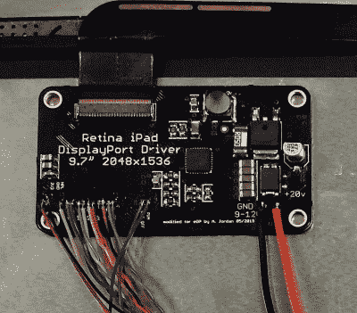

# 将这些 IPad 显示器与这个 EDP 适配器配合使用

> 原文：<https://hackaday.com/2019/07/18/put-those-ipad-displays-to-work-with-this-edp-adapter/>

不管你对苹果和他们多年来培养的生态系统有什么感觉，你都必须在硬件方面给他们一些信任。他们的“视网膜”显示器是一个完美的例子；当他们将 2，048 乘 1，536 的面板带到 iPad 3 上时，这项技术立即成为每个平板电脑所有者羡慕的对象。但是如果你想在苹果的围墙花园之外使用这些华丽的屏幕呢？

 事实证明，在其他设备上使用这些屏幕有很多选择，但【亚瑟·乔丹】对其中任何一个都不太满意。所以他做了任何有自尊的黑客都会做的事情，[并为 iPad 3 和 4 屏幕制作了自己的适配器](https://github.com/BigCorvus/Retina-Display-eDP-Adapter-For-UP-Board)。并不是说他完全是在黑暗中做的；他的设计基于开源的 Adafruit Qualia 驱动程序，而后者又基于[Mike 的 Mods]所做的研究。一个开源社区工作的完美例子。

由此产生的电路板允许您将 iPad 3 或 4 的 Retina 显示屏连接到任何具有嵌入式显示端口(eDP)的设备。没有在他的板上设置专用端口，[Arthur]只是留下了裸露的焊盘，你可以在那里焊接你的特定设备可能使用的任何接口方法。在他的案例中，[他想将其连接到 x86 UP Core SBC](https://hackaday.com/2017/06/02/first-thoughts-on-the-new-up-core/) ，所以他甚至想出了一个单独的适配器，可以将该板的小型显示连接器与可以用手焊接的东西分开。

那么[Arthur]开发的 board 和 Adafruit 的 Qualia 有什么不同呢？主要是通过删除 DisplayPort 连接器以支持那些裸露的焊盘，它变得更小了，但他也放弃了背光控制硬件和 3.3V 调节器，根据他的经验，这些对于他工作过的 eDP 设备来说是不必要的。因此，如果空间是您的构建中的一个问题，这个版本可能就是您所追求的。

[我们在过去见过其他视网膜显示适配器](https://hackaday.com/2014/03/12/an-open-source-ipad-display-adapter/)，当然，iPad 并不是唯一一个拥有足够好的屏幕可以重复使用的[高端设备](https://hackaday.com/2015/05/02/excruciating-quest-turns-chromebook-pixel-ips-into-exquisit-extra-monitor/)。这里的教训是，如果你在你的产品中放了一个必备的特性，当一些黑客出现并想出如何解放它以达到他们自己的目的时，不要感到惊讶。