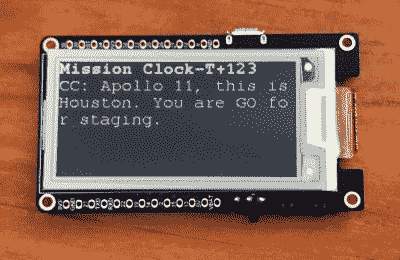

# EInk 显示器上的现场阿波罗 11 号抄本

> 原文：<https://hackaday.com/2019/07/18/live-apollo-11-transcript-on-eink-display/>

历史上很少有时刻像阿波罗 11 号登月任务那样被记录得如此详细或分析得如此透彻。将三个人送到离我们最近的天体邻居那里并完好无损地返回需要很多精心的计划，记录下他们旅途中的每一个瞬间对于确保事情顺利进行至关重要。当我们庆祝人类走出地球第一步 50 周年时，这些记录给了我们一种方式，让我们可以与阿姆斯特朗、奥尔德林和柯林斯并肩前进。

 作为巴夏礼射电望远镜 50 周年庆祝活动的一部分，【安德鲁】设计了一个徽章，让他可以佩戴上阿波罗 11 号的一小部分。使用一个 ESP32 和一个 eInk 屏幕，[它实时回放机组人员和地面控制之间的任务记录](https://hackaday.io/project/166596-apollo-11-live-on-the-esp32)。这是一种独特的体验任务的方式，这种任务是由国家航空航天局标志的细致的数据收集实现的。

[Andrew]受到“实时阿波罗 11 号”网站的启发，但他没有从互联网上下载内容，而是将任务记录作为 CSV 文件加载到 ESP32 的 SPIFFS 文件系统上。这并不是说徽章完全离线，它确实需要连接到互联网(通过他手机上的热点)，这样它就可以保持内部时钟与 NTP 同步。与从互联网上传输相比，将所有东西都放在本地确实可以降低能耗，但他承认，除此之外，他没有太多考虑能源效率，肯定还有一些改进的空间。

他使用的 LILYGO TTGO 板结合了 ESP32 和 2.13 英寸的 eInk 显示屏，与我们之前介绍的 Badgy 没有什么不同。他在 Thingiverse 上找到了一个 3D 打印外壳的 STL，并对其进行了修改以适应电池。不幸的是，最初的模型是在一个许可证下发布的，该许可证阻止他发布他的修改版本，但如果你有兴趣建立自己的人类最大的冒险的运行代码[，复制它听起来并不太困难。](https://hackaday.com/2017/07/20/first-men-on-the-moon/)