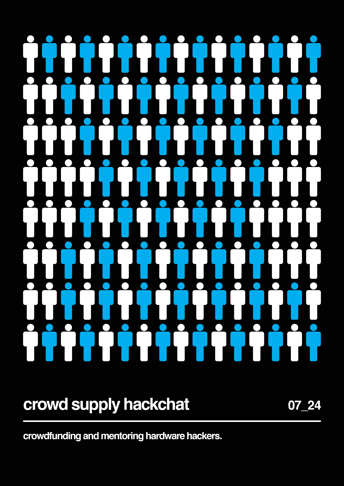

# 与 Josh Lifton 的大众供应黑客聊天

> 原文：<https://hackaday.com/2019/07/22/crowd-supply-hack-chat-with-josh-lifton/>

加入我们 7 月 24 日星期三中午太平洋时间[与](https://hackaday.io/event/165483-crowd-supply-hack-chat-with-josh-lifton)[乔希·丽芙顿](https://hackaday.io/hacker/236683-joshua-lifton)的大众供应黑客聊天！

当你准备将你的下一个大创意从一个项目变成一个产品时，你会面临一些问题，这些问题通常不会出现在业余爱好者面前。生产一件产品与生产许多产品截然不同，很快你就要处理零件供应商、PCB 制造、装配、包装、运输、营销和支持等问题。

将你的想法推向市场需要付出很多努力，对于这位崭露头角的硬件大亨来说，一只指导之手将是最受欢迎的。这就是波特兰众筹和指导公司 [Crowd Supply](https://www.crowdsupply.com/) 背后的逻辑。Josh Lifton 是它的首席执行官，他会顺便来 Hack Chat 回答你所有的问题，关于众筹如何运作，众筹提供什么来帮助创作者，以及一个成功的项目的基本要素是什么。

 我们的黑客聊天是 [Hackaday.io 黑客聊天群发消息](https://hackaday.io/messages/room/2369)中的社区直播活动。本周，我们将于太平洋时间 7 月 24 日星期三中午 12:00 坐下来讨论。如果时区让你烦恼，我们有[一个方便的时区转换器](https://www.timeanddate.com/countdown/generic?iso=20190724T12&p0=224&msg=Crowd+Supply+Hack+Chat+with+Josh+Lifton&font=cursive)。

点击右边的那个发言气泡，你会被直接带到 Hackaday.io 上的黑客聊天群，不用等到周三；随时加入，你可以看到社区在谈论什么。

[图片来源:乔恩·豪斯，[波特兰论坛报](https://pamplinmedia.com/pt/239-business/224132-81452-its-not-charity-its-business)