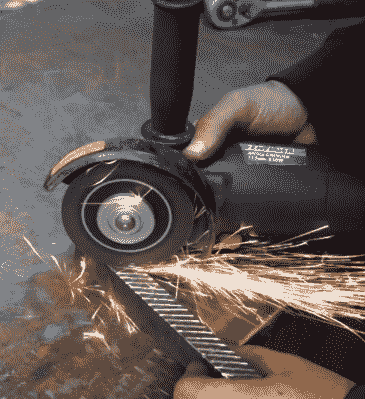

# 液压台钳是废金属和角磨的杰作

> 原文：<https://hackaday.com/2019/07/22/hydraulic-bench-vise-a-masterpiece-of-scrap-metal-and-angle-grinding/>

对我们大多数人来说，老虎钳是那种你可以夹在工作台边缘用手转动的东西。它甚至可能由塑料制成，这取决于你用它做什么工作。但是可以肯定地说，[WorkshopFromScratch]不会在这个将近 100 磅的液压虎钳的钳口中焊接任何 PCB[，这个虎钳是他从……scratch](https://www.youtube.com/watch?v=KVbAhd6u4AU)制造的。

 在广告之后的视频中，他拿出一堆废金属，包括一大块家得宝货架上的东西和一块生锈的盘子，看起来像是从一艘沉船的船体上剥下来的，然后把它变成了一个巨大的老虎钳，有五吨的夹紧力。除了几个螺栓，几个气体支柱和提供肌肉的液压千斤顶，一切都是手工切割和焊接在一起的。这里没有花哨的加工；如果你有一个角磨机，一个焊机，当然还有前面提到的废金属，你就有了自己的巨型老虎钳。

架子的一部分从中间切下，形成虎钳的底部，但大多数其他部分都是由从板上切下的单独形状焊接在一起形成的。考虑到零碎的构建方法，最终的结果看起来非常专业。诀窍是打磨所有表面，包括焊缝，直到一切看起来一致。然后再涂一层底漆，然后涂上面漆。

虽然整个造型非常令人印象深刻，但我们最喜欢的部分是下颚上的手工切割交叉影线。他一手拿着工件，一手拿着角磨机，以近乎机械的精度切割出图案。如果我们不是很了解，我们可能会认为[WorkshopFromScratch]是某种来自未来的金属加工机器人。

能够与金属打交道是一项了不起的技能，我们总是对看到人们用焊机和一些废品场找到的东西能制造出什么东西印象深刻。尤其是当他们制造出可以投入实际使用的工具和[设备](https://hackaday.com/2015/11/04/blacksmith-forge-made-from-the-bathroom-sink/)。

 [https://www.youtube.com/embed/KVbAhd6u4AU?version=3&rel=1&showsearch=0&showinfo=1&iv_load_policy=1&fs=1&hl=en-US&autohide=2&wmode=transparent](https://www.youtube.com/embed/KVbAhd6u4AU?version=3&rel=1&showsearch=0&showinfo=1&iv_load_policy=1&fs=1&hl=en-US&autohide=2&wmode=transparent)

