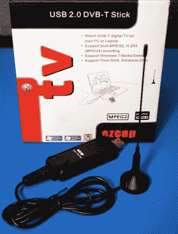
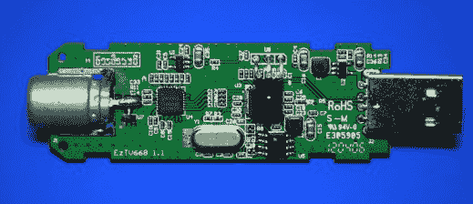
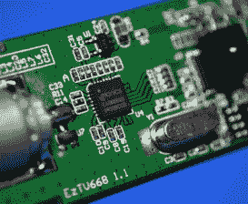
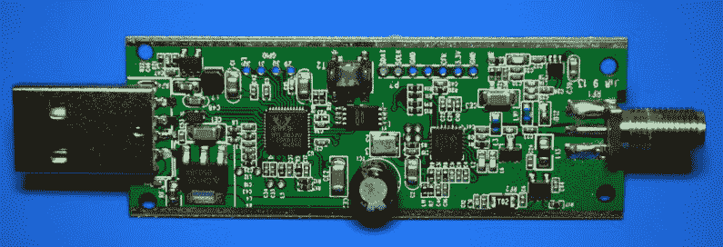
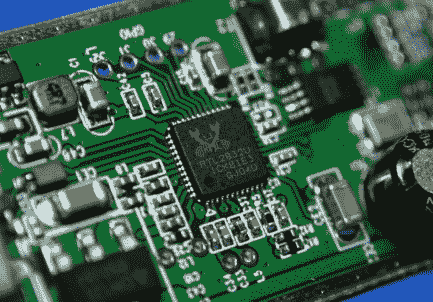
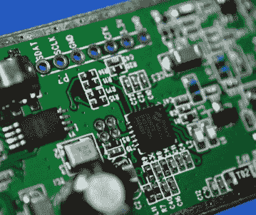
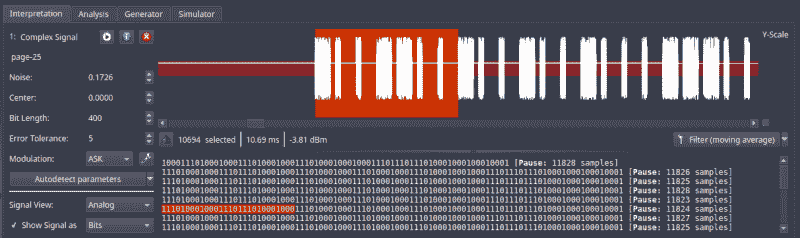

# RTL-SDR:七年后

> 原文：<https://hackaday.com/2019/07/31/rtl-sdr-seven-years-later/>

在向 Jolly Wrencher 宣誓效忠之前，我为其他几个网站写过文章，创作了或多或少和我现在做的一样的内容。事实上，话题的重叠已经足够了，偶尔这些文章会在 Hackaday 上出现。其中一篇文章[是*开始使用 RTL-SDR* ，这篇文章在七年多前](https://hackaday.com/2012/06/27/getting-started-with-software-defined-radio/)出现在这个网站的页面上。最初的链接文章早就消失了，它所在的网站现在显然是专门针对任天堂游戏的，但你可能从标题中就能知道它的主旨。

An “Old School” RTL-SDR Receiver

当我在 2012 年写那篇文章的时候，[RTL-SDR 项目](https://osmocom.org/projects/rtl-sdr/wiki/Rtl-sdr)和它的社区还处于起步阶段。需要进行一些真正的挖掘，以了解支持哪些基于 Realtek RTL2832U 的电视调谐器，需要什么适配器来连接更强大的天线，以及如何编译所有必要的软件来让它们在广告频率范围之外收听。这并不是最用户友好的体验，当一切都结束时，你很大程度上只能使用自己的设备。如果你不知道如何在 GNU Radio 中创建自己的接收器，除了偷听火腿或收听当地的调频广播，你没有太多的事情可做。

近十年后，事情发生了巨大变化。RTL-SDR 硬件和软件本身已经有了巨大的改进，但也许更重要的是，该项目的成功开启了软件定义无线电(SDR)领域的一场革命。2012 年之前，特别提款权当然不是不可获得的，但它们要昂贵得多。当时，市场上最具可比性的设备应该是 FUNcube dongle，这是一种近 200 美元的接收器，实际上是为接收立方体卫星的数据而设计的。任何比这更便宜的东西都可能是一套设备，而且通常在更窄的频率范围内工作。

今天，我们认为 RTL-SDR 接收器是必备工具。只需一套廉价的螺丝刀，你就可以进入一个不久前对业余黑客来说几乎还是隐藏的世界。让我们仔细看看，在过去几年里，人人喜爱的低成本 SDR 以几个显而易见的方式帮助释放了射频黑客精灵。

## 硬件发展

尽管该项目被称为 RTL-SDR，但 Realtek RTL2832U 芯片实际上只是等式的一半；这是一个 USB 解调器芯片，需要与调谐器配对才能工作。在早期，有许多不同的调谐器在使用，弄清楚你得到的是一个相当大的问题。Elonics E4000 是最理想的调谐器，因为它具有最宽的频率范围，但很难提前知道你会得到什么。

包装和文件几乎毫无用处；要么是制造商懒得包含这些信息，要么是即使他们包含了这些信息，随着产品新版本的产生，这些信息通常也会变得过时。确定你得到了什么的唯一方法是看看是否有人已经购买了那个特定的型号并报告了他们的发现。幸运的是，调谐器足够便宜，你可以买一对夫妇和实验。在那个时候，从进口网站上找到不到 10 美元的 RTL-SDR 兼容设备并不罕见。

  IR receiver covering RTL2832U  E4000 Tuner

打开当代 RTL2832U+E4000 接收器，我们可以看到它们相对简单。薄薄的塑料外壳并不能很好地防止干扰，Belling-Lee 连接器旨在与传统的电视天线配合使用。请注意，这种特殊型号具有红外接收器，因此用户可以使用附带的遥控器更换电视频道；提醒我们这个设备的真正用途。

这些天来，你不需要费力地通过几乎相同外观的 USB 电视调谐器页面来找到兼容的硬件。现在有几款基于 RTL2832U 的接收机是专门为 RTL-SDR 使用而设计的，一般售价约为 30 美元。这些设备不仅解决了原始硬件产品的缺点，而且在许多情况下添加了新的功能，这些功能在它们只是用于在计算机上观看电视时根本没有意义。

  Overview  RTL2832U demodulator, note GPIO pin header  R820T2 tuner and expansion header

这里我们有“RTL-SDR Blog v3”接收器，它是最受欢迎的“下一代”RTL-SDR 接收器之一。塑料外壳已被铝制外壳所取代，不仅减少了干扰，而且有助于主板在工作时散热。该晶体已经升级为温度补偿振荡器(TCXO)，有助于减少温度漂移。R820T2 调谐器与标准 SMA 天线连接器配对，如果您希望对核心硬件进行修改或扩展，它和 RTL2832U 都有一些未使用的引脚。

## 软件库

对基本 RTL-SDR 硬件的改进是受欢迎的，不用担心您购买的接收器是否真的能与驱动程序一起工作是很好的，但实际上这些变化主要有利于那些正在推动信封边缘的更铁杆的用户。如果你只是想闻闻 433 MHz 的温度计，你并不需要 TCXO。对大多数用户来说，最大的改进来自软件方面。

首先，RTL-SDR 包几乎肯定会在您最喜欢的 GNU/Linux 发行版的库中。除非你需要一些先进的特性，否则你不必再从源代码中编译驱动程序和用户界面工具。SDR 图形前端通常也是如此，即 Alexandru Csete 的 [gqrx。这两个软件包足以让你在广播中浏览有趣的信号，但这只是开始。廉价特别提款权的兴起激发了许多奇妙的新软件包，它们比以前可用的要超前好几光年。](http://gqrx.dk/)

当然，最好的例子之一是通用无线电黑客(Universal Radio Hacker),这是一个让你搜索、捕捉并最终解码无线信号的一体化工具。无论是一个已知的协议，它已经有一个内置的解码器，还是一些全新的东西，你需要逆向工程，通用无线电黑客是一个强大的工具，从字面上拉无中生有的二进制数据。那些希望逆转未知无线协议的人也应该看看 [inspectrum](https://github.com/miek/inspectrum) ，这是过去几年开发的另一个工具，[可以用来分析捕获的波形](https://hackaday.com/2019/06/04/your-table-is-ready-courtesy-of-hackrf/)。

Decoding a captured ASK OOK signal in Universal Radio Hacker

如果您对这些无线电的实际应用更感兴趣，也可以考虑利用低成本 SDR 的高可用性开发一些令人印象深刻的“交钥匙”应用。一个这样的项目是 [dump1090](https://github.com/antirez/dump1090) ，一个专门为 RTL-SDR 开发的 ADS-B 解码器。通过分布式接收器网络，该软件允许社区通过[创建开放数据飞机数据库](https://hackaday.com/2018/12/03/putting-that-airplane-on-the-map-live-and-with-python/)来民主化飞行跟踪。

## 灵感的礼物

自启动以来，RTL-SDR 项目已经成为任何想要尝试无线电的人事实上的“第一步”。它便宜、简单，而且由于硬件无法传输，你不必担心会与 FCC 或当地的对等机构发生冲突。老实说，很难想出一个有效的理由*而不是*在你的锦囊妙计中加入一个这样的小 USB 接收器；即使你只使用一次，它的回报也将超过它本身。

最终，这是 RTL-SDR 项目的最大成就。它降低了无线电实验和黑客攻击的门槛，从而催生了一个全新的时代。从 Hackaday 提供的独特优势来看，我们可以看到 RF 项目的急剧上升，这与一种易于使用且极其经济实惠的软件定义无线电的推出相对应。除了汽车里的收音机之外，那些可能从未拥有过“真正”收音机的人，现在可以揭开过去让我们大多数人无法收听广播的那层神秘面纱。对于无线黑客来说，这是一个非常激动人心的时代，从现在开始事情只会变得更加有趣。RTL-SDR 万岁！