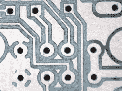

# 办公桌大小的数控雕刻机做这项工作

> 原文：<https://hackaday.com/2019/07/23/desk-sized-cnc-engraver-does-the-job/>

当你想进行 CAD 设计并尽可能快和容易地制造真正的零件时，数控机床非常有用。通常，它们被用于大规模的工业环境中，但是数控机床有各种形状和尺寸。[正如【不止一个用户】所展示的那样](http://morethanuser.blogspot.com/2019/07/diy-cnc-desk-plotter.html)，我们有可能制造出一台正适合放在办公桌上的实用机器。

The holes pictured were made with a 0.5mm tool, showing off the precision and accuracy of the machine.

该建筑由一台铝框数控雕刻机组成，主要用于印刷电路板的生产。然而，它也可以处理塑料工作，如果运行速度足够慢，还可以处理铝。像大多数车库数控项目一样，它结合了步进电机和 Arduino。切割面积为 16 厘米 x 16 厘米，对于大多数业余爱好者来说绰绰有余。

有很多有趣的细节，如由 U 型钢螺栓连接在一起制成的 T 型槽床，以及由微动开关制成的简单探针。也许最令人印象深刻的是精确的切割。这对于 PCB 工作尤其重要，否则小问题可能会导致短路或开路，并使最终的零件无用。

我们确信这个项目对[不止是用户]的未来项目会很有用，而且没有什么比制作自己的工具更好的了。如果你对 CNC 整体来说还是个新手，[考虑在开始之前收集一些设计技巧](https://hackaday.com/2019/05/20/design-tips-for-easier-cnc-milling/)。