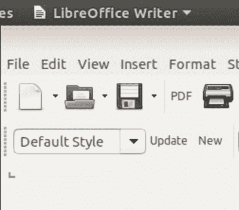
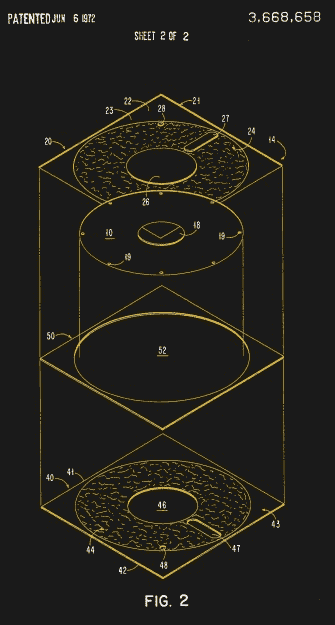
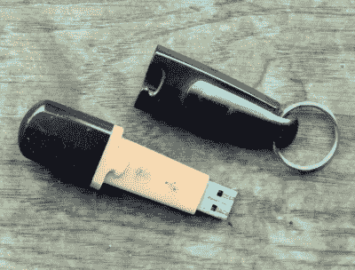

# 逆向技术:被 Linux 遗弃的软盘

> 原文：<https://hackaday.com/2019/07/26/retrotechtacular-the-floppy-disk-orphaned-by-linux/>

大约一周前，Linus Torvalds 做出了一个软件承诺，这似乎意味着一个时代的终结。有问题的代码包含一些本地软盘控制器驱动程序的补丁。值得注意的是，他说软盘驱动程序现在是孤立的。它的维护者不再有工作的软盘硬件来测试软件，Linus 评论说“*我认为从实际硬件的角度来看，这个驱动程序可以被认为是死的*”，尽管他确实指出对 USB 软盘驱动器的积极支持仍然存在。

这是一个非常合理的观点，因为在逆向计算领域之外，物理软盘而不是虚拟软盘已经几乎消失了。它们不再适用于台式机和笔记本电脑已经有十多年了，它们曾经是任何办公室的必需品，现在只存在于你的文字处理器上的“保存”图标中。软盘已经死了，而且已经死了很长时间了。

The save icon in LibreOffice and other desktop software is probably the last place the floppy exerts a hold over us.

尽管如此，莱纳斯平静的宣布对任何一个特定年龄的人来说都是一个小小的震动，对他们来说，软盘和计算机曾经是密不可分的。当你的数字生活不存在于你的手机或云端，而是存在于一个塑料软盘盒中时，这些磁盘就意味着某些东西。软盘不仅有技术上的影响，也有社会上的影响，它们是一种物理象征，可以包含你珍贵的短暂财产，是数字时代的现代纪念品盒。我们可能在十年前就已经停止使用它们了，但不知何故它们仍然是我们计算 DNA 的一部分。

因此，虽然对你们中的一些人来说,*retro techatacular*系列是关于过去几年中罕见和不寻常的技术，但现在是时候看看一些我们都认为自己知道的无处不在的东西了。软盘是从哪里来的，它还在哪里，除了那个保存图标之外，它给我们留下了什么遗产？

## 软盘是哪里来的？

20 世纪 50 年代和 60 年代的计算机通常是房间大小的机器，即使到 60 年代末，典型的小型计算机已经缩小到一个橱柜的大小，它仍然保留了它的大型兄弟的一些属性。可移动存储介质是纸带和卡片，或者大容量磁盘包和磁带卷。

20 世纪 70 年代初即将到来的台式计算机不仅要求更高的容量，而且要求这些新机器的存储介质更方便。正是 IBM 以 8 英寸磁盘的形式提供了必要的技术，这种磁盘是他们开发的，用于将微码加载到他们的 System/370 大型机中。他们在 1969 年 12 月申请了容量为 80kB 的单面光盘专利，并于 1972 年 6 月获得授权。在 20 世纪 70 年代，IBM 和其他制造商生产了各种各样的 8 英寸磁盘驱动器，容量越来越大，在那十年里，8 英寸磁盘驱动器成为小型机和台式计算机的普遍现象。这一时期，由于工作场所的 CP/M 机器上的 8 英寸驱动器，许多消费者第一次看到了软盘，它们一度成为高科技未来的象征。

随着前 IBM 员工阿兰·舒加特成立的公司在 1976 年生产 5.25 英寸的格式，将柔性磁盘放在有织物衬里的塑料钱包中的基本设计很快就小型化了。这显然是一个缩小的 8 英寸磁盘，但其增加的便携性和方便性导致了它的迅速采用。当 IBM 的个人电脑在 1981 年首次亮相时，它是显而易见的选择，实现了大众市场的普及，直到它被索尼 1981 年推出的 3.5 英寸硬外壳格式慢慢取代。

## …它去了哪里？

This Disgo-branded 32MB Flash drive cost me a small fortune back in about 2001, but meant I could carry a load of floppies-worth of data in a much more convenient form.

任何占主导地位的技术在适当的时候都会被取代，这是不可避免的，但为什么软盘在 20 世纪 90 年代末会如此迅速地消失呢？是对额外容量的渴望无法通过扩展密度驱动器或昂贵的新格式(如 Iomega 的 Zip 驱动器)来满足吗？或者它只是被更好的技术如 CD-ROM 或 USB 闪存驱动器所取代？更有可能的是，这两者以及更多因素导致了这种格式的流行度下降。

曾经有一段时间，引导软盘是任何使用计算机的人的必备工具，但随着 CD 和 USB 驱动器接管了这一功能，我们说好的摆脱，不再需要祈祷我们的引导软盘没有丢失扇区。更方便的大容量免费云服务的出现——想起 2004 年 Gmail 的推出——敲响了软盘的丧钟。如果你在大约 2005 年之后购买了一台安装了软盘驱动器的电脑，你属于少数，而在 2019 年，它们作为带有 USB 接口的外设仍然存在。也许最能说明问题的是，在亚马逊上搜索会发现一盒 10 张软盘售价约为 15 美元，这种曾经的日用品已经变成了昂贵的奇怪物品。

软驱已经离我们而去，但我们还能从它身上留下什么遗产呢？也许最明显的是在每一台台式计算机中，软驱的尺寸使驱动器托架的尺寸标准化，这反过来又规定了设计放入驱动器托架的其它设备的尺寸。当然，我们总是会在那个时代的电影中看到软盘的魅力，比如 1999 年的*办公室* 中 3.5 英寸[的过时场景，或者 1983 年的](https://www.youtube.com/watch?v=I80QQ1gbpX8)[战争游戏](https://www.youtube.com/watch?v=1VZlmV9V2Do)*中 8 英寸的使用。*

 *我们将为您留下一段视频，展示 3.5 英寸软盘的自动化生产线。我们看到所有的组成部分，包括写保护滑块和磁头快门弹簧等微小部件，都聚集在一个漂亮的自动化生产线上。令人惊讶的是，外壳是在圆盘本身从一端滑入之前组装的。如果你还在使用软盘做除了逆向计算之外的事情，我们很乐意在评论中听到你的意见。

 [https://www.youtube.com/embed/kc4kJKOGnHY?version=3&rel=1&showsearch=0&showinfo=1&iv_load_policy=1&fs=1&hl=en-US&autohide=2&wmode=transparent](https://www.youtube.com/embed/kc4kJKOGnHY?version=3&rel=1&showsearch=0&showinfo=1&iv_load_policy=1&fs=1&hl=en-US&autohide=2&wmode=transparent)

感谢[Foone]提出这个想法。

软盘标题图片:乔治·切尔尼列夫斯基[ [公共领域](https://commons.wikimedia.org/wiki/File:Floppy_disk_2009_G1.jpg)。*