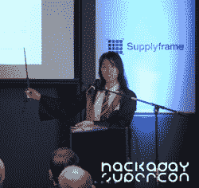

# 还剩一周时间进行超级交流和研讨会提交

> 原文：<https://hackaday.com/2019/07/25/one-week-left-for-supercon-talk-and-workshop-submissions/>

黑客日超级会议是世界上最酷的黑客的最高密度。其他事件可能更大，但我们敢说没有更好的了。如果你喜欢 Hackaday，我们知道你喜欢，你真的应该在 11 月来加州帕萨迪纳加入我们。

毫无疑问，参加会议的最佳方式是*参加*会议。这是你的机会[做一个演讲或一个研讨会](https://www.jotform.com/form/83455932567165)，与理解的人群分享你辛苦获得的知识、你疯狂的黑客技术或有趣的硬件英雄故事。如果我们为这个大型节目挑选你的演讲，你可以免费入场。

 我最喜欢的 Supercon 故事之一是在她的(和我的！)第一超。她是一个长期的 Hackaday 读者，老实说，对亲自见到所有伟大的人感到有点敬畏。到了 next Supercon，她正在做一个关于她基于 IMU 的机器学习哈利波特魔杖的[演示，并用她对你可以用传感器和代码做的酷事情的热爱来激励我们其余的人。这是我见过的关于机器学习的最诚实、最有信息量的演讲之一！](https://hackaday.com/2018/12/07/magic-wand-learns-spells-through-machine-learning-and-an-imu/)

你也有*你的*故事要分享，对吗？你也有一周的时间为一次谈话提出建议。[你可以这样做](https://www.jotform.com/form/83455932567165)！

超级广场见！