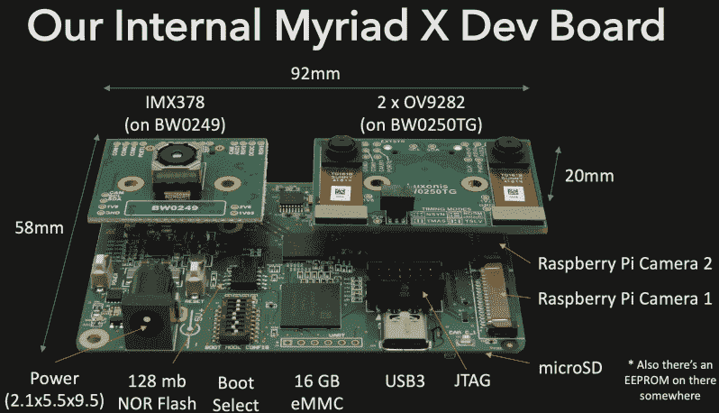

# 树莓派的高性能立体计算机视觉

> 原文：<https://hackaday.com/2019/08/03/high-performance-stereo-computer-vision-for-the-raspberry-pi/>

到目前为止，在 Raspberry Pi 上运行任何类型的计算机视觉系统都相当乏味，即使添加了像 Movidius Neural Compute Stick 这样的产品。希望在享受 Raspberry Pi 社区的好处的同时改善性能状况， [[Brandon]和他的团队一直在开发 Luxonis DepthAI](https://hackaday.io/project/163679-luxonis-depthai) 。该项目使用载板将无数的 X VPU 和一套相机与 Raspberry Pi 计算模块相匹配，到目前为止，性能增益非常有希望。

 那么它是如何工作的呢？双灰度相机允许系统感知深度或距离，用于生成“热图”；非常适合避障等任务。同时，高分辨率的彩色摄像机可用于目标检测和跟踪。根据[Brandon]的说法，绕过 Pi 的 CPU 并通过 USB 发送所有处理过的数据可以实现大约 5 倍的性能提升，从而释放主英特尔 Myriad X 芯片的全部潜力。

对于检测像人或人脸这样的标准对象，使用 OpenVino 这样的软件是相当容易的，open vino 在 Raspberry Pi 上已经相当成熟。我们很好奇该系统将如何处理定制模型，但毫无疑问，[布兰登的]团队将有助于改善未来的这种情况。

该项目正处于积极的开发状态，这正是我们对 2019 年 Hackaday 奖参赛作品的预期。现在相机不一定是理想的，例如深度传感器靠得太近，不太有效，但团队仍在微调他们的硬件选择。最终目标是制造一种设备，帮助骑自行车的人避免危险的碰撞，我们非常有兴趣观察这个项目的发展。

休息后的视频显示了立体热图的作用。手显示为暖黄色，因为它与蓝色背景相比相对较近。我们过去已经介绍过树莓派和 Movidius 盘的组合，但是立体视觉性能的改进真的将它带到了另一个层次。

 [https://www.youtube.com/embed/ZzN1dk4LU8k?version=3&rel=1&showsearch=0&showinfo=1&iv_load_policy=1&fs=1&hl=en-US&autohide=2&wmode=transparent](https://www.youtube.com/embed/ZzN1dk4LU8k?version=3&rel=1&showsearch=0&showinfo=1&iv_load_policy=1&fs=1&hl=en-US&autohide=2&wmode=transparent)

The [HackadayPrize2019](https://prize.supplyframe.com) is Sponsored by:     