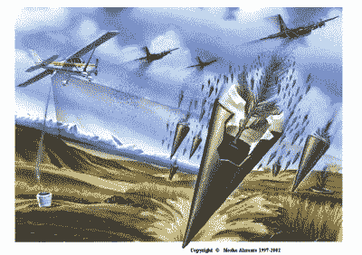
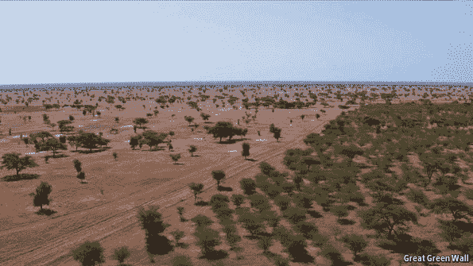

# 一万亿棵树——这能有多难？

> 原文：<https://hackaday.com/2019/08/05/a-trillion-trees-how-hard-can-it-be/>

2016 年的数据显示，这是自 1880 年开始记录以来最热的一年。二氧化碳水平持续处于历史高位，去年，联合国政府间气候变化专门委员会警告说，人类只有 12 年的时间来将变暖限制在 1.5 摄氏度。

减少排放是黄金标准，但这不是解决问题的唯一途径。已经有很多关于碳封存领域的研究——捕获大气中的碳并将其封存的实践。通常，这包括抽取旧油井和充满二氧化碳的含水层的宏伟计划，但还有另一种与自然本身一样古老的碳捕获方法。

正如大多数小学科学课程所教授的那样，我们周围的树木负责捕捉二氧化碳，并在此过程中释放可呼吸的氧气。碳成为树木生物量的一部分，不再留在大气中吸收我们宝贵的地球上的热量。因此，种植更多的树木有助于控制碳水平，延缓全球气温上升。但是我们到底在谈论多少棵树呢？最近公布的数字是 1，000，000，000，000 棵树，这令人难以置信，也让我们想知道如何才能在这样一个雄心勃勃的项目中取得成功。

## 树真的有帮助吗？

已经对全球重新造林作为应对气候变化策略的可能性进行了研究。Bastin，*等人*确定地球上还有[再覆盖 9 亿公顷森林的能力](https://science.sciencemag.org/content/365/6448/76)。这样做需要大约 1 万亿棵树。

真正令人大开眼界的是:这些树木可以储存 205 亿吨二氧化碳，这将占自工业革命开始以来人类增加到大气中的二氧化碳的 2/3。这种规模的植树有很多好处。那么种植一万亿棵树需要什么呢？

## 一万亿是个很大的数字

这是一个我们在日常生活中很少碰到的数字。一万亿等于一万亿，即十亿分之一。种那么多树肯定需要极大的努力。手工完成这项工作的想法——每个活着的人大约有 130 棵树——令人难以置信，但还有其他方法存在。

An artist’s impression on what aerial reforestration might look like.

最有希望的想法之一是空中植树造林。现在看似已经解散的空中造林公司[早在 20 世纪 90 年代末就提出了一项计划](https://www.theguardian.com/uk/1999/sep/02/paulbrown),旨在重新利用适合空投地雷的军用飞机。取而代之的是，它们将被重新配置以投放特殊设计的圆锥，里面装有树苗以及肥料和吸湿材料。球果在受到冲击时会将自己埋在土壤中，生物降解以允许树木的根系发育。

据估计，一架 C-130 飞机每次飞行可以运送 125，000 棵树，一天可以运送 900，000 棵树。这是大量的树木被放入土壤中，但一万亿仍然是一个巨大的里程碑。信封背面的一些计算强调了达到这个数字需要克服的障碍。

The C-130 Hercules is one of the world’s most popular military transport aircraft.

全球有 2500 架 C-130 运输机。假设他们中的大多数人大部分时间都忙于他们现有的工作，保守的估计表明，也许 250 架飞机可以专职从事植树造林任务。不可能每一天都适合砍树，尤其是在干燥的夏季。对天气和后勤问题做一个大概的估计，我们可以说一年中大约有 50%的时间可以进行空投。250 架飞机一年工作 182 天，每天空投 90 万棵树，一年总计超过 400 亿棵树。按照这个速度，需要 25 年才能达到 1 万亿棵树。不是一个快速的解决方案。

不幸的是，有更多的现实世界的因素阻碍这成为现实。仅仅让 250 架飞机按照如此严格的时间表飞行就需要付出接近柏林空运水平的努力。此外，生产用于交付的树苗也不是一项小任务，需要大片土地用于生产树苗本身以及用于空中交付的锥形套管。尽管付出了这么多努力，这项工作仍然需要 25 年才能完成！

During the Berlin Airlift, a Western supply plane landed in Berlin approximately every 30 seconds. Almost 300,000 flights were undertaken in total.

在这个问题上投入更多的飞机会加快运送速度，但只会进一步增加生产足够的树木弹药来空投到预期的森林地点的后勤困难。我们甚至还没有触及这样一个事实，即 100%倒下的树不可能成功生长。

树木作为碳银行也有进一步的问题。我们大多数听说过森林的人也听说过森林火灾——树木只有在不燃烧的时候才起到碳汇的作用。在火灾频发的地区，[草原可能是更安全的选择](https://phys.org/news/2018-07-grasslands-reliable-carbon-trees.html)。这是因为一些植物品种将大部分碳储存在它们的根系中，而根系不容易燃烧。任何大型项目都必须考虑特定地区的最佳植物选择，平衡当地生态系统中可以种植的植物与火灾风险以及最有效的碳储存物种。

这是有可能实现的。然而，这需要一定程度的承诺，类似于第二次世界大战中的全面战争理论，即各国将其全部经济产出用于确保自身的生存。当然，随着灾难性气候变化的幽灵仍在地平线上隐现，这可能正是需要发生的事情。

## 进步是一步一步来的

Projects like Africa’s Great Green Wall promise to make a dent in worldwide carbon levels.

虽然种植 1 万亿棵树显然不容易，更不用说快速种植，但这并不意味着没有人在努力。十亿棵树运动始于 2006 年，到 2007 年已经种植了十亿棵树。在转变为万亿棵树运动之后，通过捐赠和社区参与等多种方式，迄今为止已经种植了 136 亿棵树。其他努力也在进行中—[中国开展了大规模的重新造林活动](http://www.xinhuanet.com/english/2019-03/22/c_137915662.htm),[绿色长城项目](https://www.greatgreenwall.org/about-great-green-wall)旨在显著改变非洲景观的现状。

虽然我们不太可能很快看到万亿棵树里程碑的到来，但所有朝着这个目标的进展都是有益的。结合减排和其他环保措施，我们仍有希望通过采取正确的行动来避免灾难性的气候事件。