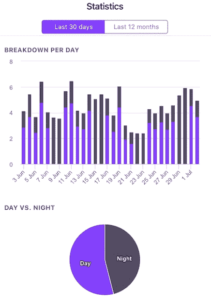

# 构建安全的 ESP32 家庭能源监控器

> 原文：<https://hackaday.com/2019/07/27/building-a-safe-esp32-home-energy-monitor/>

减少你家能源消耗的第一步是首先弄清楚你实际使用了多少。毕竟，当你开始做出改变时，你需要一个基线来比较。但是摆弄高压是很多黑客会尽力避免的事情。幸运的是，正如[Xavier Decuyper]解释的那样，你可以[构建一个非常强大的 DIY 能源监控系统，而不必修改你的交流布线](https://savjee.be/2019/07/Home-Energy-Monitor-ESP32-CT-Sensor-Emonlib/)。

 在休息后的视频中，[Xavier]回顾了它的工作原理，但简短的版本是，你只需要使用一个电流互感器(CT)传感器。这些小装置夹在交流电线上，通过感应检测有多少电流通过。在他的案例中，他使用了 YHDC SCT-013-030 传感器，可以测量高达 30 安培的电流，成本约为 12 美元。它输出 0 到 1 伏之间的电压，这使得使用您最喜欢的微控制器的 ADC 读取非常容易。

一旦你把 CT 传感器连接到你的微控制器上，剩下的就真的取决于你想在软件方面走多远了。如果这是你的风格，你可以将当前的消耗记录到一个纯文本文件中，但[Xavier]想挑战自己，开发一个可以与商业产品相媲美的能源监控系统，所以他收集了数据并运行了它。

他的文章中有很大一部分解释了如何使用亚马逊网络服务(AWS)来处理并最终显示他用 ESP32 能源监视器收集的所有数据。每 30 秒，硬件通过 MQTT 向 AWS 报告当前消耗。读数存储在数据库中，[Xavier]使用 GraphQL 和 Dygraphs 来生成可视化效果。他甚至使用 Ionic 开发了一个跨平台的移动应用程序，这样他就可以在旅途中讨好他的专业外观的图表和图形。

我们已经看到[如何仔细监控能源消耗可以揭示一些令人惊讶的趋势](https://hackaday.com/2018/05/29/smart-plugs-dont-save-you-energy-but-dont-consume-much-either/)，所以如果你想去绿色[并且没有光耦合电表](https://hackaday.com/2016/04/24/energy-monitor-optically-couples-to-smart-meter/)，CT 传感器方法可能正是你所需要的。

 [https://www.youtube.com/embed/ah3ezprtgmc?version=3&rel=1&showsearch=0&showinfo=1&iv_load_policy=1&fs=1&hl=en-US&autohide=2&wmode=transparent](https://www.youtube.com/embed/ah3ezprtgmc?version=3&rel=1&showsearch=0&showinfo=1&iv_load_policy=1&fs=1&hl=en-US&autohide=2&wmode=transparent)

