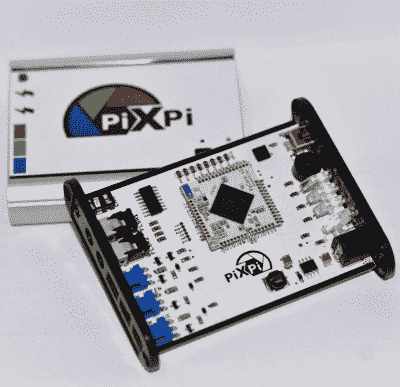

# 使用 PiXPi 控制您的 DSLR

> 原文：<https://hackaday.com/2019/07/28/take-control-of-your-dslr-with-pixpi/>

如果你曾经尝试过拍摄一个快速移动的物体，你就会知道时机有多重要。你可能只有一次机会，如果你过早或过晚按下快门，这个镜头就可能被毁掉。过了某一点，没有人能足够快地做出反应。这就是为什么[【Krzysztof krzelak】创造了 PiXPi](https://hackaday.io/project/166730-pixpi) 。

在过去，我们已经看到高速闪光灯被设计成通过在精确的时刻照亮场景来“冻结时间”，虽然 PiXPi 在技术上可以做到这一点，但它也提供了一些捕捉完美时刻的替代方法。这里的想法是给摄影师提供尽可能多的工具，让他们有最好的机会获得他们想要的照片。

 本质上，PiXPi 是一个微控制器，它允许你使用智能手机上易于使用的图形编程界面来编排 DSLR 的触发器、外部闪光灯和各种其他传感器和设备。例如，你可以对 PiXPi 编程，当它检测到足够大的噪音时触发你的相机。

但这款设备也能让你变得更加主动。PiXPi 可以直接控制动作，而不是坐在后面等待信号来启动相机。例如，[Krzysztof]发明了一种电子触发阀，可以根据指令释放一滴液体。使用 PiXPi，摄影师可以很快建立一个触发水滴的程序，等待几毫秒到达目标，然后抓拍一张照片。

2019 年 Hackaday 奖的目标是开发一种适合生产的产品，自然[其中很大一部分是有一个经过深思熟虑的设计](https://hackaday.com/2019/03/20/the-joy-of-properly-designed-embedded-systems/)。但是，如果你最终想要销售上述产品，记住最终用户的需求也是非常重要的。为此，我们认为[Krzysztof]做得很好，不仅使系统非常灵活，而且使它易于使用。

 [https://www.youtube.com/embed/cK5UgD781-4?version=3&rel=1&showsearch=0&showinfo=1&iv_load_policy=1&fs=1&hl=en-US&autohide=2&wmode=transparent](https://www.youtube.com/embed/cK5UgD781-4?version=3&rel=1&showsearch=0&showinfo=1&iv_load_policy=1&fs=1&hl=en-US&autohide=2&wmode=transparent)

The [HackadayPrize2019](https://prize.supplyframe.com) is Sponsored by:     