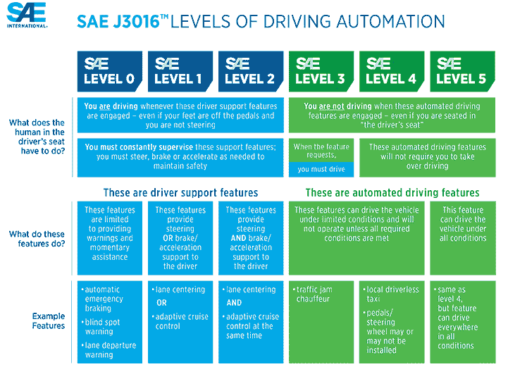

# 自动化货运:排队

> 原文：<https://hackaday.com/2019/08/13/automate-the-freight-platooning/>

又一次漫长而毫无意义的公路旅行似乎打断了我的生活，从我拿到驾照开始，我和一个朋友在宾夕法尼亚州东部的某个地方行驶。他告诉我，在长途旅行中，他常常会找另一辆与目的地同州的车来解闷，然后跟着它走。我当时不确定盯着同一辆车，一小时又一小时，一英里又一英里，除了让你看起来有点毛骨悚然，还能做什么，但这似乎对他有用。

对开车的大学生有效的方法也适用于长途卡车司机，车队的概念长期以来一直是路上生活的一个事实，也是流行文化的一部分。在美国州际公路上，几乎没有一次旅行不看到至少两个卡车司机以紧密的队形行进，部分原因是为了友谊和相互支持，但也有经济原因。现在，随着排队成为自动化货运的另一种方式，技术已经准备好将护送提升到一个新的水平。

## 我不是尾随，我是起草

排队的物理原理很简单:物体在空气中运动会受到阻力。空气阻力随着速度的增加而增加，并与保持前进所需的能量直接相关。物体在空气中的表面积越大，受到的阻力就越大。

卡车司机总是利用牵引作为降低燃料成本的一种方式。通过在领先车辆的滑流中的部分真空中行驶，跟随车辆可以实现显著的燃料节省。引导车辆也经受减小的阻力。这是因为通常出现在半挂车后缘的由阻力引起的尾流湍流会转移到后面车辆的后部。对于参与车队的所有卡车来说，牵引是空气动力学的胜利。

但是两辆高速行驶的车靠得很近可能会导致灾难，尤其是当领头的司机需要快速停车的时候。这就是排队的用武之地。车队实际上只是类固醇起草-卡车司机已经在做的技术援助。多家公司正在研究为长途卡车司机协调排队的系统，其中一家公司 [Peloton Technology](https://peloton-tech.com) 已经部署了一个工作系统:

[https://player.vimeo.com/video/155164547](https://player.vimeo.com/video/155164547)

PlatoonPro 系统提供了寻找排内伙伴并协调他们到位所需的无线系统，以及安全操作排所需的传感器套件和车辆控制。它使用一个[专用短程通信(DSRC)](https://hackaday.com/2019/02/21/when-will-our-cars-finally-speak-the-same-language-dsrc-for-vehicles/) 链接来保持排成员在一起并安全地操作车辆。地理围栏可以防止车队在拥挤的地区形成，这是由网络操作云(NOC)确定的，它也可以用来寻找车队伙伴，并警告司机接近道路危险。

## 无论你去哪里，我都会跟着你

PlatoonPro 目前已经上市，有六个客户在使用，美国 18 个州的法律允许使用 platoon pro。但尽管 PlatoonPro 令人印象深刻，但它实际上只是一个车辆间巡航控制系统。虽然排队可以节省相当多的燃料——在车队伙伴之间最多节省 7%——车队中的两辆卡车仍然需要司机。

正如我们在“自动化货运”系列文章中多次指出的，司机是昂贵的；公司不仅要支付他们的工资和福利，司机还要请病假和休假，随时可能辞职，还可能给司机带来一系列个人问题。从卡车运输公司的角度来看，他们雇用的司机越少，头疼的事就越少。因此，当一些公司在追求全自动长途卡车时，Peloton 认为只替换一半卡车是有价值的。

进入自动跟随，[Peloton 最近宣布的](https://peloton-tech.com/peloton-announces-its-vision-for-the-trucking-industry-drivers-lead-and-technology-follows/)。在自动跟随车队中，只有引导车辆有驾驶员。后面的车辆配备了相同的传感器套件，并通过与 PlatoonPro 相同的车对车(V2V)系统与领先车辆相连，是无人驾驶的。跟随车辆从引导车辆中的驾驶员接收加速、制动和转弯的命令。一个自动化的跟随车队可以立即使单个司机运输的货物增加一倍，减少一半的人员成本，同时还可以实现更高的燃油经济性。

SAE “Levels of Driving Autonomy.” PlatoonPro is a Level 1 system, while automated following qualifies as Level 4\. Click to enlarge. Source: [SAE International](https://www.sae.org/news/press-room/2018/12/sae-international-releases-updated-visual-chart-for-its-%E2%80%9Clevels-of-driving-automation%E2%80%9D-standard-for-self-driving-vehicles)

虽然 PlatoonPro 有资格成为 SAE 级或“驾驶员辅助”自动驾驶系统，但事实是，后面的车辆中没有安全驾驶员，这使得自动跟随 4 级系统。这与在高速公路上运送货物的 5 级无人驾驶卡车车队相去甚远，但正如 Peloton 指出的那样，这在短期内更可行。

除了节省燃料和人员之外，四级系统还有明显的好处。航运公司将从更灵活的物流中受益，在漫长的路线上，跟随卡车将被合作到多个线索。主要司机将受益于运营更短的路线，这将增加招聘和保留。此外，首席车手需要更多的培训，承担更多的责任，因此要求更多的补偿。

对于航运公司和司机来说，自动跟踪似乎是一个明显的胜利，至少对于那些拥有适应新系统所需技能的人来说是如此。这是一个有趣的想法，应该有助于弥合自动化航运目前的状况和未来的差距。