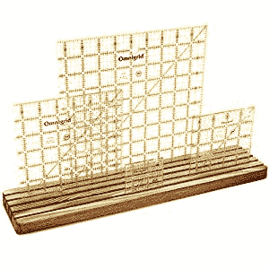

# 绗缝台是一个独立的单元

> 原文：<https://hackaday.com/2019/08/01/quilting-desk-is-an-absolute-unit/>

大多数爱好都有很多工具，螺纹注射也不例外。当谈到你可以购买的大量物品时，绗缝本身可能是女王的爱好:专门的模板、夹子、顶针、隐形墨水笔等等。当然，您希望坐在机器前，一切触手可及。

Ruler rack via [Amazon](https://www.amazon.com/Wooden-Quilting-Rulers-Template-Organizer).

几年前，[kevsoodworks]为他的妻子制作了一个令人印象深刻的定制绗缝书桌。几年来他一直在扩建，但现在是时候扩建一个更大的了。这只美丽的野兽有 21 个抽屉和 6 个大的塑料箱。应妻子的要求，其中一个抽屉是垂直的。[Kev]没有说她在里面放了什么，但如果这是我们的桌子，那就是我们存放所有需要保持水平(或垂直)的大型塑料尺子的地方。还有一个升降机，所以任何缝纫机都可以与巨大的顶部齐平。

幸运的是，凯文喜欢教书。他在一系列视频中记录了这一构建，这些视频与他的 CAD 图纸[很好地匹配，可以下载](https://www.kevswoodworks.com/plans-download)。穿过休息时间观看这些视频。

想做一些线程注入，但不想花费数百元的机器？我们的入门级注射器很幸运。如果你的是一块废铁或者针脚有限，[更换马达](https://hackaday.com/2014/02/16/building-a-better-sewing-machine/)，或者[增加一个 Arduino](https://hackaday.com/2015/01/07/arduino-controlled-sewing-machine-increases-stitch-options/) 。

 [https://www.youtube.com/embed/r2MdyfvvHuI?version=3&rel=1&showsearch=0&showinfo=1&iv_load_policy=1&fs=1&hl=en-US&autohide=2&wmode=transparent](https://www.youtube.com/embed/r2MdyfvvHuI?version=3&rel=1&showsearch=0&showinfo=1&iv_load_policy=1&fs=1&hl=en-US&autohide=2&wmode=transparent)

 [https://www.youtube.com/embed/lnkORfLC1d4?version=3&rel=1&showsearch=0&showinfo=1&iv_load_policy=1&fs=1&hl=en-US&autohide=2&wmode=transparent](https://www.youtube.com/embed/lnkORfLC1d4?version=3&rel=1&showsearch=0&showinfo=1&iv_load_policy=1&fs=1&hl=en-US&autohide=2&wmode=transparent)

 [https://www.youtube.com/embed/CpqCME3Cx7c?version=3&rel=1&showsearch=0&showinfo=1&iv_load_policy=1&fs=1&hl=en-US&autohide=2&wmode=transparent](https://www.youtube.com/embed/CpqCME3Cx7c?version=3&rel=1&showsearch=0&showinfo=1&iv_load_policy=1&fs=1&hl=en-US&autohide=2&wmode=transparent)

