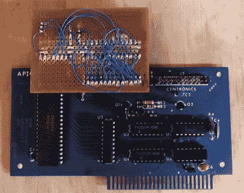

# 用苹果逆向工程一个古老的 SBC

> 原文：<https://hackaday.com/2019/08/04/reverse-engineering-an-ancient-sbc-with-an-apple/>

我们在社区中花了很多时间讨论 8 位时代的家用电脑，而几乎完全忽略了它们的工业等价物。虽然今天机器的设计者更有可能接触微控制器，但四十年前他们会使用单板计算机，它可能与你用来玩吃豆人的计算机共享大量芯片。

【EPO och】[最近拥有了一台 CMS 9619A 高级单板微型计算机](https://apple-crapple.blogspot.com/2019/05/cms-6919a-sbc.html)，这是一台用于工业应用的相当独特的可编程逻辑控制器。它由摩托罗拉 6809 CPU 驱动，具有常见的外围芯片阵列。为了解开它的秘密，他没有使用 2019 年的一系列工具，而是使用了一台古老的苹果[e]微型电脑。

在这种类型的 8 位机器中，各种外设通过地址解码逻辑来启用，当调用特定的 I/O 地址时，地址解码逻辑触发它们的芯片选择线。有时这项任务由一组 74 或类似的逻辑芯片完成，但在 CMS 9619A 的情况下，它落在可编程阵列逻辑(PAL)上。这些芯片可以被认为是当今 FPGAs 的简单前身，是创建定制解码逻辑的理想选择。

正如你所料，PAL 是一个不透明的设备，所以要推导出地址映射，必须使用 Apple ]的打印机卡和一些基本代码对其进行逆向工程。然后剩下的就是做一些 ROM 拆卸工作和[连接串口](https://apple-crapple.blogspot.com/2019/07/cms-9619-sbc-power-and-serial-ports.html)，然后用苹果打一些 ROM 补丁【作为 EPROM 程序员最终[访问机器的调试器](https://apple-crapple.blogspot.com/2019/07/cms-9619-success.html)。

6809 作为 Radio Shack 的 CoCo 和 Dragon 计算机的大脑而闻名，但这并不是我们第一次在 SBC 中看到它。