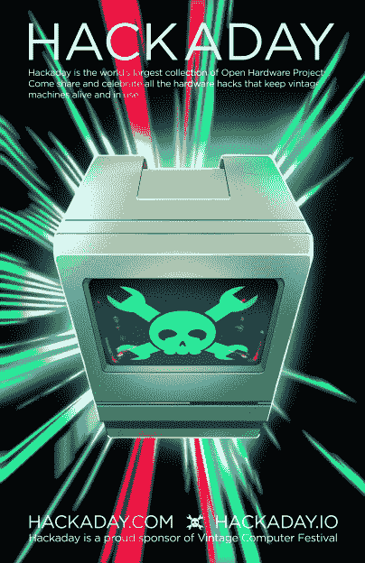

# 复古电脑节西部快到了

> 原文：<https://hackaday.com/2019/07/30/vintage-computer-festival-west-is-almost-here/>

如果你对技术感兴趣，对那种特殊的黄色塑料感兴趣，并且恰好位于加利福尼亚地区，那么我们为你准备了这个活动。[西部老式计算机节将于本周末](http://vcfed.org/wp/festivals/vintage-computer-festival-west/)，即 8 月 3 日和 4 日在加州山景城的计算机历史博物馆举行。

复古计算机节为所有对硅有热情的人提供了一个真正独特的体验。你还能在哪里参加苹果早期员工的圆桌会议，讨论即将展出的一批真正的超稀有苹果 I 电脑，或者近距离接触修复的阿波罗导航电脑？如果你真的想深入研究，Hackaday 自己的 Bill Herd 将会出席他的讲座，讲述热量和时间对几十年前的硬件内部组件的影响。

 还怀疑吗？也许你会从庆祝*地震*二十多年的展览中得到乐趣，举办一个局域网游戏，经典游戏在不太常见的平台上运行，如 RS/6000 系列或 Sun Ulta。如果你有兴趣看经典技术的现代重建，也会有很多展出。Eric Schlaepfer 将展示他的标志性 6502 微处理器的[晶体管规模复制品，你不会想错过](https://hackaday.com/2017/05/20/dis-integrated-6502-running-programs-acting-like-computer/)[它所有的彩虹色拨动开关和闪光灯荣耀](https://hackaday.com/2018/06/13/vcf-east-cactus-retro-because-it-wants-to-be/)。

当然，如果你在市场上寻找你自己的计算机历史，没有比这更好的地方了。寄售区让观众有机会买卖各种古董和独特的硬件，让他们重温过去，获得电脑(或组装电脑的零件)的最佳方式[是参加一个专门的活动](https://hackaday.com/2018/03/07/evolution-of-the-worlds-oldest-computer-festival/)。另外，没有运费！

简而言之，复古电脑节上真的有适合每个人的东西。即使你没有经历过 Apple II 或 Commodore 64 的全盛时期，这些活动也是了解一项今天我们都认为理所当然的技术的早期的难得机会。你有没有想过程序是如何被输入到那些早期的计算机中的，而这些计算机只不过是一排拨动开关和一排发光二极管？VCF 的一个热情的参展商将非常乐意带你参观这个过程。

归根结底，保留这项技术并与后代分享才是真正的意义所在。[就像前几年一样](https://hackaday.com/2018/08/01/this-weekend-the-vintage-computer-festival-west/)，Hackaday 很荣幸能够赞助复古电脑节，并进一步实现他们的目标，确保这一令人难以置信的共同遗产不会丢失。